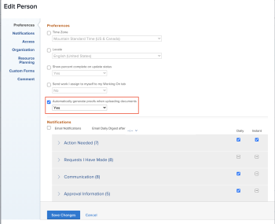

# Configurar se as provas são geradas automaticamente

É possível configurar se o sistema gera provas automaticamente quando os usuários especificados adicionam documentos ao Workfront. Essa configuração é desativada por padrão.

## Requisitos de acesso

Você deve ter o seguinte:

<table style="table-layout:auto"> 
 <col> 
 <col> 
 <tbody> 
  <tr> 
   <td role="rowheader"><a href="https://business.adobe.com/br/products/workfront/pricing.html" target="_blank">Plano do Adobe Workfront</a> </td> 
   <td>Qualquer</td> 
  </tr> 
  <tr> 
   <td role="rowheader"><a href="../../../administration-and-setup/add-users/access-levels-and-object-permissions/wf-licenses.md" class="MCXref xref">Visão geral das licenças</a>*</td> 
   <td>Plano</td> 
  </tr> 
  <tr> 
   <td role="rowheader">Acessar configurações</td> 
   <td> 
Você deve ser um administrador do Workfront. Para obter informações sobre administradores do Workfront, consulte <a href="../../../administration-and-setup/add-users/configure-and-grant-access/grant-a-user-full-administrative-access.md" class="MCXref xref">Conceder a um usuário acesso administrativo total</a>.
 </td> 
  </tr> 
 </tbody> 
</table>

&#42;Para saber qual plano, tipo de licença ou acesso você tem, contate o administrador do Workfront.

## Configure se as provas são geradas automaticamente para um único usuário

1. Clique no ícone **Menu principal**  no canto superior direito do Adobe Workfront e clique em **Usuários** .
1. Selecione um usuário com acesso à prova e clique em **Editar**.
1. Na seção **Preferências**, ative ou desative a caixa de seleção **Gerar provas automaticamente ao carregar documentos**.

   

1. Clique em **Salvar alterações**.

## Configure se as provas são geradas automaticamente para vários usuários

1. Clique no ícone **Menu principal**  no canto superior direito do Adobe Workfront e clique no ícone **Usuários** .
1. Selecione os usuários com acesso à prova e clique em **Editar**.

   >[!IMPORTANT]
   >
   >Se todos os usuários não tiverem acesso à prova, a opção Gerar provas automaticamente ao carregar documentos não será exibida.

1. Na seção **Preferências**, habilite a caixa de seleção **Gerar provas automaticamente ao carregar documentos** e selecione **Sim** ou **Não**.

   

1. Clique em **Salvar alterações**.

