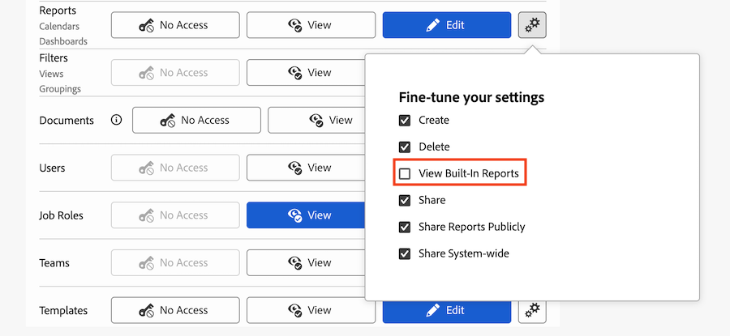

# Ocultar relatórios internos

O Adobe Workfront tem uma extensa lista de relatórios internos padrão que os usuários podem acessar e visualizar. Como administrador do Workfront, você pode modificar o nível de acesso de um usuário para ocultar relatórios internos, de modo que os usuários não tenham acesso a eles.

## Requisitos de acesso

+++ Expanda para visualizar os requisitos de acesso da funcionalidade neste artigo.

<table style="table-layout:auto"> 
 <col> 
 <col> 
 <tbody> 
  <tr> 
   <td role="rowheader">Pacote do Adobe Workfront</td> 
   <td>Qualquer</td> 
  </tr> 
  <tr> 
  <tr> 
   <td role="rowheader">Licença do Adobe Workfront</td> 
   <td>
Padrão

       
Plano
</td>
  </tr> 
  </tr> 
  <tr> 
   <td role="rowheader">Configurações de nível de acesso</td> 
   <td>Administrador de Sistema</td>
  </tr> 
 </tbody> 
</table>

Para obter mais detalhes sobre as informações contidas nesta tabela, consulte [Requisitos de acesso na documentação do Workfront](/help/quicksilver/administration-and-setup/add-users/access-levels-and-object-permissions/access-level-requirements-in-documentation.md).

+++

## Ocultar relatórios internos

{{step-1-to-setup}}

1. Clique em **Níveis de Acesso**.
1. Selecione o nível de acesso para o qual deseja ocultar relatórios internos e clique em **Editar**.
1. Para o objeto **Relatórios**, clique no ícone **Configurações** ao lado do nível mais alto de acesso disponível e desmarque **Exibir Relatórios Internos**.

   

1. Clique em **Salvar**.
