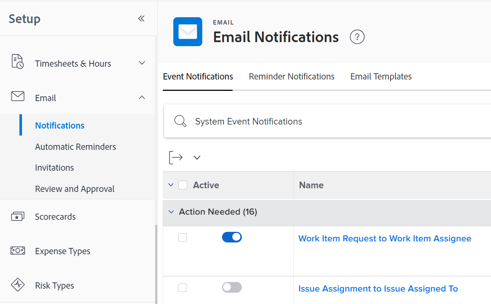

# Configurar notificações de eventos para todos no sistema

<!-- Audited: 1/2024 -->

<!--DON'T DELETE, DRAFT OR HIDE THIS ARTICLE. IT IS LINKED TO THE PRODUCT, THROUGH THE CONTEXT SENSITIVE HELP LINKS-->

As notificações de eventos acionam emails para usuários quando ocorre um determinado evento. Como administrador do Adobe Workfront ou usuário com nível de acesso do Planner, você pode configurar uma notificação de eventos para todos os usuários do sistema. A configuração de uma notificação de evento consiste em ativá-la ou desativá-la.

<!--Alina annotation on the word "all" in 2nd sentence: abive, drafted and remains QS only-->

Dependendo do evento que você ativar e do usuário manter ativado em seu próprio perfil, os usuários receberão notificações instantâneas, diárias ou por e-mail instantâneas e diárias quando um evento ocorrer.

Primeiro, você deve especificar quais notificações deseja que todos os usuários recebam na área Configuração da sua instância do Workfront. Depois que você ativa uma notificação na área Configuração, ela é exibida como ativada para cada usuário na página de perfil.

Depois que as notificações são ativadas na área Configuração e aparecem nas páginas de perfil dos usuários, usuários individuais ou outro usuário com uma licença de Plano também podem configurar as notificações ativadas em um perfil de usuário para controlar quais notificações um usuário específico recebe e com que frequência. Para obter mais informações, consulte [Modificar suas próprias notificações por email](../../../workfront-basics/using-notifications/activate-or-deactivate-your-own-event-notifications.md).

Para obter uma lista de todas as notificações de evento que você pode ativar e desativar, consulte [Tipos de notificação de evento](../../../administration-and-setup/manage-workfront/emails/event-notifications-available-in-wf.md).

Para obter informações sobre como desbloquear uma notificação de evento para que os administradores de grupo possam configurá-la para seus grupos, consulte [Desbloquear ou bloquear a configuração de notificações de evento para todos os grupos](../../../administration-and-setup/manage-workfront/emails/unlock-configuration-of-event-notifications-for-groups.md) e [Exibir e configurar notificações de evento para um grupo](../../../administration-and-setup/manage-groups/create-and-manage-groups/view-and-configure-event-notifications-group.md).

## Requisitos de acesso

+++ Expanda para visualizar os requisitos de acesso da funcionalidade neste artigo.

<table style="table-layout:auto"> 
 <col> 
 <col> 
 <tbody> 
  <tr> 
   <td role="rowheader">Pacote do Adobe Workfront</td> 
   <td>Qualquer</td> 
  </tr> 
  <tr> 
   <td role="rowheader">Licença do Adobe Workfront</td> 
   <td> 
Padrão

Plano
 
</td> 
  </tr> 
  <tr> 
   <td role="rowheader">Configurações de nível de acesso</td> 
   <td> 
Planejador ou superior com acesso administrativo a notificações de lembrete
 </td> 
  </tr> 
 </tbody> 
</table>

Para obter informações, consulte [Requisitos de acesso na documentação do Workfront](/help/quicksilver/administration-and-setup/add-users/access-levels-and-object-permissions/access-level-requirements-in-documentation.md).
+++

## Configurar notificações de eventos para todos os usuários

Você deve ativar as notificações na área Configuração do Workfront antes que os usuários possam ativá-las ou desativá-las em seus perfis individuais.

>[!TIP]
>
>Não é possível ativar as notificações para o Workfront Goals na área Configuração. Os usuários podem ativar essas notificações somente em seus perfis. Os usuários com licenças de Plano podem ativá-las para outros usuários. Para obter informações sobre como habilitar notificações do Workfront Goals para usuários, consulte [Notificações: Metas](../../../workfront-basics/using-notifications/notifications-goals.md).

{{step-1-to-setup}}

1. Clique em **Email** > **Notificações**.

   

1. Verifique se a guia **Notificações de Evento** está aberta.
1. Alterne a opção à esquerda do nome do evento para ativá-lo ou desativá-lo.

   Para ver o status de notificação padrão de um evento, consulte [Notificações de evento](../../../workfront-basics/using-notifications/event-notifications.md).

1. (Opcional) Clique no nome de uma notificação de evento para personalizar a linha de assunto da notificação de e-mail.

   Para obter mais informações sobre como personalizar as linhas de assunto das notificações por email, consulte [Personalizar assuntos de email para notificações de evento](../../../administration-and-setup/manage-workfront/emails/custom-email-subjects-event-notification.md).

1. (Opcional) Se desejar desbloquear a configuração de uma notificação por email para que os administradores de grupo possam configurá-la separadamente para seus grupos, clique no botão  à direita da notificação para alterná-la para a posição desbloqueada .

   Para obter mais informações, consulte [Desbloquear ou bloquear a configuração de notificações de eventos para todos os grupos](../../../administration-and-setup/manage-workfront/emails/unlock-configuration-of-event-notifications-for-groups.md).

Os usuários podem personalizar a frequência dessas notificações em seus perfis de usuário.
