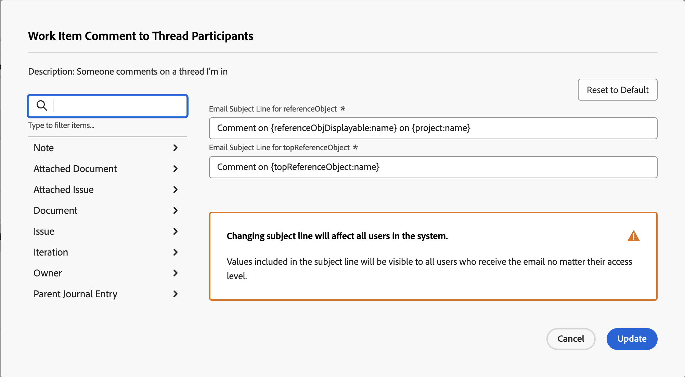

# Personalizar assuntos de email para notificações de eventos

Você pode personalizar a linha de assunto dos emails acionados pelas notificações de evento:

A alteração das linhas de assunto afeta todos os usuários no sistema, independentemente do nível de acesso do recipient. Os usuários veem todos os objetos e campos incluídos no assunto do email.

Algumas notificações de eventos têm várias linhas de assunto, o que significa que essas notificações de eventos podem ter vários assuntos de email com base em sua funcionalidade.

>[!IMPORTANT]
>
>Tenha cuidado ao excluir campos padrão para casos em que as linhas de assunto se referem a vários objetos. Veja a seguir a lista de notificações de eventos que contém essas linhas de assunto:
>
>* Alguém me inclui em uma atualização direcionada
>* Alguém inclui minha equipe em uma atualização direcionada
>* Comentário de Item de Trabalho para os Participantes da Discussão
>* Comentário no Item de Trabalho para os Atribuídos no Item de Trabalho
>

## Requisitos de acesso

+++ Expanda para visualizar os requisitos de acesso para a funcionalidade neste artigo.

<table style="table-layout:auto"> 
 <col> 
 </col> 
 <col> 
 </col> 
 <tbody> 
  <tr> 
   <td role="rowheader">Pacote do Adobe Workfront</td> 
   <td>Qualquer</td> 
  </tr> 
  <tr> 
   <td role="rowheader">Licença do Adobe Workfront</td> 
   <td>
   
Standard

   
Plano

   </td> 
  </tr> 
  <tr> 
   <td role="rowheader">Configurações de nível de acesso</td> 
   <td> 
Planejador ou superior, com acesso administrativo a notificações de lembrete
 </td> 
  </tr> 
 </tbody> 
</table>

Para obter informações, consulte [Requisitos de acesso na documentação do Workfront](/help/quicksilver/administration-and-setup/add-users/access-levels-and-object-permissions/access-level-requirements-in-documentation.md).

+++

## Personalizar linhas de assunto de email para notificações de eventos {#customize-email-subject-lines-for-event-notifications}

{{step-1-to-setup}}

1. No painel esquerdo, clique em **Email** > **Notificações**.

1. Clique na guia **Notificações de Eventos**.
1. Clique no nome da notificação de eventos que deseja personalizar para abrir a caixa **Notificação de Eventos**.
1. Na caixa **Linha de assunto do email**, altere o texto e os campos, incluindo campos personalizados, no assunto do email.

   Os nomes dos campos adicionados devem corresponder à sintaxe de camel case da estrutura do banco de dados. <!--For more information about how our objects and their fields are named in the Workfront database, see the [Adobe Workfront API](../../../wf-api/workfront-api.md).-->

1. Clique em **Atualizar** para salvar as novas linhas de assunto para seus emails.

## Personalizar linhas de assunto de email para emails com vários objetos

Algumas notificações de eventos têm várias linhas de assunto, dependendo de quais objetos são acionados.

Por exemplo, &quot;Alguém inclui-me em uma atualização direcionada&quot; tem duas linhas de assunto diferentes: a primeira é para tarefas, problemas, tarefas de modelo e documentos (também conhecido como &quot;referenceObject&quot;) e a segunda é para objetos que permitem que os usuários façam comentários, como portfólio, programa e assim por diante (também conhecido como &quot;topReferenceObject&quot;).

Se um usuário for incluído em uma conversa na tarefa, problema, tarefa de modelo ou documento, um email será gerado com a primeira linha de assunto. A linha de assunto contém &quot;referenceObject:name&quot; e o sistema define o objeto e exibe o nome apropriado no campo de assunto. A linha de assunto do email seria semelhante a esta: &quot;Comment on Task 123 on Project ABC&quot;.

Se adicionado a uma conversa de projeto, um email com o segundo assunto será gerado. Aqui, a linha de assunto contém &quot;topReferenceObject:name&quot; e, novamente, o Workfront identifica qual objeto foi referenciado e retornará esse nome de objeto em vez de &quot;topReferenceObject:name&quot; no assunto. A linha de assunto do email seria semelhante a esta: &quot;Comment on Project ABC&quot;.

Para editar as linhas de assunto do email e adicionar campos adicionais às linhas de assunto, consulte [Personalizar linhas de assunto de email para notificações de eventos](#customize-email-subject-lines-for-event-notifications) neste artigo.

## Personalizar linhas de assunto de email para emails de várias ações

Algumas notificações de eventos também têm vários assuntos de email para destacar as diferentes ações que são tomadas nos objetos.

Por exemplo, solicitar que um documento seja adicionado a um problema é um evento que pode acionar dois emails diferentes: um para quando o documento é adicionado e outro para quando o documento é editado.

Para editar as linhas de assunto do email e adicionar campos adicionais às linhas de assunto, consulte [Personalizar linhas de assunto de email para notificações de eventos](#customize-email-subject-lines-for-event-notifications) neste artigo.
