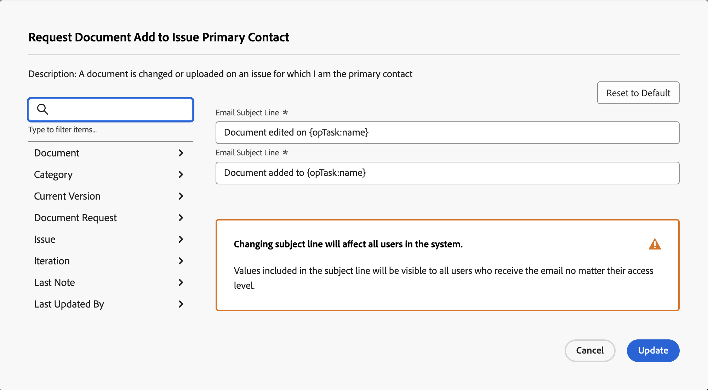

# Personalizar assuntos de email para notificações de eventos

Você pode personalizar a linha de assunto dos emails acionados por notificações de eventos:

A alteração das linhas de assunto afeta todos os usuários no sistema, independentemente do nível de acesso do recipient. Os usuários veem todos os objetos e campos incluídos no assunto do email.

Algumas notificações de eventos têm várias linhas de assunto, o que significa que essas notificações de eventos podem ter vários assuntos de email com base em sua funcionalidade.

>[!IMPORTANT]
>
>Tenha cuidado ao excluir campos padrão para casos em que as linhas de assunto se referem a vários objetos. Veja a seguir a lista de notificações de eventos que contêm essas linhas de assunto:
>
>* Alguém tiver me incluído em uma atualização direcionada
>* Alguém tiver incluído minha equipe em uma atualização direta
>* Comentário de Item de Trabalho para os Participantes da Discussão
>* Comentário no Item de Trabalho para os Atribuídos no Item de Trabalho
>

## Requisitos de acesso

Você deve ter o seguinte acesso para executar as etapas neste artigo:

<table style="table-layout:auto"> 
 <col> 
 </col> 
 <col> 
 </col> 
 <tbody> 
  <tr> 
   <td role="rowheader">Plano Adobe Workfront*</td> 
   <td>Qualquer Um</td> 
  </tr> 
  <tr> 
   <td role="rowheader">Licença da Adobe Workfront*</td> 
   <td>Plano</td> 
  </tr> 
  <tr> 
   <td role="rowheader">Configurações de nível de acesso*</td> 
   <td> 
Planejador ou superior, com acesso administrativo às notificações de lembrete
 
Para obter informações sobre como conceder acesso administrativo a um Usuário do Plano, consulte <a href="../../../administration-and-setup/add-users/configure-and-grant-access/grant-users-admin-access-certain-areas.md" class="MCXref xref">Conceder aos usuários acesso administrativo a determinadas áreas</a>.
 </td> 
  </tr> 
 </tbody> 
</table>

&#42;Para descobrir qual plano, tipo de licença ou acesso você tem, entre em contato com o administrador da Workfront.

## Personalizar linhas de assunto de email para notificações de eventos {#customize-email-subject-lines-for-event-notifications}

1. Clique no botão **Menu principal** ícone  no canto superior direito do Adobe Workfront, em seguida, clique em **Configuração** .

1. No painel esquerdo, clique em **Email** > **Notificações**.

1. Clique no botão **Notificações de evento** guia .
1. Clique no nome da notificação de evento que deseja personalizar para abrir o **Notificação de evento** caixa.
1. No **Linha de Assunto do Email** , altere o texto e os campos, incluindo campos personalizados, no assunto do email.

   Os nomes dos campos adicionados devem corresponder à sintaxe de maiúsculas e minúsculas de camel da estrutura do banco de dados. <!--For more information about how our objects and their fields are named in the Workfront database, see the [Adobe Workfront API](../../../wf-api/workfront-api.md).-->

1. Clique em **Atualizar** para salvar as novas linhas de assunto para seus emails.

## Personalizar linhas de assunto de email para emails com vários objetos

Algumas notificações de eventos têm várias linhas de assunto, dependendo dos objetos que acionam.

Por exemplo, &quot;Alguém me inclui em uma atualização direcionada&quot; tem duas linhas de assuntos diferentes: o primeiro é para tarefas, problemas, tarefas de modelo e documentos (também conhecido como &quot;referenceObject&quot;) e o segundo é para objetos que permitem que os usuários façam comentários, como portfólio, programa e assim por diante (também conhecido como &quot;topReferenceObject&quot;).

Se um usuário for incluído em uma conversa sobre tarefa, problema, tarefa do modelo ou documento, um email será gerado com a primeira linha de assunto. A linha de assunto contém &quot;referenceObject:name&quot; e o sistema define o objeto e exibe o nome apropriado no campo de assunto. A linha de assunto do email seria semelhante a esta: &quot;Comentário sobre a Tarefa 123 no Projeto ABC.&quot;

Se adicionado a uma conversa de projeto, um email com o segundo assunto será gerado. Aqui, a linha de assunto contém &quot;topReferenceObject:name&quot; e novamente o Workfront identifica qual objeto foi referenciado e retornará o nome do objeto em vez de &quot;topReferenceObject:name&quot; no assunto. A linha de assunto do email seria semelhante a esta: &quot;Comentário sobre o Projeto ABC.&quot;

Para editar as linhas de assunto do email e adicionar campos adicionais às linhas de assunto, consulte [Personalizar linhas de assunto de email para notificações de eventos](#customize-email-subject-lines-for-event-notifications) neste artigo.

## Personalizar linhas de assunto de email para emails de várias ações

Algumas notificações de eventos também têm vários assuntos de email para destacar as diferentes ações que são tomadas nos objetos.

Por exemplo, solicitar que um documento seja adicionado a um problema é um evento que pode acionar dois emails diferentes: um para quando o documento é adicionado e outro para quando o documento é editado.

Para editar as linhas de assunto do email e adicionar campos adicionais às linhas de assunto, consulte [Personalizar linhas de assunto de email para notificações de eventos](#customize-email-subject-lines-for-event-notifications) neste artigo.
