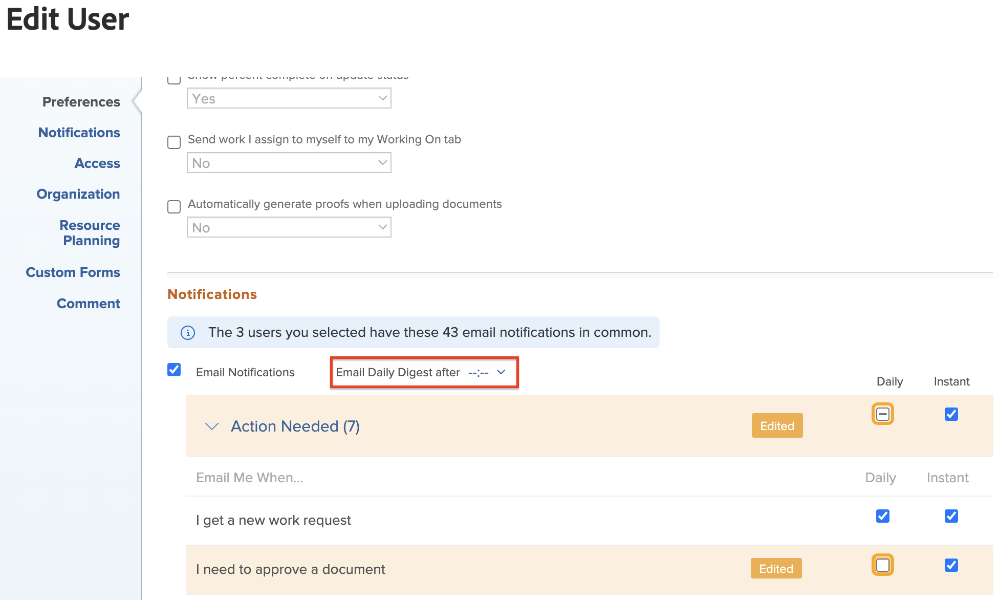

# Modify multiple users&#39; email notification settings

<!-- Audited: 12/2023 -->

If you are an Adobe Workfront administrator or you have a Planner access level allowing you to edit other users&#39; settings, you can configure the notification settings for multiple users at one time. This includes specifying whether users receive notifications as events happen, or in one daily digest email, as described in [Adobe Workfront notifications](../../../workfront-basics/using-notifications/wf-notifications.md). For information about the access level needed to edit users, see [Grant access to users](../../../administration-and-setup/add-users/configure-and-grant-access/grant-access-other-users.md).

You can also configure email notifications for one user at a time, including your own profile. For more information, see [Modify your own email notifications](../../../workfront-basics/using-notifications/activate-or-deactivate-your-own-event-notifications.md).

## Requisitos de acesso

+++ Expanda para visualizar os requisitos de acesso da funcionalidade neste artigo.

<table style="table-layout:auto"> 
 <col> 
 <col> 
 <tbody> 
  <tr> 
   <td role="rowheader">Pacote do Adobe Workfront</td> 
   <td>Qualquer</td> 
  </tr> 
  <tr> 
   <td role="rowheader">Licença do Adobe Workfront</td> 
   <td> 
    
Padrão

    
Plano

   </td>
  </tr> 
 </tbody> 
</table>

Para obter informações, consulte [Requisitos de acesso na documentação do Workfront](/help/quicksilver/administration-and-setup/add-users/access-levels-and-object-permissions/access-level-requirements-in-documentation.md).

+++

## Modify email notification settings for multiple users

When you configure notification settings in bulk, you can change only the settings that the selected users have in common.

When you modify a notification setting, the label **Edited** appears for that notification setting, to let you know that that notification setting has been modified.

To modify email notification settings for multiple users:

{{step-1-to-users}}

1. Select the users, then click **Edit**.
1. In the **Edit Person** box that appears, click **Notifications**.

1. Expand a category to view notification settings related to that category.

   If there is at least one user selected where the notifications do not match the notifications of the other selected users, the category check box for that notification contains a horizontal line  instead of a check mark.

1. Click any notifications that you want the users to receive either daily or instantly, or clear any that you want them to stop receiving.

   >[!NOTE]
   >
   >   For the **Communication** category, you can select individual notifications for instant delivery only. You must select all of the notifications to be delivered in a daily digest.

1. Se você selecionou notificações para serem enviadas como um resumo diário, selecione a hora do dia em que deseja que o resumo seja entregue na parte superior da seção **Notificações** do menu **Resumo diário de emails após**.

   

   The daily digest includes events that meet the criteria of the notifications 24 hours prior to the selected time. Users receive one daily digest email for each notification type.

   The daily digest may arrive after the time you select, depending on how many emails are queued for delivery in the system. The time listed is your local time as specified in your browser settings.
