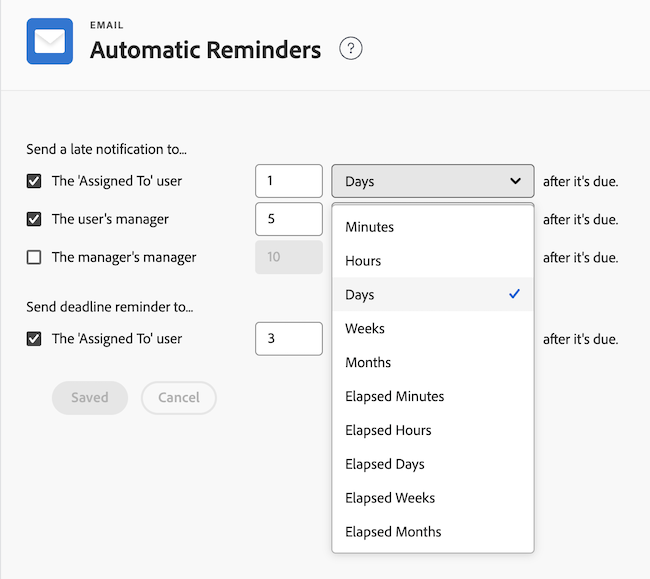

# Configurar lembretes automáticos

<!--DON'T DELETE, DRAFT OR HIDE THIS ARTICLE. IT IS LINKED TO THE PRODUCT, THROUGH THE CONTEXT SENSITIVE HELP LINKS.-->

Como administrador do Adobe Workfront, você pode configurar lembretes automáticos para acionar notificações por email quando todas as tarefas ou problemas estiverem vencidos, atrasados ou próximos à data planejada de conclusão. Após definir essas configurações, os usuários não poderão desativar lembretes automáticos.

Para notificações de atraso, o email é enviado à noite até que a tarefa ou o problema seja concluído.

Um lembrete automático pode ser enviado para um ou mais dos seguintes itens:

* Os usuários atribuídos a uma tarefa ou problema
* O gerente imediato do usuário
* O gerente do gerente imediato

>[!NOTE]
>
>Não é possível alterar o conteúdo ou a linha de assunto do email acionado por um lembrete automático.

## Requisitos de acesso

+++ Expanda para visualizar os requisitos de acesso para a funcionalidade neste artigo.

Você deve ter o seguinte acesso para executar as etapas deste artigo:

<table style="table-layout:auto"> 
 <col> 
 <col> 
 <tbody> 
  <tr> 
   <td role="rowheader">plano do Adobe Workfront</td> 
   <td>Qualquer</td> 
  </tr> 
  <tr> 
   <td role="rowheader">Licença do Adobe Workfront</td> 
   <td>Plano</td> 
  </tr> 
  <tr> 
   <td role="rowheader">Configurações de nível de acesso</td> 
   <td> 
Administrador do sistema
 </td> 
  </tr> 
 </tbody> 
</table>

+++

## Configurar lembretes automáticos

{{step-1-to-setup}}

1. Clique em **Email** > **Lembretes automáticos**.

1. Na área **Enviar uma notificação de atraso para**, selecione uma das seguintes opções:

   <table>
    <tr>
        <td>O usuário "Atribuído a"</td>
        <td>Selecione essa opção se desejar que o usuário atribuído a uma tarefa ou problema receba uma notificação de atraso sobre o atraso do item de trabalho.</td>
        <td></td>
    </tr>
    <tr>
        <td>O gerente do usuário</td>
        <td>Selecione essa opção se desejar que o gerente do usuário receba uma notificação atrasada sobre o atraso do item de trabalho do subordinado direto.</td>
        <td></td>
    </tr>
    <tr>
        <td>O gerente do gerente</td>
        <td>Selecione essa opção se desejar que o gerente imediato receba uma notificação de atraso sobre um item de trabalho de um dos usuários do subordinado direto atrasados.</td>
        <td></td>
    </tr>
    <tr>
        <td>O usuário "Atribuído a"</td>
        <td>(Na área <b>Enviar lembrete de prazo final para</b>.) Selecione esta opção se quiser que o usuário atribuído a uma tarefa ou um problema receba uma notificação sobre seu item de trabalho perto da data de vencimento.</td>
        <td></td>
    </tr>
   </table>

1. Selecione o tempo para o lembrete automático a ser enviado, selecionando o tempo antes ou depois da data de vencimento do item de trabalho.

   A hora é calculada a partir da Data de conclusão planejada da tarefa ou problema.

   Especifique o número de minutos, horas, dias, semanas ou meses para adicionar tempo à Data de conclusão planejada das tarefas ou problemas. Selecione **Minutos Decorridos**, **Horas Decorridas**, **Dias Decorridos** ou **Semanas Decorridas** para adicionar horas que incluam finais de semana, feriados e horas fora do horário comercial conforme indicado em sua agenda.

   Por exemplo, se uma tarefa for atribuída na sexta-feira e tiver uma duração de 3 dias decorridos, a data de conclusão da tarefa será definida para segunda-feira (supondo que sábado e domingo seja um fim de semana). Se a tarefa tiver uma duração de 3 dias (não decorridos), a data de conclusão da tarefa será definida para quarta-feira.

   

1. Clique em **Salvar**.

## Receber lembretes automáticos

Se você for a entidade designada em uma notificação de Lembrete automático, você receberá um email quando o prazo especificado for atingido. Para notificações de atraso, o email é enviado à noite até que a tarefa ou o problema seja concluído.

As tarefas com determinados tipos de dependência podem ser entregues após a data de início especificada, mesmo que estejam vencidas. Por exemplo, se uma tarefa tiver uma predecessora com uma dependência Finish-Start (fs), ela não será incluída no email, mesmo que tenha passado da data de início especificada, porque você não pode iniciar a tarefa até que a predecessora seja concluída.

Para obter mais informações sobre como receber emails de Lembretes automáticos, consulte a seção [Lembretes automáticos](../../../workfront-basics/using-notifications/wf-notifications.md#automatic-reminders) em [Notificações do Adobe Workfront](../../../workfront-basics/using-notifications/wf-notifications.md).

## Enviar lembretes automáticos

Os lembretes automáticos são enviados assim que a hora selecionada pelo administrador do Workfront é atingida.

Se quiser acionar o envio manual dos emails de lembrete automáticos, use o Diagnóstico. Para obter mais informações sobre como acessar e usar o Diagnóstico no Workfront, consulte [Usar Diagnóstico para acionar processos automatizados](../../../administration-and-setup/manage-workfront/run-diagnostics/use-diagnostics-to-trigger-automated-processes.md).
