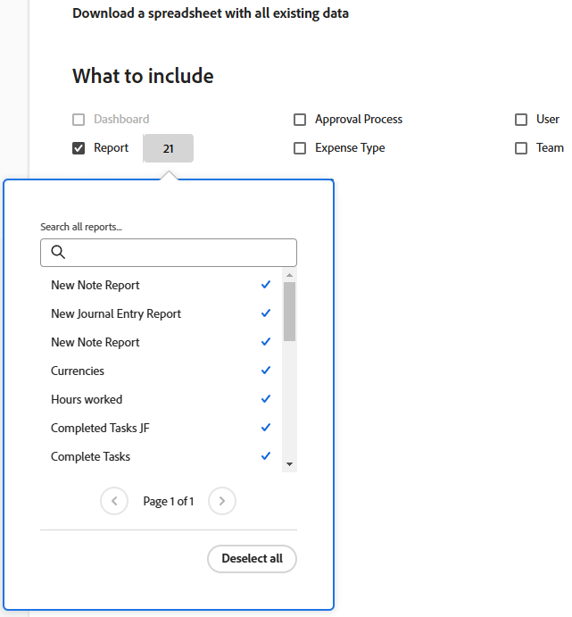

# Exportar dados do Workfront via Kick-Starts

<!-- Audited: 2/2024 -->

<!--

***DON'T DELETE, DRAFT OR HIDE THIS ARTICLE. IT IS LINKED TO THE PRODUCT, THROUGH THE CONTEXT SENSITIVE HELP LINKS. **

-->

Como administrador do Adobe Workfront, você pode usar o exportador de dados Kick-Starts para exportar dados do Workfront. Você pode usá-lo em outros aplicativos depois de exportá-lo.

A exportação de dados por meio do Kick-Starts também é útil para entender quais campos estão associados a cada objeto, como esses campos são codificados e como os valores desses campos são formatados no banco de dados.

## Requisitos de acesso

+++ Expanda para visualizar os requisitos de acesso para a funcionalidade neste artigo.

<table style="table-layout:auto"> 
 <col> 
 <col> 
 <tbody> 
  <tr> 
   <td>Pacote do Adobe Workfront</td> 
   <td>
Qualquer
</td> 
  </tr> 
  <tr> 
   <td>Licença do Adobe Workfront</td> 
   <td>
Standard

       
Plano
</td>
  </tr> 
  <tr> 
   <td>Configurações de nível de acesso</td> 
   <td>Administrador de Sistema</td> 
  </tr> 
 </tbody> 
</table>

Para obter informações, consulte [Requisitos de acesso na documentação do Workfront](/help/quicksilver/administration-and-setup/add-users/access-levels-and-object-permissions/access-level-requirements-in-documentation.md).

+++

## Vantagens e desvantagens de usar o kick-starts para exportar dados

Há duas maneiras de exportar dados no Workfront:

* Exportação de dados de um relatório ou lista

  Para obter mais informações sobre como exportar dados de um relatório ou lista, consulte [Exportar dados](../../../reports-and-dashboards/reports/creating-and-managing-reports/export-data.md).

* Exportação de dados por meio de inícios

A tabela a seguir mostra as vantagens e desvantagens de cada método:

<table style="table-layout:auto"> 
 <col> 
 <col> 
 <col> 
 <thead> 
  <tr> 
   <th>  </th> 
   <th> 
Os dados exportados incluem valores de objeto e campo
 </th> 
   <th> 
Capacidade de Exportar Dados em Vários Tipos de Objeto Simultaneamente
 </th> 
  </tr> 
 </thead> 
 <tbody> 
  <tr> 
   <td> 
<strong>Exportando Dados de uma Exibição de Lista</strong> 
 
Para obter mais informações sobre como exportar dados de uma lista, consulte <a href="../../../reports-and-dashboards/reports/creating-and-managing-reports/export-data.md" class="MCXref xref">Exportar dados</a>
 </td> 
   <td> 
Sim
 
Os campos nativos e os campos personalizados do Workfront associados aos objetos são exportados.
 </td> 
   <td> 
Não
 </td> 
  </tr> 
  <tr> 
   <td> 
<strong>Exportando Dados via Kick-Starts</strong> 
 </td> 
   <td> 
Sim (limitado)
 
A maioria dos campos nativos do Workfront associados aos objetos é exportada, mas alguns não são. Por exemplo, não é possível exportar os campos Agendamento, Proprietário do projeto ou Patrocinador do projeto por meio de uma exportação de início de projeto.
 
Em um projeto com um formulário personalizado anexado, os dados inseridos nos campos no formulário não são exportados.
 
Mas você pode exportar um formulário personalizado. O arquivo resultante lista os campos configurados no formulário, como caixas de texto e botões de opção.
 </td> 
   <td> 
Sim
 
Usar o Kick-Starts para exportar dados do Workfront permite exportar dados relacionados a vários tipos de objetos em uma única exportação. Por exemplo, você pode incluir tarefas, problemas e projetos em uma única exportação.
 </td> 
  </tr> 
 </tbody> 
</table>

## Exportar limites

As seguintes limitações existem ao exportar dados por meio de kick-starts (os dados são exportados em um formato de arquivo do Excel):

* **50.000 linhas:** o número de linhas permitidas no arquivo.
* **65.530 hiperlinks:** esse é um limite imposto pelo Excel a documentos que contêm mais de 65.530 hiperlinks. Esses documentos não podem ser abertos após serem exportados. Observe que um documento do Excel pode ter apenas 200 linhas de dados, mas se houver mais de 65.530 links dentro do documento, ele não abrirá.

## Exportar dados por meio de inicializações

{{step-1-to-setup}}

1. Clique em **Sistema** > **Kick-Starts** e em **Exportar Dados.**

1. Selecione o objeto que deseja exportar. Por padrão, os seguintes objetos são exibidos em **O que incluir**:

   <table style="table-layout:auto"> 
    <col> 
    <col> 
    <col> 
    <thead> 
     <tr> 
      <th> 
<strong>Objeto</strong> 
 </th> 
      <th> 
<strong>Planilhas Exportadas do Arquivo do Excel</strong> 
 </th> 
      <th> 
 <strong>Formato de exportação</strong>
 </th> 
     </tr> 
    </thead> 
    <tbody> 
     <tr> 
      <td scope="col" valign="top"> 
Painel
 
 
 
 
 </td> 
      <td scope="col" valign="top"> 
Parâmetro Opção de Parâmetro Grupo de Parâmetros Parâmetro de Categoria Categoria Relatório Seção da Guia Portal Painel Preferências
 </td> 
      <td scope="col" valign="top"> ZIP</td> 
     </tr> 
     <tr> 
      <td scope="col" valign="top"> 
Relatório
 
 
 
 
 </td> 
      <td scope="col" valign="top">Parâmetro Opção De Parâmetro Grupo De Parâmetros Parâmetro De Categoria Categoria Relatório Preferências</td> 
      <td scope="col" valign="top"> ZIP </td> 
     </tr> 
     <tr> 
      <td scope="col" valign="top"> 
Aprovação
 </td> 
      <td scope="col" valign="top"> 
Aprovador da etapa Etapa de aprovação Aprovação Processo de aprovação Preferências
 </td> 
      <td scope="col" valign="top"> 
 Excel
 </td> 
     </tr> 
     <tr> 
      <td scope="col" valign="top"> 
Dados personalizados
 </td> 
      <td scope="col" valign="top"> 
Parâmetro Opção de Parâmetro Grupo de Parâmetros Parâmetro de Categoria Categoria Preferências
 </td> 
      <td scope="col" valign="top"> 
 Excel
 </td> 
     </tr> 
     <tr> 
      <td scope="col" valign="top"> 
Tipo de Despesa
 </td> 
      <td valign="top"> 
Tipo de Despesa Preferências
 </td> 
      <td scope="col" valign="top"> 
Excel
 </td> 
     </tr> 
     <tr> 
      <td valign="top"> 
Tipo de hora
 </td> 
      <td valign="top"> 
Tipo de Hora Preferências
 </td> 
      <td scope="col" valign="top"> 
Excel
 </td> 
     </tr> 
     <tr> 
      <td valign="top"> 
Equipe
 </td> 
      <td valign="top"> Membro da Equipe Equipe Preferências </td> 
      <td scope="col" valign="top"> 
 Excel
 </td> 
     </tr> 
     <tr> 
      <td valign="top"> 
Usuário
 </td> 
      <td valign="top"> 
Preferências de Usuário
 </td> 
      <td valign="top"> 
 Excel
 </td> 
     </tr> 
    </tbody> 
   </table>

   >[!NOTE]
   >
   >Se a opção **Painel** não estiver disponível, significa que você não tem nenhum painel em seu sistema que seja compartilhado em todo o sistema. Não é possível exportar painéis privados.

1. Clique em **Mais Opções** para ver a lista completa de objetos.

   Todos os objetos listados aqui também podem ser usados para importar dados para o Workfront.

   A única exceção é o objeto **Níveis de Acesso**. A folha de dados Níveis de acesso incluída em uma exportação é fornecida apenas para fins de referência. Ele permite atribuir um nível de acesso a uma nova conta de usuário por ID.

   Para obter mais informações sobre como importar dados para o Workfront por meio de kick-starts, consulte [Importar dados para o Adobe Workfront usando um modelo de Kick-Start](../../../administration-and-setup/manage-workfront/using-kick-starts/import-data-via-kickstarts.md). Veja a seguir uma lista de todos os objetos que podem ser exportados por meio de kick-starts:

   <table style="table-layout:auto"> 
    <col> 
    <col> 
    <col> 
    <thead> 
     <tr> 
      <th> 
Objeto
 </th> 
      <th> 
Planilhas Exportadas do Arquivo do Excel
 </th> 
      <th> 
Formato de exportação
 </th> 
     </tr> 
    </thead> 
    <tbody> 
     <tr> 
      <td scope="col" valign="top">Nível de acesso</td> 
      <td scope="col" valign="top">Preferências de Nível de Acesso  </td> 
      <td scope="col" valign="top">Excel</td> 
     </tr> 
     <tr> 
      <td scope="col" valign="top">Atribuição</td> 
      <td scope="col" valign="top">Preferências de atribuição</td> 
      <td scope="col" valign="top">Excel</td> 
     </tr> 
     <tr> 
      <td scope="col" valign="top">Empresa</td> 
      <td scope="col" valign="top"> Empresa Preferências </td> 
      <td scope="col" valign="top">Excel</td> 
     </tr> 
     <tr> 
      <td scope="col" valign="top">Modelo de email</td> 
      <td scope="col" valign="top"> Modelo de email Preferências </td> 
      <td scope="col" valign="top">Excel</td> 
     </tr> 
     <tr> 
      <td scope="col" valign="top">Despesa</td> 
      <td valign="top"> Despesa Preferências </td> 
      <td scope="col" valign="top"> Excel</td> 
     </tr> 
     <tr> 
      <td valign="top">Página Externa</td> 
      <td valign="top"> Página Externa Preferências </td> 
      <td scope="col" valign="top">Excel</td> 
     </tr> 
     <tr> 
      <td valign="top">Filtro</td> 
      <td valign="top"> Filtrar  Preferências </td> 
      <td valign="top">ZIP </td> 
     </tr> 
     <tr> 
      <td valign="top">Grupo</td> 
      <td valign="top"> Grupo Preferências  </td> 
      <td valign="top">Excel</td> 
     </tr> 
     <tr> 
      <td valign="top">Agrupamento</td> 
      <td valign="top"> Agrupamento Preferências </td> 
      <td valign="top">ZIP</td> 
     </tr> 
     <tr> 
      <td valign="top">Hour</td> 
      <td valign="top"> Hora Preferências </td> 
      <td valign="top">Excel</td> 
     </tr> 
     <tr> 
      <td valign="top">Problema</td> 
      <td valign="top"> Preferências de Problema </td> 
      <td valign="top">Excel</td> 
     </tr> 
     <tr> 
      <td valign="top">Função no trabalho</td> 
      <td valign="top"> Função no trabalho Preferências </td> 
      <td valign="top">Excel</td> 
     </tr> 
     <tr> 
      <td valign="top">Caminho de Etapas</td> 
      <td valign="top"> Etapa Caminho da Etapa Preferências </td> 
      <td valign="top">Excel </td> 
     </tr> 
     <tr> 
      <td valign="top">Observação</td> 
      <td valign="top"> Nota Preferências </td> 
      <td valign="top">Excel</td> 
     </tr> 
     <tr> 
      <td valign="top">Portfólio</td> 
      <td valign="top"> Portfolio Preferências  </td> 
      <td valign="top">Excel</td> 
     </tr> 
     <tr> 
      <td valign="top">Projeto</td> 
      <td valign="top"> Fila Projeto Regra de Encaminhamento Tópico da Fila Preferências </td> 
      <td valign="top">Excel</td> 
     </tr> 
     <tr> 
      <td valign="top">Estimativa de Recursos</td> 
      <td valign="top"> Estimativa de Recursos Preferências </td> 
      <td valign="top">Excel</td> 
     </tr> 
     <tr> 
      <td valign="top">Conjunto de Recursos</td> 
      <td valign="top"> Preferências do Pool de Recursos  </td> 
      <td valign="top">Excel</td> 
     </tr> 
     <tr> 
      <td valign="top">Risco</td> 
      <td valign="top"> Risco Preferências  </td> 
      <td valign="top">Excel</td> 
     </tr> 
     <tr> 
      <td valign="top">Tipo de Risco</td> 
      <td valign="top"> Tipo de Risco Preferências  </td> 
      <td valign="top">Excel </td> 
     </tr> 
     <tr> 
      <td valign="top">Scorecard</td> 
      <td valign="top">Perguntas do Scorecard Opção de Scorecard Scorecard Preferências </td> 
      <td valign="top">Excel </td> 
     </tr> 
     <tr> 
      <td valign="top">Tarefa</td> 
      <td valign="top"> Preferências da Tarefa  </td> 
      <td valign="top">Excel </td> 
     </tr> 
     <tr> 
      <td valign="top">Modelo</td> 
      <td valign="top"> Fila Modelo Regra de Roteamento Tópico da Fila Preferências </td> 
      <td valign="top">Excel  </td> 
     </tr> 
     <tr> 
      <td valign="top">Atribuição de Modelo</td> 
      <td valign="top"> Atribuição de Modelo Preferências </td> 
      <td valign="top">Excel </td> 
     </tr> 
     <tr> 
      <td valign="top">Modelo de Tarefa</td> 
      <td valign="top"> Preferências de Modelo de Tarefa  </td> 
      <td valign="top">Excel </td> 
     </tr> 
     <tr> 
      <td valign="top">Planilha de horas</td> 
      <td valign="top"> Perfil de Planilha de Horas Planilha de Horas Preferências </td> 
      <td valign="top">Excel  </td> 
     </tr> 
     <tr> 
      <td valign="top"> Exibir </td> 
      <td valign="top"> Exibir  Preferências  </td> 
      <td valign="top">ZIP</td> 
     </tr> 
    </tbody> 
   </table>

1. Clique em **Baixar.**

   O arquivo de início inicial exportado é baixado no computador como um arquivo do Excel ou como um . arquivo zip que contém vários arquivos Excel e de propriedades. Cada arquivo do Excel é uma coleção de planilhas, em que cada planilha representa um campo associado ao objeto selecionado. Há uma planilha **Propriedades** associada a cada exportação.

   As opções **Painel** e **Relatório** permitem que você selecione painéis e relatórios específicos para incluir no download. Para painéis, você só pode exportar painéis que são compartilhados em todo o sistema.

   Não é possível exportar relatórios de matriz. Para obter mais informações sobre relatórios de matriz, consulte [Criar um relatório de matriz](../../../reports-and-dashboards/reports/creating-and-managing-reports/create-matrix-report.md).

   O Kick-Starts não é compatível com filtros ou agrupamentos do modo de texto. Para uma exportação bem-sucedida, os filtros e agrupamentos de relatórios devem ser alternados para o Modo Padrão.

   Você pode selecionar até 100 painéis e 100 relatórios em uma única exportação.

   

   É possível exportar vários objetos de uma só vez.

1. (Recomendado) Analise os dados exportados para garantir que todas as informações que você espera ver foram exportadas.

   Para exportações grandes, o Workfront trabalha em segundo plano para produzir o arquivo do Excel e fornece uma mensagem de aviso sobre o atraso. O arquivo de início é enviado por email para você quando o download é concluído.

