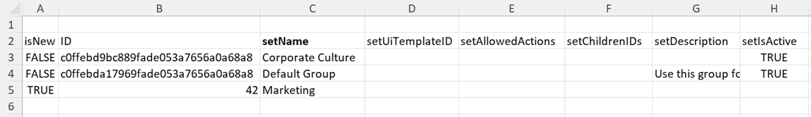

# Importar dados para o Workfront usando um modelo de Kick-Start

<!--Audited: 12/2023-->

Kick-Starts são pastas de trabalho do Excel com formatação especial, que você pode preencher com os dados que deseja importar para o Workfront. O Adobe Workfront fornece um modelo de Kick-Start que você pode usar para isso, conforme explicado em [Importador de dados de Kick-Starts](../../../administration-and-setup/manage-workfront/using-kick-starts/kick-starts-data-importer.md).

Esse processo é dividido em três tarefas principais:

* Primeiro, você exporta um modelo de Kick-Start como um arquivo de planilha
* Depois, você preenche a planilha com seus dados
* Por fim, você importa a planilha preenchida para o Workfront

Cada um desses procedimentos é descrito na ordem correta neste artigo.

## Requisitos de acesso

+++ Expanda para visualizar os requisitos de acesso da funcionalidade neste artigo.

<table style="table-layout:auto"> 
 <col> 
 <col> 
 <tbody> 
  <tr> 
   <td>Pacote do Adobe Workfront</td> 
   <td>
Qualquer
</td> 
  </tr> 
  <tr> 
   <td>Licença do Adobe Workfront</td> 
   <td>
Padrão

       
Plano
</td>
  </tr> 
  <tr> 
   <td>Configurações de nível de acesso</td> 
   <td>Administrador de sistema</td> 
  </tr> 
 </tbody> 
</table>

Para obter informações, consulte [Requisitos de acesso na documentação do Workfront](/help/quicksilver/administration-and-setup/add-users/access-levels-and-object-permissions/access-level-requirements-in-documentation.md).

+++

## Limitações

Você pode importar um grande número de objetos para o Workfront usando um modelo de Kick-Start. No entanto, considere as seguintes limitações:

* Importar dados usando esse método não atualiza as informações dos registros que já existem no Workfront.
* Você pode importar apenas novos registros e as respectivas informações.
* Importe no máximo 2.000 registros por vez para garantir que a importação não atinja o tempo-limite

## Exportar um modelo de Kick-Start como um arquivo de planilha

Ao exportar um modelo de Kick-Start, você recebe uma pasta de trabalho de planilha do Excel em branco. Depois de baixar a planilha para o computador, você poderá preenchê-la com suas informações e importá-la de volta para o Workfront.

Para exportar um modelo de Kick-Start:

{{step-1-to-setup}}

<!--
1. Click the **Main Menu** icon  in the upper-right corner of Adobe Workfront, then click **Setup** .
-->

1. Clique em **Sistema** > **Importar dados (Kick-Starts)**.

1. Selecione os tipos de informações que deseja incluir.

   Cada opção selecionada representa uma coleção de várias guias na planilha exportada. Por exemplo, se você selecionar a opção **Relatório**, todos os objetos necessários para criar um relatório serão incluídos na planilha (exibições, filtros, agrupamentos, relatórios).

   Você pode usar todos os tipos de objetos listados abaixo para importar dados para o Workfront. (A única exceção é a opção Níveis de acesso. A planilha de dados Níveis de acesso em uma exportação é fornecida para fins de referência. Ela permite atribuir um nível de acesso a uma nova conta de usuário por ID).

   O modelo de cada um dos tipos de objeto pode ser exportado nos seguintes formatos de arquivo e contém as seguintes folhas:

   <table style="table-layout:auto"> 
    <col> 
    <col> 
    <col> 
    <thead> 
     <tr> 
      <th> 
<strong>Objeto</strong> 
 </th> 
      <th> 
<strong>Exportar como</strong> 
 </th> 
      <th> 
<strong>Folhas na planilha exportada</strong> 
 </th> 
     </tr> 
    </thead> 
    <tbody> 
     <tr> 
      <td scope="col"> 
Painel
 
Todos os painéis compartilhados publicamente no sistema estão disponíveis para exportação. Não é possível exportar painéis que não foram compartilhados em todo o sistema. Você pode selecionar até 100 painéis específicos em uma única exportação.
 </td> 
      <td scope="col">Exportar como arquivo ZIP</td> 
      <td scope="col"> 
Parâmetro
 
Texto descritivo

Opção de parâmetro
 
Grupo de parâmetros
 
Parâmetro da categoria
 
Categoria
 
Relatório
 
Seção de guias do portal
 
Painel
 
Preferências
 </td> 
     </tr> 
     <tr> 
      <td scope="col"> 
Relatório
 
Todos os relatórios do sistema estão disponíveis para exportação. É possível selecionar até 100 relatórios específicos em uma única exportação.
 
O Kick-Start não permite o uso de filtros ou agrupamentos no Modo texto. Para uma exportação bem-sucedida, os filtros e agrupamentos de relatórios devem ser alternados para o Modo padrão.
 </td> 
      <td scope="col">Exportar como arquivo ZIP </td> 
      <td scope="col"> 
Parâmetro
 
Texto descritivo
 
Opção de parâmetro
 
Grupo de parâmetros
 
Parâmetro da categoria
 
Categoria
 
Relatório
 
Preferências
 </td> 
     </tr> 
     <tr> 
      <td scope="col"> 
Aprovação
 </td> 
      <td scope="col"> 
Exportar como arquivo do Excel
 </td> 
      <td scope="col"> 
Aprovador de estágio
 
Estágio de aprovação
 
Aprovação
 
Processo de aprovação
 
Preferências
 </td> 
     </tr> 
     <tr> 
      <td scope="col"> 
Dados personalizados
 </td> 
      <td scope="col"> 
Exportar como arquivo do Excel
 </td> 
      <td scope="col"> 
Parâmetro
 
Texto descritivo
  
Opção de parâmetro
 
Grupo de parâmetros
 
Parâmetro da categoria
 
Categoria
 
Preferências
 </td> 
     </tr> 
     <tr> 
      <td scope="col"> 
Tipo de despesa
 </td> 
      <td scope="col"> 
Exportar como arquivo do Excel
 </td> 
      <td> 
Tipo de despesa
 
Preferências
 </td> 
     </tr> 
     <tr> 
      <td> 
Tipo de hora
 </td> 
      <td scope="col"> 
Exportar como arquivo do Excel
 </td> 
      <td> 
Tipo de hora
 
Preferências
 </td> 
     </tr> 
     <tr> 
      <td> 
Equipe
 </td> 
      <td scope="col"> 
Exportar como arquivo do Excel
 </td> 
      <td> 
 Membro da equipe
 
Equipe
 
Preferências 
 </td> 
     </tr> 
     <tr> 
      <td> 
Usuário
 </td> 
      <td> 
Exportar como arquivo do Excel. Para ver a lista completa de opções, clique em <strong>Mais opções</strong>.
 </td> 
      <td> 
Usuário
 
Preferências
 </td> 
     </tr> 
     <tr> 
      <td>Nível de acesso</td> 
      <td>Exportar como arquivo do Excel</td> 
      <td> 
Nível de acesso
 
Preferências
 </td> 
     </tr> 
     <tr> 
      <td>Atribuição</td> 
      <td>Exportar como arquivo do Excel</td> 
      <td> 
Atribuição
 
Preferências
 </td> 
     </tr> 
     <tr> 
      <td>Empresa</td> 
      <td>Exportar como arquivo do Excel</td> 
      <td> 
 Empresa
 
Preferências 
 </td> 
     </tr> 
     <tr> 
      <td>Modelo de email</td> 
      <td>Exportar como arquivo do Excel</td> 
      <td> 
Modelo de email
 
Preferências 
 </td> 
     </tr> 
     <tr> 
      <td>Despesa</td> 
      <td>Exportar como arquivo do Excel</td> 
      <td> 
 Despesa
 
Preferências 
 </td> 
     </tr> 
     <tr> 
      <td>Página externa</td> 
      <td>Exportar como arquivo do Excel</td> 
      <td> 
 Página externa
 
Preferências 
 </td> 
     </tr> 
     <tr> 
      <td>Filtro</td> 
      <td>Exportar como um arquivo ZIP</td> 
      <td> 
 Filtro
 
Preferências 
 </td> 
     </tr> 
     <tr> 
      <td>Grupo</td> 
      <td>Exportar como arquivo do Excel</td> 
      <td> 
 Grupo
 
Preferências 
 </td> 
     </tr> 
     <tr> 
      <td>Agrupamento</td> 
      <td>Exportar como um arquivo ZIP</td> 
      <td> 
 Agrupamento
 
Preferências 
 </td> 
     </tr> 
     <tr> 
      <td>Hora</td> 
      <td>Exportar como arquivo do Excel</td> 
      <td> 
 Hora
 
Preferências 
 </td> 
     </tr> 
     <tr> 
      <td>Problema</td> 
      <td>Exportar como arquivo do Excel</td> 
      <td> 
 Problema
 
Preferências 
 </td> 
     </tr> 
     <tr> 
      <td>Função no trabalho</td> 
      <td>Exportar como arquivo do Excel</td> 
      <td> 
 Função no trabalho
 
Preferências 
 </td> 
     </tr>

   <tr> 
      <td>Caminho de marcos</td> 
      <td> Exportar como arquivo do Excel</td> 
      <td> 
 Marco
 
Caminho de marcos
 
Preferências 
 </td> 
     </tr>

   <tr> 
      <td>Nota</td> 
      <td>Exportar como arquivo do Excel</td> 
      <td> 
 Nota
 
Preferências 
 </td> 
     </tr> 
     <tr> 
      <td>Portfólio</td> 
      <td>Exportar como arquivo do Excel</td> 
      <td> 
 Portfólio
 
Preferências 
 </td> 
     </tr> 
     <tr> 
      <td>Projeto</td> 
      <td>Exportar como arquivo do Excel</td> 
      <td> 
 Fila
 
Projeto
 
Regra de roteamento
 
Tópico da fila
 
Preferências 
 </td> 
     </tr> 
     <tr> 
      <td>Estimativa de recursos</td> 
      <td>Exportar como arquivo do Excel</td> 
      <td> 
 Estimativa de recursos
 
Preferências 
 </td> 
     </tr> 
     <tr> 
      <td>Risco</td> 
      <td>Exportar como arquivo do Excel</td> 
      <td> 
 Risco
 
Preferências 
 </td> 
     </tr> 
     <tr> 
      <td>Tipo de risco</td> 
      <td> Exportar como arquivo do Excel</td> 
      <td> 
 Tipo de risco
 
Preferências
 </td> 
     </tr> 
     <tr> 
      <td>Cartão de pontuação</td> 
      <td>Exportar como arquivo do Excel</td> 
      <td> 
Pergunta do cartão de pontuação
 
Opção de cartão de pontuação
 
Cartão de pontuação
 
Preferências 
 </td> 
     </tr> 
     <tr> 
      <td>Tarefa</td> 
      <td>Exportar como arquivo do Excel</td> 
      <td> 
 Tarefa
 
Preferências 
 </td> 
     </tr> 
     <tr> 
      <td>Modelo</td> 
      <td> Exportar como arquivo do Excel</td> 
      <td> 
 Fila
 
Modelo
 
Regra de Roteamento
 
Tópico da fila
 
Preferências 
 </td> 
     </tr> 
     <tr> 
      <td>Atribuição do modelo</td> 
      <td>Exportar como arquivo do Excel</td> 
      <td> 
 Atribuição do modelo
 
Preferências 
 </td> 
     </tr> 
     <tr> 
      <td>Tarefa de modelo</td> 
      <td>Exportar como arquivo do Excel</td> 
      <td> 
 Tarefa de modelo
 
Preferências 
 </td> 
     </tr> 
     <tr> 
      <td>Folha de horas</td> 
      <td> Exportar como arquivo do Excel</td> 
      <td> 
 Perfil da folha de horas
 
Folha de horas
 
Preferências 
 </td> 
     </tr> 
     <tr> 
      <td>Visualizar </td> 
      <td> 
Exportar como arquivo ZIP
 </td> 
      <td> 
 Visualizar
 
Preferências 
 </td> 
     </tr> 
    </tbody> 
   </table>

1. Clique em **Baixar**.
1. Continue com [Preencher o modelo de planilha com seus dados](#populate-the-spreadsheet-template-with-your-data) para preencher o modelo de planilha em branco com suas informações.

## Preencher o modelo de planilha com seus dados {#populate-the-spreadsheet-template-with-your-data}

* [Visão geral das abas (folhas de dados) incluídas na planilha](#overview-of-the-tabs-data-sheets-included-in-the-spreadsheet)
* [Importar um registro](#import-a-record)
* [Incluir datas](#include-dates)
* [Usar curingas](#use-wildcards)
* [Substituição de nome de atributo para IDs](#attribute-name-substitution-for-ids)

### Visão geral das abas (folhas de dados) incluídas na planilha

>[!TIP]
>
>Para entender melhor como você precisará formatar as informações em cada coluna ao preencher o modelo Kick-Start, considere fazer um teste exportando um Kick-Start com dados existentes do Workfront nos objetos que você está tentando importar. Para obter instruções, consulte [Exportar dados do Adobe Workfront via Kick-Starts](../../../administration-and-setup/manage-workfront/using-kick-starts/export-data-from-wf-via-kick-starts.md).

Ao abrir um modelo Kick-Starts em branco, várias abas (folhas de dados) são disponibilizadas. Elas dependem dos objetos que você selecionou para download. Cada uma representa um objeto no aplicativo, como projeto, tarefas, horas, painel e usuários:

Ao abrir uma dessas abas, a linha 2 exibe os campos de cada objeto que podem ser definidos durante uma importação. Em um cabeçalho de coluna, após a palavra “set”, o nome do campo é exibido conforme aparece no banco de dados. Esses campos funcionam como cabeçalhos de coluna.

>[!IMPORTANT]
>
>Para evitar erros, certifique-se do seguinte:
>
>* Não exclua a primeira linha vazia de uma planilha de kick-start.
>* Não exclua, modifique nem reorganize esses campos (cabeçalhos de coluna) de nenhuma forma. Por exemplo, não altere a ordem nem os nomes deles.
>* Adicione valores a todos os campos que aparecem em negrito no cabeçalho da coluna. Esses representam campos obrigatórios.
>
>     No entanto, se um campo obrigatório contiver um valor padrão definido nas preferências do sistema, você não precisará preenchê-lo.
>
>     Por exemplo, na aba **PROJ Project**, os campos **setCondition** e **setConditionType** podem ser deixados em branco, mas não as colunas **setGroupID** e **setName**.
>
>* Determinados campos, incluindo **setResourceRevenue** e **setEnteredByID**, são gerados automaticamente pelo sistema. Se você inserir dados nesses campos na planilha, o processo de kick-start os substituirá quando você fizer o upload da planilha.

### Importar um registro  {#import-a-record}

Cada linha da planilha corresponde a um objeto exclusivo.

1. Adicionar informações na coluna **isNew**:

   * Se o objeto que você está importando for novo, digite **TRUE** para importar os dados na linha. Esse valor diferencia maiúsculas de minúsculas e sempre deve estar em letras maiúsculas
   * Se o objeto já estiver no Workfront, digite **FALSE** na coluna **isNew** para ignorar a linha. Esse valor diferencia maiúsculas de minúsculas e sempre deve estar em letras maiúsculas

      * Os registros que já existem no Workfront não são atualizados.
      * Se você baixou um modelo com dados do Workfront, os objetos existentes já estarão marcados com **FALSE**.
      * Se você baixou um modelo em branco, não precisará adicionar novas linhas para objetos existentes.

1. Adicione informações na coluna **ID** de uma das seguintes maneiras:

   * Se o objeto que você está importando for novo (e você digitou **TRUE** na coluna **isNew**), digite qualquer número para a ID. Esse número deve ser exclusivo na planilha. Por exemplo, se você importar três objetos, poderá fornecer a eles a ID 1, 2 e 3, respectivamente.

   * Se o objeto já existir no Workfront (e **FALSE** estiver na coluna **isNew**) e você estiver importando novas informações sobre objetos existentes, a ID deverá ser o GUID alfanumérico que existe no Workfront para esse objeto.

   >[!TIP]
   >
   > Para descobrir o GUID exclusivo de um objeto no Workfront, você pode criar um relatório para esse objeto e adicionar a coluna ID ao relatório. O valor de cada objeto nessa coluna é o GUID do objeto.

   * Os registros que já existem no Workfront não são atualizados.
   * Se você baixou um modelo com dados, os objetos existentes já conterão o GUID como a ID.
   * Você pode importar um novo objeto com base em um objeto existente alterando **FALSE** para **TRUE** na coluna **isNew**, alterando a ID e fazendo os ajustes necessários nos dados antes da importação.

   

   * Ao importar um projeto, você deve indicar uma ID de grupo.

      * Se o grupo já existir no Workfront, você deverá adicionar a ID exclusiva ao campo **setGroupID** do projeto.
      * Se o grupo não existir no Workfront, você poderá adicionar a planilha **Grupo GROUP** ao arquivo de importação, definir o campo **isNew** como **TRUE** na planilha Grupo e indicar uma ID numérica para o novo grupo na coluna **ID**. O campo **setGroupID** do novo projeto deve corresponder à **ID** numérica do novo grupo.

     **Exemplo:** para um projeto, o valor exibido na coluna **setGroupID** deve ser um dos seguintes:

      * O GUID de um grupo existente na instância do Workfront
      * O valor (número) na coluna ID da planilha **Grupo GROUP** se você estiver criando um novo grupo durante a importação

1. Insira valores nos campos obrigatórios e quaisquer outros campos que você deseje preencher durante a importação.
1. (Opcional) Para adicionar dados personalizados:

   * Crie uma nova coluna para cada campo personalizado que você deseje incluir no processo de importação.
   * Nomeie cada nova coluna do campo personalizado correspondente da seguinte maneira: **DE:[nome do campo personalizado conforme exibido no Workfront]**. Por exemplo, você pode criar o seguinte campo personalizado: “DE: departamentos”.
   * Na coluna **setCategoryID**, digite o GUID do formulário personalizado existente no qual o campo personalizado reside. Esse campo é exigido ao importar dados personalizados.
   * Se precisar adicionar múltiplos valores de dados no campo personalizado (como botões de opção, caixas de seleção ou listas), use o delimitador de dados personalizados de barra vertical “|” listado na guia Preferências para separar os valores.

     **Exemplo:** digite A|D na coluna DE:Departments para preencher o departamento A e o departamento D no formulário personalizado.

     >[!NOTE]
     >
     >Use o delimitador “|” somente para separar valores de campos personalizados. Você não pode usá-lo em nenhuma outra coluna da planilha, incluindo **setCategoryID**.

### Incluir datas  {#include-dates}

O Workfront pode processar a maioria dos formatos de data. No entanto, você deve garantir que a coluna de data na planilha seja formatada como uma data. A importação falhará se a coluna estiver formatada como geral, um número ou texto.

>[!TIP]
>
>O formato mais popular é DD/MM/AAAA.
>
>Por exemplo, 10/07/2023.

O Workfront também aceita valores de hora como parte da data.

Por exemplo: 10/07/2022 01:30 ou 10/07/2022 1:00 PM.

Se você omitir uma hora na data, o Workfront executará um dos seguintes procedimentos:

* Presumirá que a hora seja 12:00 AM. Para ver o resultado de data esperado, o fuso horário do sistema deve corresponder ao seu fuso horário.
* Se estiver em um objeto associado a um cronograma, a hora será ajustada para o horário mais cedo permitido pelo cronograma.

>[!NOTE]
>
>Ao usar um carimbo de data e hora UNIX, você deve incluir três zeros adicionais no final do valor.
>
>Por exemplo, se o carimbo de data e hora for 7336899000, você deve inserir 7336899000000 na célula.

### Usar curingas {#use-wildcards}

Você pode usar os seguintes curingas ao preencher a planilha de modelo Kick-Start:

<table style="table-layout:auto"> 
 <col> 
 <col> 
 <thead> 
  <tr> 
   <th> 
<strong>Curinga</strong> 
 </th> 
   <th> 
<strong>Comportamento</strong> 
 </th> 
  </tr> 
 </thead> 
 <tbody> 
  <tr> 
   <td> 
$$TODAY
 </td> 
   <td> 
Quando usado em um campo <strong>setDate</strong>, esse curinga define a data como meia-noite do dia em que você importa o Kick-Start.
 
Você pode modificar o curinga usando a sintaxe padrão permitida com o curinga em um filtro.
 
Example: </b>"><b>Exemplo: </b>se você quiser que um projeto comece na segunda-feira da semana em que for importado, independentemente do dia em que você for realizar a importação, poderá usar <strong>$$TODAYbw</strong>. Isso define a data de início planejada do seu projeto como 00h00 do domingo. Como a agenda do projeto provavelmente não permite trabalho nesse horário, ele começará às 9:00 da manhã de segunda-feira.
 </td> 
  </tr> 
  <tr> 
   <td> 
$$NOW
 </td> 
   <td> 
Quando usado em um campo <strong>setDate</strong>, esse curinga define a data de acordo com o momento em que você cria o registro durante a importação do Kick-Start.
 
Você pode modificar o curinga usando a sintaxe padrão permitida com o curinga em um filtro.
 
Example: </b>"><b>Exemplo: </b>se quiser que um projeto seja iniciado 3 horas após ser importado, você poderá usar <strong>$$NOW+3h</strong>.
 </td> 
  </tr> 
  <tr> 
   <td> 
$$USER.ID
 </td> 
   <td> 
Quando usado em um <strong>setAssignedToID</strong> ou outro campo baseado em userID, esse curinga atribui o trabalho ou associa o registro à pessoa que está executando a importação.
 </td> 
  </tr> 
  <tr> 
   <td> 
$$CUSTOMER
 </td> 
   <td> 
Este curinga foi adicionado especificamente para importações de usuários de Kick-Start. Ao criar uma conta do Workfront, um usuário com nível de acesso de admin do sistema é criado. O nome de usuário atribuído ao(à) admin padrão pode ser usado como um prefixo ao criar outros usuários na conta.
 
Como os nomes de usuário devem ser únicos para todos os clientes, isso é útil quando você tem várias pessoas com nomes de usuário muito comuns, como John Smith, que pode ter o nome de usuário “jsmith”. Ao prefixar a atribuição do nome de usuário com o nome de usuário padrão do(a) admin, você garante que cada nome de usuário seja único (por exemplo: <strong>$$CUSTOMER.jsmith</strong>).
 
Dica: uma maneira mais elegante de garantir que os nomes de usuário sejam únicos em todo o sistema é inserir o endereço de email da pessoa no campo <strong>setUsername</strong>.
 </td> 
  </tr> 
 </tbody> 
</table>

### Substituição de nome de atributo para IDs  {#attribute-name-substitution-for-ids}

Embora seja uma prática recomendada usar IDs sempre que possível, às vezes é inconveniente cruzar referências de IDs de uma folha para outra ao definir um valor **setAttributeID**. Você pode referenciar valores pelo nome simplesmente alterando o cabeçalho da coluna.

**Exemplos:**

* **Importação de projeto**

  Ao importar projetos, defina o **setGroupID** dos projetos acessando a folha **Grupo GROUP**, anotando os respectivos IDs de grupo e colando-os nas células corretas (coluna **setGroupID**) na planilha **Projeto PROJ**.

  Isso é viável quando se trabalha com apenas alguns grupos e projetos, mas se você estiver trabalhando com vários de cada, isso não é prático.

  Para realizar a substituição de nome de atributo do exemplo descrito acima, altere o cabeçalho da coluna **setGroupID** para **#setGroupID nome do GROUP**. Você pode então referenciar o grupo de cada projeto pelo nome.

  >[!NOTE]
  >
  >A opção de usar a substituição de nome de atributo é limitada apenas a referências para registros existentes. Você não pode usar a substituição de nomes para objetos que está criando na mesma importação.

* **Importação de usuários**

  Ao importar usuários, preencha o **setRoleID** a partir de uma lista de funções na aba **Função ROLE**.

  Algumas das IDs de função são para registros que já existem na conta, e outras estão sendo criadas durante a importação.

  Para os novos registros de usuários atribuídos a funções existentes, você pode usar a substituição de nomes. No entanto, isso não é possível para os novos registros de usuários atribuídos a funções recém-importadas.

  Veja como você pode usar os dois métodos no mesmo arquivo de importação:

   * Adicione uma coluna na planilha à esquerda da coluna **setRoleID**.
   * Nomeie a nova coluna como **#setRoleID nome de ROLE**.
   * Para atribuir funções a registros existentes, insira os nomes das funções na coluna **#setRoleID nome de ROLE**.

     Para atribuir funções a novos registros de função, insira a ID que você atribuiu na folha Função ROLE no campo setRoleID.

     

## Importar os dados da planilha para o Workfront

Depois de preencher o modelo do Excel com seus dados, você pode fazer upload deles para o Workfront.

A importação de Kick-Start é compatível com os seguintes tipos de arquivo:

* Excel (.xls ou .xlsx)
* Arquivo compactado (.ZIP) (que contém apenas arquivos .xlsx ou .xls)

  >[!NOTE]
  >
  >Você deve usar um arquivo .ZIP ao importar planilhas do Excel que fazem referência aos seguintes objetos:
  >
  >* Relatórios
  >* Documentos
  >* Avatares
  >* Visualizar, filtrar ou agrupar arquivos de propriedade
  >
  >Ao usar um arquivo de importação compactado, o arquivo .ZIP deve ter o mesmo nome do arquivo .xlsx ou .xls e todos os arquivos devem estar no mesmo nível de estrutura (sem pastas).

Para importar os dados da planilha de modelo para o Workfront:

<!--1. Click the **Main Menu** icon  in the upper-right corner of Adobe Workfront, then click **Setup** .-->

{{step-1-to-setup}}

1. Clique em **Sistema** > **Importar dados (Kick-Starts)**.

1. Na seção **Carregar dados com planilha do Kick-Start**, clique em **Escolher arquivo**, procure e selecione a planilha preenchida.

   O arquivo é carregado automaticamente, e uma notificação de que a importação foi bem-sucedida é exibida.

   Se o arquivo do Excel levar mais de 5 minutos para ser carregado para o Workfront, o aplicativo expirará e o Workfront não poderá carregar o arquivo. Tente importar os dados em lotes menores de objetos.

1. (Condicional) Se a importação não tiver sido bem-sucedida, você receberá uma mensagem de erro informando qual é o problema. Tente identificar o campo, a planilha e o número da linha em que o problema foi encontrado e corrija as informações no arquivo do Excel. Em seguida, tente importar o arquivo mais uma vez.
1. (Condicional) Se estiver usando o Workfront Fusion, agora você poderá ativar os FLOs ou cenários quando a importação for concluída.
