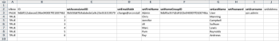

# Cenário de início: Preparação de Empresa, Grupo, Função e Início do Usuário

Ao implementar a Adobe Workfront, em vez de inserir dados manualmente, você pode importar a lista de clientes, os departamentos internos, as funções do trabalho e as informações do usuário.

## Requisitos de acesso

Você deve ter o seguinte acesso para executar as etapas neste artigo:

<table style="table-layout:auto"> 
 <col> 
 <col> 
 <tbody> 
  <tr> 
   <td role="rowheader">Plano Adobe Workfront</td> 
   <td>Qualquer Um</td> 
  </tr> 
  <tr> 
   <td role="rowheader">Licença Adobe Workfront</td> 
   <td>Plano</td> 
  </tr> 
  <tr> 
   <td role="rowheader">Configurações de nível de acesso</td> 
   <td> 
Você deve ser um administrador do Workfront.
 
<b>OBSERVAÇÃO</b>: Caso ainda não tenha acesso, pergunte ao administrador do Workfront se ele definiu restrições adicionais em seu nível de acesso. Para obter informações sobre como um administrador do Workfront pode modificar seu nível de acesso, consulte <a href="../../../administration-and-setup/add-users/configure-and-grant-access/create-modify-access-levels.md" class="MCXref xref">Criar ou modificar níveis de acesso personalizados</a>.
 </td> 
  </tr> 
 </tbody> 
</table>

## O que você pode importar

A tabela a seguir exibe Empresas, Grupos e Funções a serem importadas:

<table style="table-layout:auto"> 
 <col> 
 <col> 
 <col> 
 <thead> 
  <tr> 
   <th><strong>Empresas</strong> </th> 
   <th><strong>Grupos</strong> </th> 
   <th><strong>Funções</strong> </th> 
  </tr> 
 </thead> 
 <tbody> 
  <tr> 
   <td valign="top"> 
Acme, Co
 
Workfront, Inc.
 
<em>Sua empresa</em> 
 
XYZ, Inc.
 </td> 
   <td valign="top"> 
Finanças
 
IT 
 
Marketing 
 
Vendas
 </td> 
   <td valign="top"> 
Analista de negócios
 
Controladora criativa
 
Projetista
 
Gerenciador de Recursos
 
Scrum Principal
 
Escritor técnico
 
Desenvolvedor da Web
 </td> 
  </tr> 
 </tbody> 
</table>

Os nomes de função devem ser exclusivos, as funções de trabalho existentes não podem ser importadas.

As tabelas a seguir exibem os usuários a serem importados e vários atributos de usuário para cada:

### Usuário 1

| **Nome** | Chris |
|---|---|
| **Sobrenome** | Manejo |
| **Nome de usuário/Email** | mailto:cmanning@foo.com |
| **Senha** | updateMe |
| **Acesso** | Integrante da Equipe |
| **Empresa** | &lt;*Sua empresa>* |
| **Grupo padrão** | Marketing |
| **Função de trabalho** | Analista de negócios |

{style=&quot;table-layout:auto&quot;}

### Usuário 2

| **Nome** | Jennifer |
|---|---|
| **Sobrenome** | Campbell |
| **Nome de usuário/Email** | jcampbell@foo.com |
| **Senha** | updateMe |
| **Acesso** | Gerente de Projeto |
| **Empresa** | &lt;*Sua empresa>* |
| **Grupo padrão** | Marketing |
| **Função de trabalho** | Gerente de Projeto |

{style=&quot;table-layout:auto&quot;}

### Usuário 3

| **Nome** | Jill |
|---|---|
| **Sobrenome** | Sullivan |
| **Nome de usuário/Email** | jsullivan@foo.com |
| **Senha** | updateMe |
| **Acesso** | Help Desk |
| **Empresa** | &lt;*Sua empresa>* |
| **Grupo padrão** | Vendas |
| **Função de trabalho** | Representante de vendas |

{style=&quot;table-layout:auto&quot;}

### Usuário 4

| **Nome** | Marc |
|---|---|
| **Sobrenome** | Lewis |
| **Nome de usuário/Email** | mlewis@foo.com |
| **Senha** | updateMe |
| **Acesso** | Gerente de Portfólio |
| **Empresa** | &lt;*Sua empresa>* |
| **Grupo padrão** | Finanças |
| **Função de trabalho** | Controlador |

{style=&quot;table-layout:auto&quot;}

### Usuário 5

| **Nome** | Pam |
|---|---|
| **Sobrenome** | Reynolds |
| **Nome de usuário/Email** | preynolds@foo.com |
| **Senha** | updateMe |
| **Acesso** | Gerente de Projeto |
| **Empresa** | *Sua empresa>* |
| **Grupo padrão** | Marketing |
| **Função de trabalho** | IT |

{style=&quot;table-layout:auto&quot;}

### Usuário 6

| **Nome** | Ray |
|---|---|
| **Sobrenome** | Andrews |
| **Nome de usuário/Email** | randrews@foo.com |
| **Senha** | updateMe |
| **Acesso** | Administrador |
| **Empresa** | *Sua empresa>* |
| **Grupo padrão** | Gerenciador de Recursos |
| **Função de trabalho** | nenhum |

{style=&quot;table-layout:auto&quot;}

## Baixar um modelo de início rápido

1. Clique no botão **Menu principal** ícone  no canto superior direito do Adobe Workfront, em seguida, clique em **Configuração** .

1. Clique em **Sistema** > **Primeiros Passos** > **Importar dados.**

1. Clique em **Mais opções** para ver a lista completa de opções de importação.
1. Selecione os objetos Nível de Acesso, Empresa, Grupo, Função de Trabalho e Usuário que deseja importar.

## Informações da empresa de entrada

1. Abra o **Workfront.xlsx** arquivo que você acabou de baixar.

   >[!TIP]
   >
   >Ao trabalhar com planilhas muito amplas, você pode usar a ferramenta Painel de Congelamento (ou equivalente) do seu editor de planilhas para facilitar o trabalho com a planilha.

1. Vá para a planilha &quot;CMPY Company&quot;.

   Deve estar vazio a menos que as empresas já estejam no sistema. 

   

1. Especifique TRUE no **isNew** coluna.
1. Repita essa ação para cada empresa que está sendo adicionada. (Neste exemplo, conclua essa ação para as linhas 3 a 6, pois quatro empresas estão sendo adicionadas.)

   

1. Especifique uma ID exclusiva.

   Isso deve ser feito para cada linha da coluna ID. Os inteiros que começam em 1 funcionam bem ao criar novos registros.

   

1. Defina um Nome.

   Especifique os nomes de cada cliente na **setName** coluna.

   

1. Vá para a folha Grupo GRUPO.

   A menos que você já tenha criado grupos no Workfront, esta planilha deverá exibir somente o Grupo padrão provisionado com cada conta do Workfront.

    

1. Defina as **isNew** column.De acordo com o cenário, 4 grupos serão importados, portanto, especifique TRUE nas linhas 4 a 7 para a coluna &#39;isNew&#39;.
1. Especifique uma ID exclusiva.

   Isso deve ser feito para cada linha da coluna ID. Os inteiros que começam em 1 funcionam bem ao criar novos registros.

   

1. Defina um Nome.

   Especifique os nomes de cada departamento no **setName** coluna.

   

   Especifique as informações da função. Vá para a folha Função de FUNÇÃO.

1. A menos que você já tenha criado ou excluído funções em sua conta, esta planilha deverá exibir 8 funções provisionadas com cada conta do Workfront.

   

1. Defina a instrução True.

   Sete Funções de Trabalho estão importando, insira TRUE nas linhas 12 a 18 para a coluna &#39;isNew&#39;.

   

1. Especifique uma ID exclusiva.

   Isso deve ser feito para cada linha da coluna ID. Os inteiros que começam em 1 funcionam bem ao criar novos registros.

   

   

1. Forneça os nomes de cada função digitando-a na coluna setName.

   

1. Forneça detalhes adicionais, conforme necessário.

   Inclua taxas de faturamento, taxas de custo e descrições para as Funções que você está criando, conforme necessário.

1. Vá para a folha Usuário do USUÁRIO para inserir Informações do usuário.

   A menos que você já tenha criado usuários em sua conta, esta planilha deve exibir somente o Usuário administrador que está provisionado com cada conta do Workfront.

    

1. Defina o valor True especificando TRUE nas linhas 4 a 9 para a coluna &#39;isNew&#39;, pois seis usuários estão sendo importados.

   

1. Defina uma ID exclusiva especificando uma ID exclusiva em cada linha para a coluna ID. Normalmente, os números inteiros que começam em 1 funcionam bem para novos registros.

   

1. Insira os nomes de cada usuário nas colunas &quot;setFirstName&quot; e &quot;setLastName&quot;.

   

1. Defina valores de detalhes especificando valores nas colunas &#39;setEmail&#39;, &#39;setPassword&#39; e &#39;setUsername&#39;.

   

1. Especifique os valores de Nível de Acesso.

   Por exemplo, Chris Manning, que é membro da equipe, procure a ID na folha de Nível de Acesso ACSLVL para o nível de acesso do Membro da equipe. Copie a ID na área de transferência e, na planilha Usuário do USUÁRIO, cole-a no **setAccessLevelID** coluna na linha do Chris.

   Repita essa etapa para cada usuário e nível de acesso.

    

1. Especifique os detalhes do Grupo Doméstico.

   De acordo com o cenário, Chris Manning pertence ao grupo de Marketing. Na planilha Grupo de GRUPOS, localize a ID do grupo de Marketing, copie-a na área de transferência e na planilha Usuário do USUÁRIO, cole-a na **setHomeGroupID** coluna na linha do Chris. &#x200B;Repita essa etapa para cada atribuição de usuário e grupo.

    

1. Especifique os detalhes da empresa.

   Todos os usuários nesse cenário pertencem à mesma empresa. Na planilha Empresa CMPY, localize a ID da *Sua própria empresa *, copie a ID na área de transferência e, na guia Usuário do USUÁRIO, cole esse valor em cada linha da coluna &#39;setCompanyID&#39;. &#x200B;

   Repita essa etapa para cada atribuição de usuário e grupo.

   

   

1. Especifique os detalhes da Função de Trabalho.

   De acordo com o cenário, Chris Manning terá o papel de Analista de Negócios. Na folha Função de FUNCIONAMENTO, localize a ID da função do Analista de negócios, copie-a na área de transferência e, na folha Usuário do USUÁRIO, cole-a na coluna &quot;setRoleID&quot; na linha do Chris. &#x200B;Repita essa etapa para cada atribuição de usuário e grupo.

   

   

1. Preencha outros detalhes do usuário, conforme necessário, e salve o arquivo.
1. Importe o arquivo Excel.

   Siga as instruções fornecidas no **Importando arquivos de início rápido** seção deste artigo.
