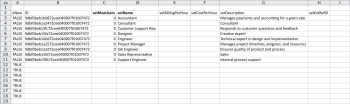

# Cenário de lançamentos: empresa, grupo, função e preparação de lançamentos do usuário

Ao implementar o Adobe Workfront, em vez de inserir dados manualmente, você pode importar a lista de clientes, os departamentos internos, as funções de trabalho e as informações do usuário.

## Requisitos de acesso

+++ Expanda para visualizar os requisitos de acesso para a funcionalidade neste artigo.

Você deve ter o seguinte acesso para executar as etapas deste artigo:

<table style="table-layout:auto"> 
 <col> 
 <col> 
 <tbody> 
  <tr> 
   <td role="rowheader">plano do Adobe Workfront</td> 
   <td>Qualquer</td> 
  </tr> 
  <tr> 
   <td role="rowheader">Licença do Adobe Workfront</td> 
   <td>
   
 Novo: Padrão

   ou
   
Atual: Plano
</td> 
  </tr> 
  <tr> 
   <td role="rowheader">Configurações de nível de acesso</td> 
   <td>[!UICONTROL Administrador do Sistema]</td> 
  </tr> 
 </tbody> 
</table>

Para obter mais detalhes sobre as informações nesta tabela, consulte [Requisitos de acesso na documentação do Workfront](/help/quicksilver/administration-and-setup/add-users/access-levels-and-object-permissions/access-level-requirements-in-documentation.md).

+++

## O que pode ser importado

A tabela a seguir exibe as empresas, grupos e funções a serem importados:

| Empresas | Grupos | Funções |
|---|---|---|
| Acme, Co 
Workfront, Inc. 
_Sua Empresa_ 
XYZ, Inc. | Finanças 
IT 
Marketing 
Vendas | Analista de negócios 
Creative da controladora 
Designer 
Gerenciador de Recursos 
Scrum Master 
Redator técnico 
Desenvolvedor da Web |

{style="table-layout:auto"}

Os nomes das funções devem ser exclusivos. As funções de trabalho existentes não podem ser importadas.

As tabelas a seguir exibem os usuários a serem importados e vários atributos de usuário para cada um:

### Usuário 1

| Atributo | Valor |
|---|---|
| **Nome** | Chris |
| **Sobrenome** | Tripulação |
| **Nome de Usuário/Email** | mailto:cmanning@foo.com |
| **Senha** | updateMe |
| **Access** | Integrante da Equipe |
| **Empresa** | &lt;*Sua Empresa>* |
| **Grupo Padrão** | Marketing |
| **Função** | Analista de negócios |

{style="table-layout:auto"}

### Usuário 2

| Atributo | Valor |
|---|---|
| **Nome** | Jennifer |
| **Sobrenome** | Campbell |
| **Nome de Usuário/Email** | jcampbell@foo.com |
| **Senha** | updateMe |
| **Access** | Gerente de projeto |
| **Empresa** | &lt;*Sua Empresa>* |
| **Grupo Padrão** | Marketing |
| **Função** | Gerente de projeto |

{style="table-layout:auto"}

### Usuário 3

| Atributo | Valor |
|---|---|
| **Nome** | Jill |
| **Sobrenome** | Sullivan |
| **Nome de Usuário/Email** | jsullivan@foo.com |
| **Senha** | updateMe |
| **Access** | Help Desk |
| **Empresa** | &lt;*Sua Empresa>* |
| **Grupo Padrão** | Vendas |
| **Função** | Representante de Vendas |

{style="table-layout:auto"}

### Usuário 4

| Atributo | Valor |
|---|---|
| **Nome** | Marc |
| **Sobrenome** | Lewis |
| **Nome de Usuário/Email** | mlewis@foo.com |
| **Senha** | updateMe |
| **Access** | Gerente de Portfólio |
| **Empresa** | &lt;*Sua Empresa>* |
| **Grupo Padrão** | Finanças |
| **Função** | Controlador |

{style="table-layout:auto"}

### Usuário 5

| Atributo | Valor |
|---|---|
| **Nome** | Pam |
| **Sobrenome** | Reynolds |
| **Nome de Usuário/Email** | preynolds@foo.com |
| **Senha** | updateMe |
| **Access** | Gerente de projeto |
| **Empresa** | *Sua Empresa>* |
| **Grupo Padrão** | Marketing |
| **Função** | IT |

{style="table-layout:auto"}

### Usuário 6

| Atributo | Valor |
|---|---|
| **Nome** | Ray |
| **Sobrenome** | Andrews |
| **Nome de Usuário/Email** | randrews@foo.com |
| **Senha** | updateMe |
| **Access** | Administrador |
| **Empresa** | *Sua Empresa>* |
| **Grupo Padrão** | Gerenciador de Recursos |
| **Função** | None |

{style="table-layout:auto"}

## Baixar um modelo de início

{{step-1-to-setup}}

1. Clique em **Sistema** > **Kick-Starts** > **Importar Dados.**

1. Clique em **Mais Opções** para ver a lista completa de opções de importação.
1. Selecione os objetos Nível de Acesso, Empresa, Grupo, Função de Trabalho e Usuário que você deseja importar.
1. Clique em **Baixar**.

## Inserir informações da empresa

1. Abra o arquivo **Workfront.xlsx** que você acabou de baixar.

   >[!TIP]
   >
   >Ao trabalhar com folhas de dados muito amplas, você pode usar a ferramenta Congelar painel do editor de planilhas (ou equivalente) para facilitar o trabalho com a planilha.

1. Vá para a folha da **Empresa de COMPILAÇÃO**.

   Deve ficar em branco, a menos que as empresas já estejam no sistema.

    

1. Digite **TRUE** na coluna **isNew**.

   Repita essa ação para cada empresa que está sendo adicionada. (Neste exemplo, conclua esta ação para as linhas 3-6, pois quatro empresas estão sendo adicionadas.)

   

1. Insira um **ID** exclusivo.

   Você deve inserir uma ID para cada linha. Números inteiros iniciando em 1 funcionam bem ao criar novos registros.

   

1. Insira os nomes de cada cliente na coluna **setName**.

   

1. Vá para a planilha **Grupo**.

   A menos que você já tenha criado grupos no Workfront, esta planilha deve exibir somente o Grupo padrão provisionado com cada conta do Workfront.

    

1. Digite **TRUE** na coluna **isNew**.

   De acordo com o cenário, 4 grupos serão importados, então insira **TRUE** na coluna **isNew** para as linhas de 4 a 7.

1. Insira um **ID** exclusivo.

   Você deve inserir uma ID para cada linha. Números inteiros iniciando em 1 funcionam bem ao criar novos registros.

   

1. Insira os nomes de cada departamento na coluna **setName**.

   

1. Vá para a planilha **Função**.

   A menos que você já tenha criado ou excluído funções em sua conta, esta planilha deve exibir 8 funções provisionadas com cada conta do Workfront.

   

1. Digite **TRUE** na coluna **isNew**.

   De acordo com o cenário, 7 Funções de Trabalho serão importadas, então insira **TRUE** na coluna **isNew** para as linhas 12 a 18.

   

1. Insira um **ID** exclusivo.

   Você deve inserir uma ID para cada linha. Números inteiros iniciando em 1 funcionam bem ao criar novos registros.

   

1. Insira um nome para cada função na coluna **setName**.

   

1. Forneça detalhes adicionais, conforme necessário.

   Inclua taxas de faturamento, taxas de custo e descrições para as Funções que você está criando, conforme necessário.

1. Vá para a planilha **Usuário**.

   A menos que você já tenha criado usuários em sua conta, esta planilha deve exibir somente o Usuário administrador que é provisionado com cada conta do Workfront.

    

1. Digite **TRUE** na coluna **isNew**.

   De acordo com o cenário, 6 usuários serão importados, então insira **TRUE** na coluna **isNew** para as linhas 4 a 9.

   

1. Insira um **ID** exclusivo.

   Você deve inserir uma ID para cada linha. Números inteiros iniciando em 1 funcionam bem ao criar novos registros.

   

1. Insira os nomes de cada usuário nas colunas **setFirstName** e **setLastName**.

   

1. Defina valores detalhados inserindo valores nas colunas **setEmail**, **setPassword** e **setUsername**.

   

1. Especifique os valores de Nível de Acesso.

   Por exemplo, Chris Manning é um membro da equipe. Procure a ID na planilha **Nível de Acesso ACSLVL** para o nível de acesso do Membro da Equipe. Copie a ID e, na folha **Usuário**, cole-a na coluna **setAccessLevelID**, na linha desse usuário.

   Repita essa etapa para cada usuário e nível de acesso.

    

1. Insira os detalhes do Grupo Padrão do usuário.

   De acordo com o cenário, Chris Manning pertence ao grupo Marketing. Na planilha do **Grupo**, localize a ID do grupo de marketing, copie-a e, na planilha do **Usuário**, cole-a na coluna **setHomeGroupID** na linha do usuário. &#x200B;Repita essa etapa para cada atribuição de usuário e grupo.

    

1. Insira os detalhes da Empresa do usuário.

   Todos os usuários neste cenário pertencem à mesma empresa. Na planilha **Empresa da CÓPIA**, localize a ID da empresa **Sua Própria Empresa**, copie a ID e, na guia **Usuário**, cole este valor em cada linha da coluna **setCompanyID**.&#x200B;

   Repita essa etapa para cada atribuição de usuário e grupo.

    

1. Insira os detalhes da Função do usuário.

   De acordo com o cenário, Chris Manning terá a função de Analista de negócios. Na planilha **Função**, localize a ID da função de Analista de Negócios, copie-a e, na planilha **Usuário**, cole-a na coluna **setRoleID**, na linha do usuário. &#x200B;Repita essa etapa para cada atribuição de usuário e grupo.

    

1. Preencha outros detalhes do usuário, conforme necessário, e salve o arquivo.
1. Importe o arquivo do Excel.

   Siga as instruções fornecidas em [Importar dados para o Adobe Workfront usando um modelo de Kick-Start](/help/quicksilver/administration-and-setup/manage-workfront/using-kick-starts/import-data-via-kickstarts.md).

>[!NOTE]
>
>Os usuários importados para o Workfront são criados com status Desativado e Aprovação pendente.
> 
>Se sua organização tiver sido migrada para a Adobe Admin Console e um usuário não sair do status Desativado e Aprovação pendente em alguns minutos, você poderá adicionar o lote de usuários diretamente à Adobe Admin Console.
>
>Para obter instruções, consulte [Gerenciar vários usuários | Upload em massa de CSV](https://helpx.adobe.com/enterprise/using/bulk-upload-users.html) na documentação do Adobe.
