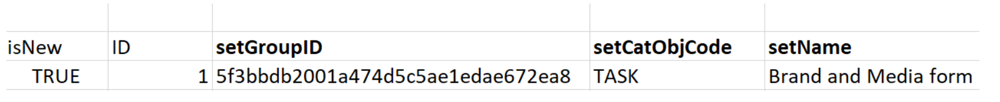

# Cenário de inicializações: importar campos personalizados de várias opções para o Workfront

Você pode importar campos personalizados com várias opções no Adobe Workfront usando a funcionalidade de Início.

Exemplos de campos personalizados com várias opções são:

* Menu suspenso com múltipla escolha
* Suspenso
* Caixa de Seleção
* Botões de seleção

Às vezes, esses campos podem ter muitas (às vezes centenas) opções. A importação deles usando a funcionalidade de Início pode economizar muito tempo, como administrador do Workfront, e garantir que você evite erros.

>[!IMPORTANT]
>
>Você deve seguir as etapas descritas nas seções abaixo, nesta ordem, para importar campos personalizados com várias opções usando um início:
>
>1. Exportar dados personalizados existentes do Workfront (etapa opcional)
>1. Exportar o modelo de Kick-Starts para dados personalizados
>1. Preencher a planilha de Kick-Starts do Excel
>1. Faça upload da Planilha do Excel para o Workfront

## Requisitos de acesso

+++ Expanda para visualizar os requisitos de acesso para a funcionalidade neste artigo.

Você deve ter o seguinte acesso para executar as etapas deste artigo:

<table style="table-layout:auto"> 
 <col> 
 <col> 
 <tbody> 
  <tr> 
   <td role="rowheader">plano do Adobe Workfront</td> 
   <td>Qualquer</td> 
  </tr> 
  <tr> 
   <td role="rowheader">Licença do Adobe Workfront</td> 
   <td>
   
 Novo: Padrão

   ou
   
Atual: Plano
</td> 
  </tr> 
  <tr> 
   <td role="rowheader">Configurações de nível de acesso</td> 
   <td>[!UICONTROL Administrador do Sistema]</td> 
  </tr> 
 </tbody> 
</table>

Para obter mais detalhes sobre as informações nesta tabela, consulte [Requisitos de acesso na documentação do Workfront](/help/quicksilver/administration-and-setup/add-users/access-levels-and-object-permissions/access-level-requirements-in-documentation.md).

+++

## Exportar dados personalizados existentes do Workfront (etapa opcional)

Se você não estiver familiarizado com a estrutura do banco de dados do Workfront, ou se não estiver familiarizado com o arquivo de início rápido que o Workfront requer para importar informações, recomendamos que primeiro exporte um arquivo de início rápido do Workfront com informações existentes, semelhantes às dos campos que deseja importar.

Por exemplo, se você deseja importar formulários personalizados ou campos personalizados, é necessário exportar um arquivo de início com Dados personalizados existentes primeiro.

A exportação dos dados existentes primeiro permite digitalizá-los e ver como os novos dados precisam ser formatados.

Se você tiver uma boa compreensão dos objetos e da estrutura do banco de dados do Workfront, continue com a seção abaixo.

Para exportar dados existentes do Workfront:

{{step-1-to-setup}}

1. Expanda **Sistema** no menu esquerdo e clique em **Exportar Dados (Kick-Starts)**.

1. Selecione **Dados personalizados** na seção **O que incluir**.

   

1. Escolha o arquivo **.xlsx** na seção **Formato de download**.

   >[!TIP]
   >
   >Dependendo da quantidade de dados personalizados que você tem em seu sistema, isso pode levar muito tempo.

1. Clique em **Baixar**. Um arquivo .xlsx é baixado no computador. Navegue até ele e abra-o.

   

1. Examine o arquivo baixado e anote os seguintes detalhes:

   * O arquivo contém várias folhas. Talvez você não precise saber as informações em todas as planilhas, mas usará algumas planilhas para importar suas informações. Reserve algum tempo para se familiarizar com o conteúdo e, especialmente, com o formato do conteúdo em cada planilha.
   * Preste atenção especial aos nomes das colunas e ao formato no qual os dados em cada coluna são exibidos.
   * Você não deve alterar os nomes nem a ordem das colunas em nenhuma das planilhas. Os cabeçalhos de coluna indicam campos que você precisa preencher com suas informações em cada linha. Se o cabeçalho da coluna for exibido em negrito, ele será um campo obrigatório, portanto, você deverá ter informações sobre ele.

   >[!IMPORTANT]
   >
   >Alguns cabeçalhos de coluna podem não ser exibidos em negrito, mas ainda podem ser obrigatórios.

   * Mantenha o arquivo baixado para referência futura e continue para a seção a seguir.

## Exportar o modelo de Kick-Starts para dados personalizados

Depois de verificar as informações sobre os campos personalizados existentes no sistema, você pode baixar um novo modelo de início para a importação.

{{step-1-to-setup}}

1. Expanda **Sistema** no menu esquerdo.

1. Clique em **Importar Dados (Kick-Starts)**.

1. Na área **Baixar uma planilha em branco do Kickstart**, marque a caixa de seleção **Dados Personalizados** e clique em **Baixar**.

   

   Um arquivo em branco de início é baixado para o computador.

   >[!NOTE]
   >
   >O número de planilhas no arquivo, seus nomes e o número de e nomes das colunas em cada planilha devem ser idênticos àqueles do início baixado na seção acima que continha seus dados personalizados existentes.

## Preencher a planilha de Kick-Starts do Excel

Antes de preencher a planilha do Excel, baixe o modelo de início conforme descrito na seção acima.

>[!IMPORTANT]
>
>Não tente importar informações usando uma planilha ad hoc do Excel. Todas as planilhas para importar informações para o Workfront usando a funcionalidade de início rápido devem corresponder ao conteúdo dos arquivos baixados do Workfront e descritos neste artigo.

Para preencher a planilha do Excel com informações para os novos campos personalizados:

1. Abra a planilha do Excel que você baixou na seção anterior e observe várias planilhas. Cada planilha representa um objeto no aplicativo.

   >[!INFO]
   >
   >Por exemplo, **Parâmetro** (que se refere ao Campo Personalizado), **Opção de Parâmetro** (que se refere à opção de Campo Personalizado), **Categoria** (que se refere ao Formulário Personalizado).
   >
   >Você deve gravar os nomes dos objetos e seus atributos no formato suportado pelo banco de dados do Workfront.
   >
   >Para obter informações sobre o significado desses objetos, consulte o [Glossário da [!DNL Adobe Workfront] terminologia](../../../workfront-basics/navigate-workfront/workfront-navigation/workfront-terminology-glossary.md).
   >
   >Para obter informações sobre os nomes dos objetos no banco de dados do Workfront, consulte o [API Explorer](../../../wf-api/general/api-explorer.md).
   >
   >

1. Verifique se as informações a seguir estão formatadas corretamente:

   * A primeira linha de cada planilha deve permanecer vazia, caso contrário, a importação gera um erro.
   * Os cabeçalhos de coluna em cada planilha representam atributos dos objetos que podem ser definidos durante uma importação. Todos os cabeçalhos de coluna devem permanecer na mesma ordem em que são localizados ao exportar a planilha e não podem ser renomeados.
   * Os cabeçalhos de coluna em negrito são campos obrigatórios e devem ter um valor.

     >[!TIP]
     >
     >Algumas colunas são necessárias, embora não estejam em negrito. Por exemplo, as colunas `isNew` e `ID` não estão em negrito, mas são campos obrigatórios.

1. Selecione a planilha `**PARAM Parameter`** e adicione informações sobre os novos campos personalizados nas seguintes colunas necessárias:

   * **`isNew`** = digite **`TRUE`** nesta coluna para cada linha que representa um novo campo personalizado. Isso indica que o campo é novo e não existe no Workfront.

     >[!TIP]
     >
     >Se uma linha representa um campo existente já no Workfront, você digitaria **`isNew`** = **`FALSE`**.

   * **`ID`** = deve ser um número exclusivo para cada linha que representa um novo campo. Você pode usar qualquer número que comece com 1, desde que cada novo campo tenha um número exclusivo.
   * **`setDataType`** = para cada linha que representa um novo campo, insira o tipo de dados aceito pelo campo. O tipo de dados deve ser inserido da maneira como aparece no banco de dados. Selecione um dos seguintes tipos de dados:
      * **`NMBR`** para número
      * **`CURC`** para Moeda
      * **`TEXT`** para texto
   * `**setDisplaySize**`= o tamanho de exibição (&#39;**setDisplaySize**&#39;) para qualquer campo personalizado de várias opções é sempre 0.
   * **`setDisplayType`** = para cada linha que representa um novo campo, insira o tipo de exibição do campo. O Tipo de Exibição deve ser inserido da maneira como apareceria no banco de dados.

     Para campos personalizados de várias opções, selecione uma das seguintes opções:

      * **`MULT`** para lista suspensa de várias seleções
      * **`SLCT`** para lista suspensa
      * **`RDIO`** para botões de opção
      * **`CHCK`** para Caixas de Seleção

     >[!TIP]
     >
     >Para encontrar informações sobre Tipo de Dados e Tipo de Exibição, consulte o [API Explorer](../../../wf-api/general/api-explorer.md), expanda o objeto **Parâmetro** e procure esses atributos na guia **campos**.

   * **`setName`** = digite o nome dos campos personalizados conforme você quer que sejam exibidos no Workfront.

     >[!INFO]
     >
     >Por exemplo, podemos importar dois campos personalizados, chamados _Marca_, um campo de caixa de seleção, e _Mídia_, um campo de botão de opção.

   * As colunas **`setName`** e **`setValue`** geralmente contêm as mesmas informações e devem refletir os nomes desejados na interface do Workfront para o seu novo campo.

   O valor de um campo é o nome que aparece nos relatórios, por exemplo, enquanto o nome é exibido nos formulários personalizados anexados aos objetos.

   Para obter mais informações, consulte [Criar um formulário personalizado](/help/quicksilver/administration-and-setup/customize-workfront/create-manage-custom-forms/form-designer/design-a-form/design-a-form.md).

   

1. Selecione a planilha **`POPT Parameter Options`** e adicione informações sobre as opções de cada campo personalizado nas seguintes colunas necessárias:

   * **`isNew`** = digite **`TRUE`** nesta coluna para cada linha que representa uma nova opção de campo.

     >[!TIP]
     >
     >    Se uma linha representa uma opção existente, você digitaria **`isNew`** = **`FALSE`**.

   * **`ID`** = deve ser um número exclusivo para cada linha que representa uma nova opção. Você pode usar qualquer número que comece com 1, desde que cada nova opção tenha um número exclusivo.
   * **`setIsDefault`** = digite `TRUE` para as opções que deseja exibir por padrão e `FALSE` para todas as outras opções, para cada campo.  Por exemplo, queremos que _Nike_ seja a opção padrão para _Brand_ e _Print_ seja a opção padrão para _Media_.

     >[!TIP]
     >
     >Você só pode ter uma opção padrão para cada campo.

   * **`setParameterID`** = as opções correspondentes ao campo personalizado _Marca_ têm um **`setParameterID`** de 1, e as opções correspondentes à _Mídia_ têm um **`setParameterID`**de 2. As planilhas `PARAM` e `POPT` fazem referência cruzada entre si para indicar quais opções pertencem a qual campo personalizado.
   * **`setDisplayOrder`**= a coluna de ordem de exibição indica a ordem na qual as opções serão exibidas no campo personalizado. Você pode começar com 1 e continuar em ordem crescente para todas as opções, independentemente de a quais campos eles pertencerão. O importante aqui é ter números exclusivos para cada opção.
   * As colunas **`setLabel`** e `**setValue`** geralmente contêm as mesmas informações e devem refletir os nomes desejados na interface do usuário do Workfront. O valor de uma opção é o nome exibido nos relatórios, por exemplo, enquanto o rótulo é exibido nos formulários personalizados quando anexados a um objeto. Para obter mais informações, consulte [Criar um formulário personalizado](/help/quicksilver/administration-and-setup/customize-workfront/create-manage-custom-forms/form-designer/design-a-form/design-a-form.md).
   * **`setIsHidden`** = digite `TRUE` se quiser que qualquer uma das opções fique oculta.

   

1. (Opcional) Se você também quiser criar um formulário personalizado em que poderá adicionar os novos campos posteriormente, selecione a planilha **`CTGY Category`** e atualize as seguintes colunas necessárias para as informações de formulário personalizado:

   * **`isNew`** = digite **`TRUE`** nesta coluna para cada linha que representa um novo formulário personalizado.
   * **`ID`** = digite um número exclusivo para cada linha que representa um novo formulário. Você pode usar qualquer número que comece com 1, desde que cada nova opção ou linha tenha um número exclusivo.
   * **`setGroupID`** = adicione a ID de Grupo para seu Grupo Doméstico ou qualquer outro grupo no sistema cujos membros você deseja ter acesso a este formulário. Este campo é obrigatório.

   Para descobrir o `ID` de um Grupo, você pode criar um relatório de Grupo e adicionar o campo `ID` no Modo de Exibição ou navegar para um grupo e localizar a URL do grupo. A ID do grupo estará no URL da página do grupo. Por exemplo, se a URL do grupo for `https://companyName.my.workfront.com/group/575b000800467a6f66e747932c807464/members`, a ID do Grupo será `575b000800467a6f66e747932c807464`.

   * **`setCatObjCode` **= este é o código de objeto para o tipo de objeto para o qual você deseja criar o formulário. Insira um código entre as seguintes opções:
      * **`CMPY`** para a Empresa
      * **`TASK`** para Tarefa
      * **`PROJ`** para Projeto
      * **`PORT`** para o Portfolio
      * **`PRGM`** para o programa
      * **`USER`** para Usuário
      * **`DOCU`** para documento
      * **`OPTASK`** para problema
      * **`EXPNS`** para Despesa
      * **`ITRN`** para Iteração
      * **`BILL`** para registros de cobrança
      * **`GROUP`** para Grupo

     >[!NOTE]
     >
     >Para formulários de vários objetos, insira o primeiro objeto que você selecionaria ao criar um formulário na interface do usuário. Por exemplo, defina o `setCatObjCode` como `TASK`, se você selecionaria Tarefa na interface do Workfront e, em seguida, Problema, Portfolio, etc., mas não deseja que o formulário fique disponível para Projetos.

   * **`setName`** = este é o nome do formulário personalizado como você deseja que ele apareça na interface do Workfront.

     

1. Salve a planilha como um arquivo .xls ou .xlsx no computador. Sua planilha do Excel está preenchida e agora está pronta para importação para o Workfront.

## Faça upload da planilha do Excel para o Workfront

Depois de executar as etapas descritas nas seções anteriores, continue com o seguinte para fazer upload dos novos campos e formulários no Workfront:

{{step-1-to-setup}}

1. Clique em **Sistema > Importar Dados (Kick-Starts)**.

1. Clique em **Escolher Arquivo** na seção **Carregar dados com a planilha do Kickstart**.

1. Procure a planilha do Excel que você preparou no computador e selecione-a quando a encontrar. Quando a Workfront reconhece o arquivo, o botão Upload fica azul.
1. Clique em **Carregar.**

   

1. Uma notificação de que a importação foi bem-sucedida é exibida. Dependendo da quantidade de informações que você está importando, essa etapa pode levar de alguns segundos a um minuto.

   

   Os novos campos e formulários personalizados agora estão em seu sistema do Workfront. Você pode encontrá-los na área Forms personalizado da Configuração.

   >[!NOTE]
   >
   >Os novos formulários e os campos importados ainda não estão conectados. O formulário é importado sem campos personalizados. Você deve adicionar manualmente os campos ao novo formulário personalizado ou a outro formulário personalizado existente.

   Para obter informações sobre como adicionar campos a formulários personalizados, consulte [Criar um formulário personalizado](/help/quicksilver/administration-and-setup/customize-workfront/create-manage-custom-forms/form-designer/design-a-form/design-a-form.md).

1. (Condicional) Se a importação não tiver sido bem-sucedida, você receberá uma mensagem de erro indicando qual é o problema. Tente identificar o campo, a planilha e o número da linha em que o problema foi encontrado, corrija as informações no arquivo do Excel e tente importar o arquivo mais uma vez.

   

1. (Condicional) Dependendo do problema, conforme indicado na mensagem de erro, algumas informações podem já ter sido importadas. Você deve executar um dos seguintes procedimentos antes de importar a planilha novamente:

   * Exclua as informações que foram importadas com êxito do Workfront da área Forms personalizado e faça a correção indicada pela mensagem de erro.
   * Indique que um campo ou um formulário já está no sistema para os campos ou formulários que já foram importados e faça a correção.
Para indicar que um campo ou um formulário personalizado já está no Workfront, você deve garantir que o campo `inNew` esteja marcado como `FALSE` em planilhas que contêm informações sobre o formulário (`CTGY`) ou o campo (`PARAM`) na planilha de importação do kick-start.
