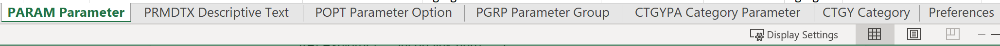

# Cenário de início: Importar campos personalizados de várias opções para o Workfront

É possível importar campos personalizados com várias opções no Adobe Workfront usando a funcionalidade Início rápido.

Exemplos de campos personalizados com várias opções são:

* Menu suspenso com múltipla escolha
* Suspenso
* Caixa de Seleção
* Botões de seleção

Às vezes, esses campos podem ter muitas (às vezes centenas) opções. Importá-los usando a funcionalidade Kick-Start pode salvá-lo, como administrador do Workfront, muito tempo e garantir que você evite erros.

>[!IMPORTANT]
>
>Você deve seguir as etapas descritas nas seções abaixo, nesta ordem, para importar campos personalizados com várias opções usando um início:
>
>1. Exportar dados personalizados existentes do Workfront (etapa opcional)
>1. Exportar o modelo de início rápido para dados personalizados
>1. Preencher a planilha Início Rápido do Excel
>1. Fazer upload da planilha do Excel para o Workfront

## Exportar dados personalizados existentes do Workfront (etapa opcional)

Se você não estiver familiarizado com a estrutura do banco de dados do Workfront ou se não estiver familiarizado com o arquivo de início rápido que o Workfront requer para importar informações, recomendamos que você exporte primeiro um arquivo de início do Workfront com informações existentes, semelhantes às dos campos que deseja importar.

Por exemplo, se você deseja importar formulários personalizados ou campos personalizados, é necessário exportar primeiro um arquivo de início com dados personalizados existentes.

Exportar seus dados existentes primeiro permite que você os verifique e veja como os novos dados precisam ser formatados.

Se você tiver uma boa compreensão dos objetos e da estrutura do banco de dados do Workfront, poderá continuar com a seção abaixo.

Para exportar dados existentes do Workfront:

1. Clique em **Menu principal > Configuração** no canto superior direito da interface do Workfront.
1. Expanda o **Sistema** à esquerda e clique em **Exportar dados (início rápido)**.

   

1. Selecionar **Dados personalizados** no **O que incluir** seção.

   

1. Choose **Arquivo .xlsx** no **Formato de download** seção.

   >[!TIP]
   >
   >    Dependendo de quantos dados personalizados você tem em seu sistema, isso pode levar muito tempo.

   

1. Clique em **Baixar**. Um arquivo .xlsx é baixado no computador. Navegue até ele e abra-o.

   

1. Examine o arquivo baixado e anote os seguintes detalhes:

   * O arquivo contém várias folhas. Talvez você não precise saber as informações em todas as planilhas, mas usará algumas das planilhas para importar suas informações. Reserve algum tempo para se familiarizar com seu conteúdo e, especialmente, com o formato do conteúdo em cada planilha.
   * Preste atenção especial aos nomes das colunas e ao formato em que os dados em cada coluna são exibidos.
   * Você não deve alterar os nomes ou a ordem das colunas em nenhuma das planilhas. Os cabeçalhos de coluna indicam campos que você precisa preencher com suas informações, em cada linha. Se o cabeçalho da coluna for exibido em negrito, esse será um campo obrigatório, portanto, você deverá ter informações nessa coluna.
   >[!IMPORTANT]
   >
   >Alguns cabeçalhos de coluna podem não ser exibidos em negrito, mas ainda podem ser necessários.

   * Mantenha o arquivo baixado para referência futura e prossiga para a seção a seguir.

## Exportar o modelo de Início rápido para Dados personalizados

Após verificar as informações sobre campos personalizados existentes no sistema, é possível baixar um novo modelo de início para sua importação.

1. Clique em **Menu principal > Configuração** no canto superior direito da interface do Workfront.

1. Expanda o **Sistema** à esquerda.

1. Clique em **Importar dados (Início)**.

   

1. No **Baixar uma planilha de Início Rápido em branco** escolha a **Dados personalizados** caixa de seleção e clique em **Baixar**.

   

   Um arquivo de início em branco é baixado para o computador.

   >[!NOTE]
   >
   >O número de folhas no arquivo, seus nomes e o número e nomes das colunas em cada folha devem ser idênticos aos do início de download baixado na seção acima que continha seus dados personalizados existentes.

## Preencher a planilha Início Rápido do Excel

Antes de preencher a planilha do excel, baixe o modelo de início conforme descrito na seção acima.

>[!IMPORTANT]
>
>Não tente importar informações usando uma planilha ad-hoc do Excel. Todas as planilhas para importar informações no Workfront usando a funcionalidade de início devem corresponder ao conteúdo dos arquivos que você baixar do Workfront e descritos neste artigo.

Para preencher a planilha do Excel com informações para os novos campos personalizados:

1. Abra a planilha do Excel que você baixou na seção anterior e observe várias planilhas. Cada folha representa um objeto no aplicativo.

   >[!INFO]
   >
   >Por exemplo, **Parâmetro** (que se refere ao campo personalizado), **Opção de parâmetro**(que se refere à opção Campo personalizado), **Categoria** (que se refere ao Formulário personalizado).
   >
   >Você deve gravar os nomes dos objetos e seus atributos no formato suportado pelo banco de dados do Workfront.
   >
   >Para obter informações sobre o significado desses objetos, consulte o [Glossário do Workfront](../../../workfront-basics/navigate-workfront/workfront-navigation/workfront-terminology-glossary.md).
   >
   >Para obter informações sobre os nomes dos objetos no banco de dados do Workfront, consulte o [API Explorer](../../../wf-api/general/api-explorer.md).
   >
   >

1. Verifique se as seguintes informações estão formatadas corretamente:

   * A primeira linha de cada folha deve permanecer vazia; caso contrário, a importação gera um erro.
   * Os cabeçalhos de coluna em cada folha representam atributos dos objetos que podem ser definidos durante uma importação. Todos os cabeçalhos de coluna devem permanecer na mesma ordem em que são encontrados ao exportar a planilha e não podem ser renomeados.
   * Os cabeçalhos de coluna em negrito são campos obrigatórios e devem ter um valor.

      >[!TIP]
      >
      >Algumas colunas são necessárias, embora não estejam em negrito. Por exemplo, a variável `isNew` e `ID` não estão em negrito, mas são campos obrigatórios.

1. Selecione o `**PARAM Parameter`** planilha e adicione informações sobre os novos campos personalizados nas seguintes colunas obrigatórias:

   * **`isNew`** = enter **`TRUE`** nesta coluna para cada linha que representa um novo campo personalizado. Isso indica que o campo é novo e não existe no Workfront.

      >[!TIP]
      >
      >    Se uma linha representar um campo existente já no Workfront, você deve inserir **`isNew`** = **`FALSE`**.

   * **`ID`** = deve ser um número exclusivo para cada linha que representa um novo campo. Você pode usar qualquer número começando com 1, desde que cada novo campo tenha um número exclusivo.
   * **`setDataType`** = para cada linha que representa um novo campo, insira o tipo de dados que o campo suporta. O Tipo de dados deve ser inserido como apareceria no banco de dados. Selecione entre os seguintes tipos de dados:
      * **`NMBR`** para Número
      * **`CURC`** para moeda
      * **`TEXT`** para texto
   * `**setDisplaySize**`= o tamanho de exibição (&#39;**setDisplaySize**&#39;) para qualquer campo personalizado de várias opções é sempre 0.
   * **`setDisplayType`** = para cada linha que representa um novo campo, insira o tipo de exibição do campo. O Tipo de Exibição deve ser inserido como apareceria no banco de dados.

      Para campos personalizados de várias opções, selecione uma das seguintes opções:

      * **`MULT`** para Menu suspenso de seleção múltipla
      * **`SLCT`** para lista suspensa
      * **`RDIO`** para botões de opção
      * **`CHCK`** para caixas de seleção
      >[!TIP]
      >
      >Para localizar as informações de Tipo de dados e Tipo de exibição, consulte [API Explorer](../../../wf-api/general/api-explorer.md), expanda a **Parâmetro** e procure por esses atributos sob o **campos** guia .

   * **`setName`** = digite o nome dos campos personalizados, conforme desejar, exibido no Workfront.

      >[!INFO]
      >
      >Por exemplo, podemos importar dois campos personalizados, chamados de _Marca_, um campo de caixa de seleção e _Mídia_, um campo de botão de opção.

   * O **`setName`** e **`setValue`** geralmente contêm as mesmas informações e devem refletir os nomes desejados na interface do Workfront para o novo campo.
   O valor de um campo é o nome que aparece nos relatórios, por exemplo, enquanto o nome é exibido nos formulários personalizados anexados aos objetos.

   Para obter mais informações, consulte [Adicionar um campo personalizado a um formulário personalizado](../../../administration-and-setup/customize-workfront/create-manage-custom-forms/add-a-custom-field-to-a-custom-form.md).

   

1. Selecione o **`POPT Parameter Options`** planilhas e adicione informações sobre as opções de cada campo personalizado nas seguintes colunas obrigatórias:

   * **`isNew`** = enter **`TRUE`** nesta coluna para cada linha que representa uma nova opção de campo.

      >[!TIP]
      >
      >    Se uma linha representar uma opção existente, você deverá inserir **`isNew`** = **`FALSE`**.

   * **`ID`** = deve ser um número exclusivo para cada linha que representa uma nova opção. Você pode usar qualquer número começando com 1, desde que cada nova opção tenha um número exclusivo.
   * **`setIsDefault`** = enter `TRUE` para as opções que deseja exibir por padrão, e `FALSE` para todas as outras opções, para cada campo.  Por exemplo, queremos _Nike_ para ser a opção padrão para _Marca_ e _Imprimir_ para ser a opção padrão para _Mídia_.

      >[!TIP]
      >
      >Você só pode ter uma opção padrão para cada campo.

   * **`setParameterID`** = as opções correspondentes à variável _Marca_ o campo personalizado tem um **`setParameterID`** de 1 e as opções correspondentes à variável _Mídia_ tem um **`setParameterID`**de 2. O `PARAM` e `POPT` as planilhas fazem referência cruzada umas às outras para indicar quais opções pertencem a qual campo personalizado.
   * **`setDisplayOrder`**= a coluna da ordem de exibição indica a ordem na qual as opções serão exibidas no campo personalizado. Você pode começar com 1 e continuar em ordem crescente para todas as opções, independentemente dos campos aos quais elas pertencerão. O importante aqui é ter números únicos para cada opção.
   * O **`setLabel`** e `**setValue`** colunas geralmente contêm as mesmas informações e devem refletir os nomes desejados na interface do usuário do Workfront. O valor de uma opção é o nome que é exibido nos relatórios, por exemplo, enquanto o rótulo é exibido nos formulários personalizados quando anexado a um objeto. Para obter mais informações, consulte [Adicionar um campo personalizado a um formulário personalizado](../../../administration-and-setup/customize-workfront/create-manage-custom-forms/add-a-custom-field-to-a-custom-form.md).
   * **`setIsHidden`** = enter `TRUE` se desejar que qualquer uma das opções fique oculta.
   

1. (Opcional) Se também quiser criar um formulário personalizado, onde poderá adicionar os novos campos posteriormente, selecione a opção  **`CTGY Category`** planilhas e atualize as seguintes colunas necessárias para obter as informações do formulário personalizado:

   * **`isNew`** = enter **`TRUE`** nesta coluna para cada linha que representa um novo formulário personalizado.
   * **`ID`** = digite um número exclusivo para cada linha que represente um novo formulário. Você pode usar qualquer número começando com 1, desde que cada nova opção ou linha tenha um número exclusivo.
   * **`setGroupID`** = adicione a ID do grupo para o Grupo doméstico ou qualquer outro grupo no sistema cujos membros você deseja ter acesso a este formulário. Este campo é obrigatório.
   Para descobrir a `ID` de um Grupo, você pode criar um relatório do Grupo e adicionar o `ID` em Exibir ou navegue até um grupo e localize o URL do grupo. A ID do grupo estará no URL da página do grupo. Por exemplo, se o URL do grupo for `https://companyName.my.workfront.com/group/575b000800467a6f66e747932c807464/members`, a ID do grupo é `575b000800467a6f66e747932c807464`.

   * **`setCatObjCode` **= este é o código de objeto do tipo de objeto para o qual você deseja criar o formulário. Insira um código nas seguintes opções:
      * **`CMPY`** para empresa
      * **`TASK`** para Tarefa
      * **`PROJ`** para Projeto
      * **`PORT`** para Portfolio
      * **`PRGM`** para Programa
      * **`USER`** para usuário
      * **`DOCU`** para Documento
      * **`OPTASK`** para problema
      * **`EXPNS`** para Despesas
      * **`ITRN`** para Iteração
      * **`BILL`** para Registros de Faturamento
      * **`GROUP`** para Grupo
      >[!NOTE]
      >
      >Para formulários de vários objetos, insira o primeiro objeto que você selecionaria ao criar um formulário na interface do usuário. Por exemplo, defina a variável `setCatObjCode` para `TASK`, se você selecionar Tarefa na interface do Workfront e, em seguida, Ocorrência, Portfolio, etc., mas não quiser que o formulário fique disponível para Projetos.

   * **`setName`** = esse é o nome do formulário personalizado como você gostaria que ele fosse exibido na interface do Workfront.

      

1. Salve a planilha como um arquivo .xls ou .xlsx no computador. Sua planilha do Excel está preenchida e agora está pronta para importação no Workfront.

## Fazer upload da planilha do Excel para o Workfront

Depois de executar as etapas descritas nas seções anteriores, continue com o seguinte para fazer upload dos novos campos e formulários para o Workfront:

1. Clique em **Importar dados** **(Início rápido) **sob o **Menu principal > Configuração > Sistema** menu.

1. Clique em **Escolher arquivo** na seção **Fazer upload de dados com a planilha de início rápido**.

1. Procure a planilha do Excel que você preparou no seu computador e selecione-a ao encontrá-la.  Quando o arquivo for reconhecido pela Workfront, o botão Upload ficará azul.
1. Clique em **Faça upload.**

   

1. Uma notificação de que a importação foi bem-sucedida é exibida. Dependendo de quantas informações você estiver importando, essa etapa pode levar de alguns segundos a um minuto.

   

   Os novos campos e formulários personalizados agora estão em seu sistema Workfront. Você pode encontrá-las na área Forms personalizado de Configuração.

   >[!NOTE]
   >
   >Os novos formulários e os campos importados ainda não estão conectados. O formulário é importado sem campos personalizados. É necessário adicionar manualmente os campos ao novo formulário personalizado ou a outro formulário personalizado existente.

   Para obter informações sobre como adicionar campos a formulários personalizados, consulte [Adicionar um campo personalizado a um formulário personalizado](../../../administration-and-setup/customize-workfront/create-manage-custom-forms/add-a-custom-field-to-a-custom-form.md).

1. (Condicional) Se a importação não foi bem-sucedida, você receberá uma mensagem de erro com o problema. Tente identificar o campo, a folha e o número da linha em que o problema foi encontrado e corrigir as informações no arquivo Excel e tente importar o arquivo mais uma vez.

   

1. (Condicional) Dependendo do problema, conforme declarado na mensagem de erro, algumas informações podem já ser importadas. Você deve fazer um dos seguintes procedimentos antes de importar a planilha novamente:

   * Exclua as informações que foram importadas com êxito do Workfront da área Forms personalizada e faça a correção indicada pela mensagem de erro.
   * Indique que um campo ou formulário já está no sistema para esses campos ou formulários que já foram importados e faça a correção.
Para indicar que um campo ou formulário personalizado já está no Workfront, verifique se a variável `inNew` campo está marcado como `FALSE` em planilhas que contêm informações sobre o formulário (`CTGY`) ou o campo (`PARAM`) na planilha de importação de início.
