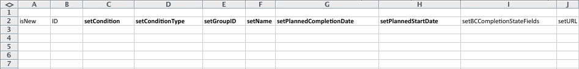

# Cenário de início: preparação de importação de projetos e tarefas simples

Descreve em detalhes as configurações e os controles disponíveis para uma Importação básica de projeto e tarefa usando o método Kick-Start.

## Cenário

A equipe de implementação preferiria importar as informações do projeto e da tarefa para projetos ativos, em vez de inserir manualmente esses dados no sistema.

* [Projetos](#projects)
* [Lista de tarefas](#task-list)

### Projetos {#projects}

A tabela a seguir exibe quatro projetos e seus detalhes básicos que precisam ser mapeados nos formatos de arquivo do Kickstart.

Esse cenário presume que os usuários já foram importados para o Adobe Workfront. Se os usuários ainda não estiverem no Workfront, substitua nomes diferentes ou conclua o Cenário de Início com usuários anteriores a esse cenário.

1. Implementar o Workfront.

   | Data de início planejado | Hoje |
   |---|---|
   | Gerente de projeto | Jennifer Campbell |
   | Patrocinador do Projeto | Marc Lewis |
   | Grupo | Marketing |
   | Empresa | *SuaEmpresa* |

   {style="table-layout:auto"}

1. Implementar o Sistema de RH

   | Data de início planejado | 14 de julho de 20XX |
   |---|---|
   | Gerente de projeto | Pam Reynolds |
   | Patrocinador do Projeto | Marc Lewis |
   | Grupo | Marketing |
   | Empresa | *SuaEmpresa* |

   {style="table-layout:auto"}

1. Implementar o sistema de gerenciamento de documentos.

   | Data de início planejado | 22 de agosto de 20XX |
   |---|---|
   | Gerente de projeto | Jennifer Campbell |
   | Patrocinador do Projeto | Ray Andrews |
   | Grupo | IT |
   | Empresa | *SuaEmpresa* |

   {style="table-layout:auto"}

1. Implementar Novo Sistema De Calendário.

   | Data de início planejado | 6 de setembro de 20XX |
   |---|---|
   | Gerente de projeto | Pam Reynolds |
   | Patrocinador do Projeto | Ray Andrews |
   | Grupo | IT |
   | Empresa | *SuaEmpresa* |

   {style="table-layout:auto"}

### Lista de tarefas {#task-list}

A lista de tarefas a seguir exibe listas de tarefas muito simplificadas para os projetos. A única diferença entre projetos são as datas de início e o progresso feito em cada projeto.

As tarefas pai herdam a Duração, o Trabalho e o Percentual Concluído das tarefas filho. Não é necessário definir esses valores para que as tarefas de resumo se tornem.

>[!NOTE]
>
>As instruções fornecidas neste cenário não são tão explícitas quanto as instruções passo a passo fornecidas em [Cenário de início: Empresa, Grupo, Função e Preparação de início de usuário](../../../administration-and-setup/manage-workfront/using-kick-starts/kick-starts-scenario-company-group-role-user-prep.md). A suposição é que você já aprendeu a pesquisar e copiar valores das planilhas Empresa e Grupo; portanto, essas etapas serão mencionadas, mas não serão especificamente descritas.

1. Configurar.
1. Importar usuários.

   <table style="table-layout:auto"> 
    <col width="50%"> 
    <col width="50%"> 
    <tbody> 
     <tr> 
      <td role="rowheader">Atribuído a</td> 
      <td>Ray Andrews</td> 
     </tr> 
     <tr> 
      <td role="rowheader">Tarefa principal</td> 
      <td>1</td> 
     </tr> 
     <tr> 
      <td role="rowheader">Duração</td> 
      <td>1 hora</td> 
     </tr> 
     <tr> 
      <td role="rowheader">Trabalho</td> 
      <td>1 hora</td> 
     </tr> 
     <tr> 
      <td role="rowheader">Percentual completo</td> 
      <td> 
Workfront: 0%
 
HR: 100%
 
Documentação: 100%
 
Calendário: 100%
 </td> 
     </tr> 
    </tbody> 
   </table>

1. Definir permissões.

   <table style="table-layout:auto"> 
    <col width="50%"> 
    <col width="50%"> 
    <tbody> 
     <tr> 
      <td role="rowheader">Atribuído a</td> 
      <td>Ray Andrews</td> 
     </tr> 
     <tr> 
      <td role="rowheader">Tarefa principal</td> 
      <td>1</td> 
     </tr> 
     <tr> 
      <td role="rowheader">Pred</td> 
      <td>2</td> 
     </tr> 
     <tr> 
      <td role="rowheader">Duração</td> 
      <td>1 hora</td> 
     </tr> 
     <tr> 
      <td role="rowheader">Trabalho</td> 
      <td>1 hora</td> 
     </tr> 
     <tr> 
      <td role="rowheader">Percentual completo</td> 
      <td> 
Workfront: 0%
 
HR: 100%
 
Documentação: 100%
 
Calendário: 100%
 </td> 
     </tr> 
    </tbody> 
   </table>

1. Criar grupos.

   <table style="table-layout:auto"> 
    <col width="50%"> 
    <col width="50%"> 
    <tbody> 
     <tr> 
      <td role="rowheader">Atribuído a</td> 
      <td>Ray Andrews</td> 
     </tr> 
     <tr> 
      <td role="rowheader">Tarefa principal</td> 
      <td>1</td> 
     </tr> 
     <tr> 
      <td role="rowheader">Pred</td> 
      <td>4</td> 
     </tr> 
     <tr> 
      <td role="rowheader">Duração</td> 
      <td>2 dias</td> 
     </tr> 
     <tr> 
      <td role="rowheader">Trabalho</td> 
      <td>4 horas</td> 
     </tr> 
     <tr> 
      <td role="rowheader">Percentual completo</td> 
      <td> 
Workfront: 0%
 
HR: 100%
 
Documentação: 100%
 
Calendário: 25%
 </td> 
     </tr> 
    </tbody> 
   </table>

1. Preparar o treinamento.

   <table style="table-layout:auto"> 
    <col width="50%"> 
    <col width="50%"> 
    <tbody> 
     <tr> 
      <td role="rowheader">Atribuído a</td> 
      <td>Chris Manning</td> 
     </tr> 
     <tr> 
      <td role="rowheader">Duração</td> 
      <td>2 dias</td> 
     </tr> 
     <tr> 
      <td role="rowheader">Trabalho</td> 
      <td>4 horas</td> 
     </tr> 
     <tr> 
      <td role="rowheader">Percentual completo</td> 
      <td> 
Workfront: 0%
 
HR: 100%
 
Documentação: 50%
 
Calendário: 100%
 </td> 
     </tr> 
    </tbody> 
   </table>

1. Crie políticas de suporte contínuas.

   <table style="table-layout:auto"> 
    <col width="50%"> 
    <col width="50%"> 
    <tbody> 
     <tr> 
      <td role="rowheader">Atribuído a</td> 
      <td>Chris Manning</td> 
     </tr> 
     <tr> 
      <td role="rowheader">Duração</td> 
      <td>2 dias</td> 
     </tr> 
     <tr> 
      <td role="rowheader">Trabalho</td> 
      <td>4 horas</td> 
     </tr> 
     <tr> 
      <td role="rowheader">Percentual completo</td> 
      <td> 
Workfront: 0%
 
HR: 100%
 
Documentação: 50%
 
Calendário: 0%
 </td> 
     </tr> 
    </tbody> 
   </table>

1. Implante.

   | Pred | 1, 6, 7 |
   |---|---|

   {style="table-layout:auto"}

1. Treine os usuários.

   <table style="table-layout:auto"> 
    <col width="50%"> 
    <col width="50%"> 
    <tbody> 
     <tr> 
      <td role="rowheader">Atribuído a</td> 
      <td>Chris Manning</td> 
     </tr> 
     <tr> 
      <td role="rowheader">Tarefa principal</td> 
      <td>8</td> 
     </tr> 
     <tr> 
      <td role="rowheader">Duração</td> 
      <td>1 dia</td> 
     </tr> 
     <tr> 
      <td role="rowheader">Trabalho</td> 
      <td>2 horas</td> 
     </tr> 
     <tr> 
      <td role="rowheader">Percentual completo</td> 
      <td> 
Workfront: 0%
 
HR: 0%
 
Documentação: 0%
 
Calendário: 0%
 </td> 
     </tr> 
    </tbody> 
   </table>

## Baixar modelo

Acesse a página Início. Selecione os objetos Empresa, Grupo, Projeto, Tarefa e Usuário. Marque a caixa de seleção Incluir dados existentes (faça isso para consultar rapidamente a Empresa, o Grupo e as IDs do Usuário). Clique no botão Download.

## Detalhes do projeto de entrada

Abra o arquivo Workfront.xlsx que acabou de baixar. Vá para a planilha Projeto PROJ.

A menos que você já tenha criado projetos no Workfront, deve estar vazio.

Defina os valores dos seguintes campos de projeto:

* **Definir isNew coluna**
Insira TRUE nas linhas 3 a 6 da coluna isNew.
* **Definir IDs exclusivas**
Insira um identificador exclusivo em cada linha para a coluna de ID — Normalmente, números inteiros iniciando em 1 funcionam bem ao criar novos registros.
* **Definir Nomes de Projeto**
Insira os nomes de cada projeto na coluna setName.
* **Definir cronograma do projeto**

  Insira a ID do agendamento que você deseja que o projeto use no campo setScheduleID

* **Definir a Data de Início Planejada do projeto**

  Insira a data e a hora na coluna setPlannedStartDate com a hora e a data em que deseja que o projeto inicie. Se deixado em branco, o Workfront importa o projeto com a data do dia atual e um carimbo de data e hora da meia-noite desse dia de acordo com o fuso horário do navegador.

* **Definir números de tarefa**
Insira valores na coluna setTaskNumber para controlar a ordem em que as tarefas aparecerão no plano de projeto.
* **Forneça as datas do projeto.**
Insira a Data inicial planejada para cada projeto na coluna setPlannedStartDate.
* **Defina outros detalhes necessários.**
Preencha outros detalhes, como uma descrição ou status atual, conforme necessário. Procure as IDs de grupo para cada projeto na planilha Grupo do Grupo e insira-as na coluna setGroupID dos respectivos projetos. Procure a ID da empresa para os projetos na planilha Empresa do CMPY e insira-a na coluna setCompanyID. Procure a ID de usuário de cada proprietário de projeto na planilha Usuário do USUÁRIO e insira-a na coluna setOwnerID. Procure a ID de usuário para cada patrocinador do projeto na planilha Usuário do USUÁRIO e insira-a na coluna setSponsorID.

>[!NOTE]
>
>Os valores aceitáveis para os campos Status e Prioridade podem ser localizados ao revisar o status e as preferências de prioridade para cada objeto na área Configuração de workflow do Workfront.

## Detalhes da tarefa de entrada

Você pode adicionar informações sobre as tarefas no projeto, ao importar o projeto usando kick-starts.

Abra o arquivo Workfront.xlsx que acabou de baixar. **Vá para a Planilha de Tarefas de TAREFA.**

A menos que você já tenha criado tarefas no Workfront, esta planilha deve estar vazia.

A maneira mais fácil de mapear tarefas é um projeto de cada vez (especialmente quando as tarefas são as mesmas em cada projeto). Em seguida, você pode copiar o plano de tarefas para o primeiro projeto e fazer pequenos ajustes no plano de tarefas para os projetos subsequentes. As etapas restantes presumirão que você está criando tarefas apenas para o projeto Implementar Workfront. De acordo com o cenário, você importará 9 tarefas por projeto, portanto, insira TRUE nas linhas 3 a 11 para a coluna isNew.

Defina os valores dos seguintes campos de tarefa:

* **Definir IDs**
Insira um identificador exclusivo em cada linha para a coluna de ID.
* **Definir Nomes**
Insira os nomes da tarefa na coluna setName.
* **Confirmar ID do Projeto**
Insira a ID que você definiu para o projeto Implementar o Workfront; revise a planilha Projeto do PROJ para verificar se essa é a ID correta.
* **Definir Usuários**
Vá para a planilha USUÁRIO para procurar a ID do usuário atribuído a cada tarefa e inserir esses valores nas respectivas células na coluna setAssignedToID.
* **Identificar relações de tarefas**
Para as tarefas de 2 a 5, insira um 1 na coluna setParentID. Para a tarefa 9, insira um 8 na coluna setParentID. Na coluna setPredecessorString, insira o número da tarefa para cada tarefa predecessora. Nos casos em que uma tarefa tem vários predecessores, como a tarefa 8 neste cenário, será necessário usar uma vírgula para separar cada ID de tarefa predecessora. Os predecessores podem ser definidos com defasagens em relacionamentos que não sejam do tipo Finish-Start usando a abreviação descrita no artigo Criação de relacionamentos predecessores.
* **Definir Duração**
Defina a duração de cada tarefa inserindo o número de horas, dias, semanas ou meses para a tarefa no campo setDuration. Em seguida, insira a unidade de duração no campo setDurationUnit.

  |   | Valor aceitável |
  |---|---|
  | Minutos | M |
  | Horas | H |
  | Dias | E |
  | Semanas | S |
  | Meses | T |

  Os minutos também podem ser representados como fração de uma hora (por exemplo, minutos = 5 horas)

* Defina a quantidade de esforço para cada tarefa no campo setWorkRequired. Em seguida, insira a unidade de trabalho no campo setWorkUnit. Se o valor Trabalho necessário for diferente da duração, também será necessário inserir um A no campo setDurationType.

  | Tipo de Duração | Valor aceitável |
  |---|---|
  | Atribuição Calculada | A |
  | Trabalho Calculado | S |
  | Controlado pelo empenho | E |
  | Simples | S |

* Insira a representação do número inteiro da porcentagem concluída no campo setPercentComplete para cada tarefa. Esse valor não deve incluir o símbolo de porcentagem (%).
* Inclua uma descrição e outros detalhes para cada Tarefa que você está criando, conforme necessário.

  

* As colunas setPlannedStartDate e setTaskConstraint não são usadas para criar a linha do tempo deste projeto porque estamos confiando em relações predecessoras. Em vez disso, você pode inserir uma data para cada tarefa. Nesse caso, certifique-se de fornecer também uma restrição de tarefa válida na coluna setTaskConstraint. Revise a Restrição da Tarefa e os artigos relacionados para obter detalhes sobre valores válidos para esse campo.

  Nesse caso, a maneira mais fácil de criar as tarefas para os outros projetos que você está importando é copiar as tarefas que acabou de definir e colá-las abaixo, começando na linha 12. Em seguida, você deverá:

   1. Renumerar os valores na coluna ID.
   1. Atualize a coluna setProjectID para o valor definido para o próximo projeto.
   1. Atualize os valores setParentID e setPredecessorString para refletir as novas IDs atribuídas às tarefas deste projeto.
   1. Atualize as atribuições de tarefas e o percentual concluído.
   1. Repita essas etapas para as tarefas do próximo projeto.

* **Importar o Arquivo do Excel**

  Siga as instruções fornecidas em [Importar dados para o Adobe Workfront usando um modelo de Kick-Start](../../../administration-and-setup/manage-workfront/using-kick-starts/import-data-via-kickstarts.md).
