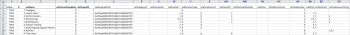

# Cenário de início: preparação simples de importação de projeto e tarefa

Descreve detalhadamente as configurações e controles disponíveis para um Projeto básico e Importação de tarefa usando o método Início rápido.

## Cenário

A equipe de implementação prefere importar informações de projeto e tarefa para projetos ativos em vez de inserir manualmente esses dados no sistema.

* [Projetos](#projects)
* [Lista de tarefas](#task-list)

### Projetos {#projects}

A tabela a seguir exibe quatro Projetos e seus detalhes básicos que precisam ser mapeados nos formatos de arquivo Início rápido .

Esse cenário presume que os usuários já estejam importados para o Adobe Workfront. Se os usuários ainda não estiverem no Workfront, substitua nomes diferentes ou complete o Cenário de início rápido com os usuários antes deste cenário.

1. Implemente o Workfront.

   | Data de início planejado | Hoje |
   |---|---|
   | Gerente de Projeto | Jennifer Campbell |
   | Patrocinador do Projeto | Marc Lewis |
   | Grupo | Marketing |
   | Empresa | *Sua empresa* |

   {style="table-layout:auto"}

1. Implementar o Sistema HR.

   | Data de início planejado | 14 de julho de 2020 |
   |---|---|
   | Gerente de Projeto | Pam Reynolds |
   | Patrocinador do Projeto | Marc Lewis |
   | Grupo | Marketing |
   | Empresa | *Sua empresa* |

   {style="table-layout:auto"}

1. Implementar o sistema de gerenciamento de documentos.

   | Data de início planejado | 22 de agosto de 20XX |
   |---|---|
   | Gerente de Projeto | Jennifer Campbell |
   | Patrocinador do Projeto | Ray Andrews |
   | Grupo | IT |
   | Empresa | *Sua empresa* |

   {style="table-layout:auto"}

1. Implemente o novo sistema de calendário.

   | Data de início planejado | 6 de setembro de 2006 |
   |---|---|
   | Gerente de Projeto | Pam Reynolds |
   | Patrocinador do Projeto | Ray Andrews |
   | Grupo | IT |
   | Empresa | *Sua empresa* |

   {style="table-layout:auto"}

### Lista de tarefas {#task-list}

A lista de tarefas a seguir exibe listas de tarefas muito simplificadas para os projetos. A única diferença entre projetos é a data de início e o progresso feito em cada projeto.

As tarefas pai herdam as tarefas Duração, Trabalho e Porcentagem de conclusão de filhos. Não é necessário definir esses valores para que se tornem tarefas de resumo.

>[!NOTE]
>
>As instruções fornecidas neste cenário não são tão explícitas como as orientações passo a passo fornecidas em [Cenário de início: Preparação de Empresa, Grupo, Função e Início do Usuário](../../../administration-and-setup/manage-workfront/using-kick-starts/kick-starts-scenario-company-group-role-user-prep.md). A suposição é que você já aprendeu a procurar e copiar valores das planilhas de Empresa e Grupo, então essas etapas serão mencionadas, mas não especificamente descritas.

1. Configurar.
1. Importar usuários.

   <table style="table-layout:auto"> 
    <col width="50%"> 
    <col width="50%"> 
    <tbody> 
     <tr> 
      <td role="rowheader">Atribuído a</td> 
      <td>Ray Andrews</td> 
     </tr> 
     <tr> 
      <td role="rowheader">Tarefa principal</td> 
      <td>1</td> 
     </tr> 
     <tr> 
      <td role="rowheader">Duração</td> 
      <td>1 hora</td> 
     </tr> 
     <tr> 
      <td role="rowheader">Trabalho</td> 
      <td>1 hora</td> 
     </tr> 
     <tr> 
      <td role="rowheader">Percentual completo</td> 
      <td> 
Workfront: 0%
 
HR: 100%
 
Documentos: 100%
 
Calendário: 100%
 </td> 
     </tr> 
    </tbody> 
   </table>

1. Defina as permissões.

   <table style="table-layout:auto"> 
    <col width="50%"> 
    <col width="50%"> 
    <tbody> 
     <tr> 
      <td role="rowheader">Atribuído a</td> 
      <td>Ray Andrews</td> 
     </tr> 
     <tr> 
      <td role="rowheader">Tarefa principal</td> 
      <td>1</td> 
     </tr> 
     <tr> 
      <td role="rowheader">Pred</td> 
      <td>2</td> 
     </tr> 
     <tr> 
      <td role="rowheader">Duração</td> 
      <td>1 hora</td> 
     </tr> 
     <tr> 
      <td role="rowheader">Trabalho</td> 
      <td>1 hora</td> 
     </tr> 
     <tr> 
      <td role="rowheader">Percentual completo</td> 
      <td> 
Workfront: 0%
 
HR: 100%
 
Documentos: 100%
 
Calendário: 100%
 </td> 
     </tr> 
    </tbody> 
   </table>

1. Criar grupos.

   <table style="table-layout:auto"> 
    <col width="50%"> 
    <col width="50%"> 
    <tbody> 
     <tr> 
      <td role="rowheader">Atribuído a</td> 
      <td>Ray Andrews</td> 
     </tr> 
     <tr> 
      <td role="rowheader">Tarefa principal</td> 
      <td>1</td> 
     </tr> 
     <tr> 
      <td role="rowheader">Pred</td> 
      <td>4</td> 
     </tr> 
     <tr> 
      <td role="rowheader">Duração</td> 
      <td>2 dias</td> 
     </tr> 
     <tr> 
      <td role="rowheader">Trabalho</td> 
      <td>4 horas</td> 
     </tr> 
     <tr> 
      <td role="rowheader">Percentual completo</td> 
      <td> 
Workfront: 0%
 
HR: 100%
 
Documentos: 100%
 
Calendário: 25%
 </td> 
     </tr> 
    </tbody> 
   </table>

1. Prepare o treinamento.

   <table style="table-layout:auto"> 
    <col width="50%"> 
    <col width="50%"> 
    <tbody> 
     <tr> 
      <td role="rowheader">Atribuído a</td> 
      <td>Chris Manning</td> 
     </tr> 
     <tr> 
      <td role="rowheader">Duração</td> 
      <td>2 dias</td> 
     </tr> 
     <tr> 
      <td role="rowheader">Trabalho</td> 
      <td>4 horas</td> 
     </tr> 
     <tr> 
      <td role="rowheader">Percentual completo</td> 
      <td> 
Workfront: 0%
 
HR: 100%
 
Documentos: 50%
 
Calendário: 100%
 </td> 
     </tr> 
    </tbody> 
   </table>

1. Crie políticas de suporte contínuas.

   <table style="table-layout:auto"> 
    <col width="50%"> 
    <col width="50%"> 
    <tbody> 
     <tr> 
      <td role="rowheader">Atribuído a</td> 
      <td>Chris Manning</td> 
     </tr> 
     <tr> 
      <td role="rowheader">Duração</td> 
      <td>2 dias</td> 
     </tr> 
     <tr> 
      <td role="rowheader">Trabalho</td> 
      <td>4 horas</td> 
     </tr> 
     <tr> 
      <td role="rowheader">Percentual completo</td> 
      <td> 
Workfront: 0%
 
HR: 100%
 
Documentos: 50%
 
Calendário: 0%
 </td> 
     </tr> 
    </tbody> 
   </table>

1. Implante.

   | Pred | 1, 6, 7 |
   |---|---|

   {style="table-layout:auto"}

1. Usuários do treinamento.

   <table style="table-layout:auto"> 
    <col width="50%"> 
    <col width="50%"> 
    <tbody> 
     <tr> 
      <td role="rowheader">Atribuído a</td> 
      <td>Chris Manning</td> 
     </tr> 
     <tr> 
      <td role="rowheader">Tarefa principal</td> 
      <td>8</td> 
     </tr> 
     <tr> 
      <td role="rowheader">Duração</td> 
      <td>1 dia</td> 
     </tr> 
     <tr> 
      <td role="rowheader">Trabalho</td> 
      <td>2 horas</td> 
     </tr> 
     <tr> 
      <td role="rowheader">Percentual completo</td> 
      <td> 
Workfront: 0%
 
HR: 0%
 
Documentos: 0%
 
Calendário: 0%
 </td> 
     </tr> 
    </tbody> 
   </table>

## Fazer download do modelo

Vá para a página Kick-Starts . Selecione os objetos Empresa, Grupo, Projeto, Tarefa e Usuário. Marque a caixa de seleção Incluir dados existentes (faça isso para fazer referência rapidamente a IDs de empresa, grupo e usuário). Clique no botão Download .

## Detalhes do projeto de entrada

Abra o arquivo Workfront.xlsx que acabou de baixar. Vá para a folha PROJ Project.

\
A menos que já tenha criado projetos no Workfront, eles devem estar vazios.\

>[!NOTE]
>
>Considere o uso da ferramenta Congelar painéis da planilha e/ou a ocultação ou remoção de colunas desnecessárias para facilitar o uso da planilha. No entanto, tenha cuidado para não remover colunas ou colunas necessárias para usar posteriormente.

Defina os valores para os seguintes campos do projeto:

* **Definir a coluna isNew**
Insira TRUE nas linhas 3 a 6 para a coluna isNew .
* **Definir IDs exclusivas**
Insira uma ID exclusiva em cada linha para a coluna ID — Normalmente, os números inteiros que começam em 1 funcionam bem ao criar novos registros.
* **Definir nomes de projeto**
Insira os nomes de cada projeto na coluna setName.
* **Definir programação do projeto**

   Insira a ID do agendamento que você deseja que o projeto use no campo setScheduleID

* **Definir a data de início planejada do projeto**

   Insira a data e a hora na coluna setPlannedStartDate com a hora e a data em que deseja que o projeto inicie. Caso deixado em branco, o Workfront importa o projeto com a data do dia atual e um carimbo de data e hora da meia-noite desse dia, de acordo com o fuso horário do navegador.

* **Definir números da tarefa**
Insira valores na coluna setTaskNumber para controlar a ordem em que as tarefas serão exibidas no plano do projeto.
* **Forneça as datas do projeto.**
Insira a Data inicial planejada para cada projeto na coluna setPlannedStartDate .
* **Defina outros detalhes necessários.**
Preencha outros detalhes, como uma descrição ou status atual, conforme necessário. Procure as IDs de grupo para cada projeto na planilha Grupo de GRUPOS e insira-as na coluna setGroupID para os respectivos projetos. Procure a ID da empresa para os projetos na planilha Empresa CMPY e insira-a na coluna setCompanyID . Procure o ID de usuário para cada proprietário de projeto na folha Usuário do USUÁRIO e insira-o na coluna setOwnerID . Procure o ID de usuário para cada patrocinador de projeto na folha Usuário do USUÁRIO e insira-o na coluna setSponsorID .

>[!NOTE]
>
>Os valores aceitáveis para os campos Status e Priority podem ser localizados revisando o status e as preferências de prioridade para cada objeto na área Configuração de fluxo de trabalho do Workfront.

## Detalhes da tarefa de entrada

Você pode adicionar informações sobre as tarefas no projeto, conforme você importa o projeto usando o início.

Abra o arquivo Workfront.xlsx que acabou de baixar. **Vá para a folha Tarefa TASK.**

A menos que já tenha criado tarefas no Workfront, esta planilha deve estar vazia.

A maneira mais fácil de mapear tarefas é um projeto de cada vez (especialmente quando as tarefas são as mesmas em cada projeto). Em seguida, você pode copiar o plano de tarefa para o primeiro projeto e fazer pequenos ajustes no plano de tarefa para os projetos subsequentes. As etapas restantes presumirão que você está criando tarefas apenas para o projeto Implementar o Workfront. De acordo com o cenário, você importará 9 tarefas por projeto, portanto, insira TRUE nas linhas 3 a 11 para a coluna isNew .

Defina os valores para os seguintes campos de tarefa:

* **Definir IDs**
Insira uma ID exclusiva em cada linha para a coluna ID .
* **Definir nomes**
Insira os nomes das tarefas na coluna setName.
* **Confirmar ID do projeto**
Insira a ID definida para Implementar o projeto do Workfront; revise a folha de projeto PROJ para verificar se é a ID correta.
* **Definir usuários**
Vá para a folha Usuário do USUÁRIO para pesquisar a ID do usuário atribuído a cada tarefa e inserir esses valores nas respectivas células na coluna setAssignedToID .
* **Identificar relacionamentos de tarefa**
Para tarefas de 2 a 5, insira um 1 na coluna setParentID . Para a tarefa 9, insira um 8 na coluna setParentID . Na coluna setPredecessorString , insira o número da tarefa para cada tarefa predecessora. Nos casos em que uma tarefa tem vários predecessores, como a tarefa 8 neste cenário, será necessário usar uma vírgula para separar cada ID de tarefa predecessora. Os predecessores podem ser definidos com atraso em relacionamentos que não sejam de Início Final usando a abreviação descrita no artigo Criação de Relacionamentos do Predecessor .
* **Definir duração**
Defina a duração de cada tarefa inserindo o número de horas, dias, semanas ou meses para a tarefa no campo setDuration . Em seguida, insira a unidade de duração no campo setDurationUnit .

   |  | Valor aceitável |
   |---|---|
   | Minutos | M |
   | Horas | H |
   | Dias | E |
   | Semanas | Q |
   | Meses | T |

   Os minutos também podem ser representados como fração de uma hora (por exemplo, minutos = 5 horas)

* Defina a quantidade de esforço para cada tarefa no campo setWorkRequired . Em seguida, insira a unidade de trabalho no campo setWorkUnit . Se o valor do Trabalho necessário for diferente da duração, também será necessário inserir um A no campo setDurationType .

   | Tipo de Duração | Valor aceitável |
   |---|---|
   | Atribuição Calculada | A |
   | Trabalho Calculado | Q |
   | Controlado pelo empenho | E |
   | Simples | S |

* Insira a representação do número inteiro da porcentagem concluída no campo setPercentComplete para cada tarefa. Esse valor não deve incluir o símbolo de porcentagem (%).
* Inclua uma descrição e outros detalhes para cada Tarefa que você está criando, conforme necessário.

   

* As colunas setPlannedStartDate e setTaskConstraint não são usadas para criar a linha do tempo desse projeto porque estamos confiando nas relações do antecessor. Em vez disso, você pode inserir uma data para cada tarefa. Se fizer isso, certifique-se também de fornecer uma restrição de tarefa válida na coluna setTaskConstraint . Revise o Conjunto de tarefas e artigos relacionados para obter detalhes sobre valores válidos para este campo.

   No caso desse cenário, a maneira mais fácil de criar as tarefas para os outros projetos que você está importando é copiar as tarefas que você acabou de definir e colá-las abaixo, a partir da linha 12. Em seguida, você:

   1. Renomeie os valores na coluna ID .
   1. Atualize a coluna setProjectID para o valor definido para o próximo projeto.
   1. Atualize os valores setParentID e setPredecessorString para refletir as novas IDs atribuídas às tarefas deste projeto.
   1. Atualizar atribuições de tarefa e porcentagem concluída.
   1. Repita essas etapas para as tarefas do próximo projeto.

* **Importar o arquivo do Excel**

   Siga as instruções fornecidas em [Importar dados para o Adobe Workfront usando um modelo de Início rápido](../../../administration-and-setup/manage-workfront/using-kick-starts/import-data-via-kickstarts.md).
