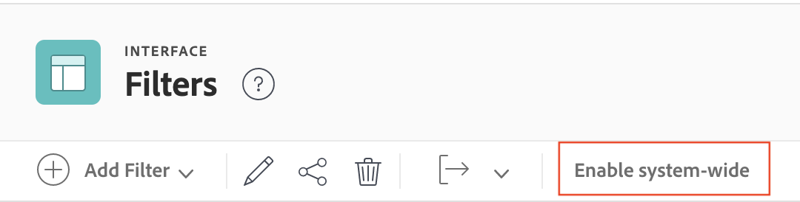

# Criar, editar e compartilhar filtros, visualizações e agrupamentos em todo o sistema

<!-- Audited: 5/2025 -->

<!--

***DON'T DELETE, DRAFT OR HIDE THIS ARTICLE. IT IS LINKED TO THE PRODUCT, THROUGH THE CONTEXT SENSITIVE HELP LINKS. **

-->

Você pode criar filtros, visualizações e agrupamentos e disponibilizá-los aos usuários em toda a organização.

Ao criar filtros, visualizações e agrupamentos em todo o sistema conforme descrito neste artigo, os usuários com os quais você os compartilha podem aproveitá-los ao visualizar suas listas. Os usuários podem criar seus próprios filtros, visualizações e agrupamentos com base naqueles que você cria, mas não podem alterá-los diretamente.

Observe que os filtros, as visualizações e os agrupamentos em todo o sistema que você cria são diferentes dos padrões que o Adobe Workfront cria automaticamente para você no sistema. Esses filtros, visualizações e agrupamentos padrão não podem ser editados ou excluídos.

## Requisitos de acesso

+++ Expanda para visualizar os requisitos de acesso para a funcionalidade neste artigo.

Você deve ter o seguinte acesso para executar as etapas deste artigo:

<table style="table-layout:auto"> 
 <col> 
 <col> 
 <tbody> 
  <tr> 
   <td role="rowheader">[!DNL Adobe Workfront] plano</td> 
   <td>Qualquer</td> 
  </tr> 
  <tr> 
   <td role="rowheader">[!DNL Adobe Workfront] licença</td> 
   <td>
Novo: [!UICONTROL Padrão]

   Ou
   
Atual: [!UICONTROL Plano]

   </td> 
  </tr>
  <tr> 
  <tr> 
   <td role="rowheader">Configurações de nível de acesso</td> 
   <td>[!UICONTROL Administrador do Sistema]</td>
  </tr> 
 </tbody> 
</table>

Para obter mais detalhes sobre as informações nesta tabela, consulte [Requisitos de acesso na documentação do Workfront](/help/quicksilver/administration-and-setup/add-users/access-levels-and-object-permissions/access-level-requirements-in-documentation.md).

+++

## Criar filtros, visualizações ou agrupamentos

{{step-1-to-setup}}

1. Clique em **[!UICONTROL Interface]** e em um dos seguintes: **[!UICONTROL Filtros]**, **[!UICONTROL Exibições]** ou **[!UICONTROL Agrupamentos]**.

1. Se você estiver criando um filtro, exibição ou agrupamento, clique em **[!UICONTROL Adicionar Filtro]**, **[!UICONTROL Adicionar Exibição]** ou **[!UICONTROL Adicionar Agrupamento]** e selecione o tipo de objeto ao qual deseja associar o novo filtro, exibição ou agrupamento.

   Ou

   Se você estiver editando um filtro, exibição ou agrupamento existente, selecione-o e clique no **[!UICONTROL ícone Editar]** .

1. Configure o filtro, a visualização ou o agrupamento.

   Para obter informações sobre opções disponíveis, consulte um dos seguintes artigos:

   * [Visão geral dos filtros](../../../reports-and-dashboards/reports/reporting-elements/filters-overview.md)
   * [Visão geral das exibições no [!UICONTROL Adobe Workfront]](../../../reports-and-dashboards/reports/reporting-elements/views-overview.md)
   * [Visão geral de agrupamentos em [!UICONTROL Adobe Workfront]](../../../reports-and-dashboards/reports/reporting-elements/groupings-overview.md)

1. Clique em **[!UICONTROL Salvar]** próximo ao canto inferior esquerdo.

Você pode disponibilizar o filtro, a visualização ou o agrupamento para os usuários do seu sistema. Para obter mais informações sobre como compartilhar filtros, exibições ou agrupamentos com outros usuários, consulte a seção [Disponibilizar filtros, exibições ou agrupamentos para usuários](#make-filters-views-or-groupings-available-to-users) neste artigo.

## Disponibilizar filtros, visualizações ou agrupamentos a todos os usuários {#make-filters-views-or-groupings-available-to-users}

Você pode optar por mostrar ou ocultar filtros, visualizações ou agrupamentos no sistema. Filtros visíveis estão disponíveis para todos os usuários em todo o sistema. Esta configuração funciona como uma chave liga/desliga para todo o sistema, incluindo o Modelo de layout.

Se você quiser ocultar filtros, visualizações ou agrupamentos de usuários específicos, recomendamos usar um Modelo de layout em vez de desativá-lo em todo o sistema.

>[!NOTE]
>
>* Se um usuário estiver usando ativamente um filtro, uma visualização ou um agrupamento e um administrador desativá-lo, o usuário ainda terá acesso até que escolha um novo filtro, exibição ou agrupamento. Depois de escolher um novo, eles não poderão mais reverter para o oculto.
>* Se todos os filtros, visualizações e agrupamentos forem restritos por meio do Modelo de layout ou desativados em todo o sistema, o usuário verá as opções padrão, pois o sistema deve exibir algo.

Para mostrar ou ocultar filtros, exibições ou agrupamentos:

{{step-1-to-setup}}

1. Clique em **[!UICONTROL Interface]** e em um dos seguintes: **[!UICONTROL Filtros]**, **[!UICONTROL Exibições]** ou **[!UICONTROL Agrupamentos]**.

1. (Condicional) Selecione o filtro, o modo de exibição ou o agrupamento que deseja disponibilizar aos usuários e clique em **[!UICONTROL Habilitar todo o sistema]**.

   

   >[!TIP]
   >
   >Se você deseja manter o filtro, a visualização ou o agrupamento disponível para a maioria dos usuários, mas ocultá-lo de outros, é possível usar o Modelo de layout. Para obter mais informações, consulte [Personalizar Filtros, Exibições e Agrupamentos usando um modelo de layout](/help/quicksilver/administration-and-setup/customize-workfront/use-layout-templates/customize-fvg-list-controls-layout-template.md).

1. (Condicional) Selecione o filtro, o modo de exibição ou o agrupamento que deseja ocultar dos usuários e clique em **[!UICONTROL Desabilitar todo o sistema]**. O filtro, a visualização ou o agrupamento agora estão ocultos no Modelo de layout e nos usuários do sistema.

## Compartilhar filtros, visualizações ou agrupamentos personalizados com usuários específicos

Estas etapas explicam como compartilhar filtros, exibições e agrupamentos personalizados com usuários específicos usando a caixa de diálogo de compartilhamento na área [!UICONTROL Interface] da [!UICONTROL Instalação]. Você pode conceder ou gerenciar o acesso a filtros, visualizações e agrupamentos que você ou outras pessoas criam. Não é possível compartilhar padrões do sistema com usuários.

{{step-1-to-setup}}

1. Clique em **[!UICONTROL Interface]** e em um dos seguintes: **[!UICONTROL Filtros]**, **[!UICONTROL Exibições]** ou **[!UICONTROL Agrupamentos]**.

1. Selecione o filtro, o modo de exibição ou o agrupamento que deseja compartilhar e clique no **[!UICONTROL ícone Compartilhar]** .
1. Comece digitando o nome de usuários, equipes, funções, grupos ou empresas específicos com os quais compartilhar o filtro, a visualização ou o agrupamento e clique no nome quando ele aparecer na lista suspensa.

   Para obter mais informações sobre compartilhamento, consulte [Visão geral das permissões de compartilhamento em objetos](../../../workfront-basics/grant-and-request-access-to-objects/sharing-permissions-on-objects-overview.md).

1. Escolha **Exibir** ou **Gerenciar** ao lado do nome do usuário, da equipe, da função, do grupo ou da empresa. Para ajustar as permissões, clique no ícone do controle deslizante e ajuste as permissões.

   

1. Clique em **[!UICONTROL Salvar]**. Os usuários especificados agora podem interagir com o filtro, a exibição ou o agrupamento ao visualizar o tipo de objeto ao qual você o associou.

## Excluir filtros, visualizações e agrupamentos

{{step-1-to-setup}}

1. Clique em **[!UICONTROL Interface]** e em um dos seguintes: **[!UICONTROL Filtros]**, **[!UICONTROL Exibições]** ou **[!UICONTROL Agrupamentos]**.

1. Selecione um ou mais itens na lista e clique no **[!UICONTROL ícone Excluir]** .

1. Na caixa de diálogo **Excluir** exibida, clique em **Sim, Excluir**.
