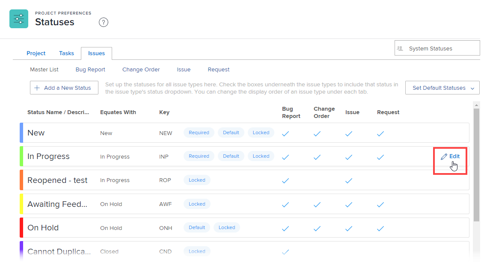

# Personalizar tipos de problemas padrão

Os tipos de problema são úteis nas seguintes circunstâncias:

* Ao personalizar os status de problemas, conforme descrito em [Criar ou editar um status](../../../administration-and-setup/customize-workfront/creating-custom-status-and-priority-labels/create-or-edit-a-status.md).
* Ao criar uma fila de solicitações, conforme descrito em [Criar uma fila de solicitações](../../../manage-work/requests/create-and-manage-request-queues/create-request-queue.md).

Você pode personalizar os rótulos de cada tipo de problema padrão para corresponder melhor à terminologia usada em sua organização.

## Requisitos de acesso

Você deve ter o seguinte acesso para executar as etapas neste artigo:

<table style="table-layout:auto"> 
 <col> 
 <col> 
 <tbody> 
  <tr> 
   <td role="rowheader">[!DNL Adobe Workfront] plano</td> 
   <td>Qualquer Um</td> 
  </tr> 
  <tr> 
   <td role="rowheader">[!DNL Adobe Workfront] licença</td> 
   <td>[!UICONTROL Plan]</td> 
  </tr> 
  <tr> 
   <td role="rowheader">Configurações de nível de acesso</td> 
   <td> 
Você deve ser um [!DNL Workfront] administrador.
 
<b>OBSERVAÇÃO</b>: Se ainda não tiver acesso, pergunte ao seu [!DNL Workfront] administrador se eles definirem restrições adicionais em seu nível de acesso. Para obter informações sobre como uma [!DNL Workfront] administrador pode modificar seu nível de acesso, consulte <a href="../../../administration-and-setup/add-users/configure-and-grant-access/create-modify-access-levels.md" class="MCXref xref">Criar ou modificar níveis de acesso personalizados</a>.
 </td> 
  </tr> 
 </tbody> 
</table>

## Tipos de problema padrão

Se tiver [!DNL Adobe Workfront] [!UICONTROL administrador] acesso, há quatro tipos de problemas padrão que você pode configurar e renomear:

* **[!UICONTROL Relatório de erros]** Usado para rastrear bugs relatados no sistema.
* **[!UICONTROL Alterar ordem]** Usado para rastrear problemas que precisam ser atualizados ou revisados.
* **[!UICONTROL Problema]** Um objeto em [!DNL Workfront] que comunica trabalho não planejado, um problema que surge ou algo que deve ser resolvido para continuar uma tarefa.
* **[!UICONTROL Solicitação]** Um tipo de problema que se aplica a uma fila de solicitações em que os usuários fazem solicitações no Workfront.

## Personalizar um tipo de problema

Considere o seguinte sobre a personalização de tipos de problemas:

* Você pode modificar o rótulo de um tipo de problema, mas não pode alterar sua função.
* Não é possível criar tipos de problema adicionais.
* Não é possível alterar os valores do filtro para o nome de um tipo de problema. Portanto, se você criar um filtro em um relatório de problema, o valor do filtro (chave) não reflete o nome personalizado do tipo de problema.
* Três status padrão estão associados a cada tipo de problema: [!UICONTROL Novo], [!UICONTROL Em Andamento]e [!UICONTROL Fechado]. Não é possível excluir esses status ou removê-los de um tipo de problema, mas é possível renomeá-los.
* É possível reordenar as opções exibidas no menu suspenso para cada tipo de problema.

Para personalizar um tipo de problema:

1. Clique no botão **[!UICONTROL Menu principal]** ícone  no canto superior direito de [!DNL Adobe Workfront], depois clique em **[!UICONTROL Configuração]** .

1. Clique em **[!UICONTROL Preferências do projeto]** > **[!UICONTROL Status]**.

1. Clique no botão **[!UICONTROL Problemas]** guia .
1. Siga um destes procedimentos:

   * Passe o mouse sobre o tipo de problema que deseja personalizar, clique no botão [!UICONTROL Editar] ícone  que aparece na extrema direita e digite um novo nome para o tipo de problema.

      

   * Clique em um [!UICONTROL tipo de problema] para listar os status associados, arraste as alças que aparecem quando você passa o mouse sobre elas e solte-as na ordem em que deseja que apareçam no problema dos usuários **[!UICONTROL Status]** menu suspenso.
