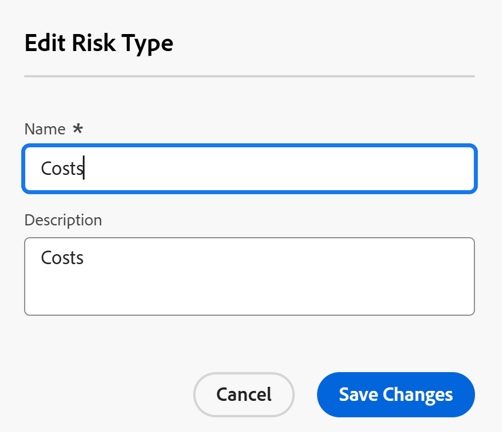

# Editar e criar tipos de risco

<!--Audited: 03/2025-->

<!--DON'T DELETE, DRAFT OR HIDE THIS ARTICLE. IT IS LINKED TO THE PRODUCT, THROUGH THE CONTEXT SENSITIVE HELP LINKS.-->

As informações destacadas nesta página referem-se a funcionalidades que ainda não estão disponíveis. Ela está disponível somente no ambiente de Pré-visualização para todos os clientes. Depois das versões mensais para produção, os mesmos recursos também ficam disponíveis no ambiente de produção para clientes que ativaram versões rápidas. 

Para obter informações sobre versões rápidas, consulte [Habilitar ou desabilitar versões rápidas para sua organização](/help/quicksilver/administration-and-setup/set-up-workfront/configure-system-defaults/enable-fast-release-process.md). 

O Adobe Workfront tem vários tipos de risco padrão que você pode associar a projetos na fase de planejamento para identificar possíveis obstáculos antes da aprovação de qualquer trabalho.

Os riscos são eventos possíveis que podem impedir a conclusão do projeto no prazo ou dentro do orçamento.

Além dos tipos de risco padrão, você pode adicionar um novo tipo de risco para refletir as necessidades em sua organização.

Você pode associar tipos de risco a riscos do projeto para identificar que tipo de risco um projeto pode encontrar.

## Requisitos de acesso

+++ Expanda para visualizar os requisitos de acesso para a funcionalidade neste artigo.

Você deve ter o seguinte acesso para executar as etapas deste artigo:

<table style="table-layout:auto"> 
 <col> 
 <col> 
 <tbody> 
  <tr> 
   <td role="rowheader">[!DNL Adobe Workfront] plano</td> 
   <td>Qualquer</td> 
  </tr> 
  <tr> 
   <td role="rowheader">[!DNL Adobe Workfront] licença*</td> 
   <td>
Novo: [!UICONTROL Padrão]

   Ou
   
Atual: [!UICONTROL Plano]

   </td> 
  </tr> 
  <tr> 
   <td role="rowheader">Configurações de nível de acesso</td> 
   <td>[!UICONTROL Administrador do Sistema]</td>
  </tr> 
 </tbody> 
</table>

*Para obter mais detalhes sobre as informações nesta tabela, consulte [Requisitos de acesso na documentação da Workfront](/help/quicksilver/administration-and-setup/add-users/access-levels-and-object-permissions/access-level-requirements-in-documentation.md).

+++

## Tipos de riscos

Os tipos de risco são rótulos que você pode usar para seus riscos a fim de categorizá-los para fins de relatório.

Como administrador [!DNL Workfront], você pode criar [!UICONTROL Tipos de Riscos] na área [!UICONTROL **Instalação**].

Depois de configurar tipos de riscos, eles são universais para o seu sistema.

Todos os proprietários de projetos podem usar os mesmos tipos de risco para seus projetos.

## Editar e criar tipos de risco

Alguns tipos de risco já estão em [!DNL Workfront], por padrão.

Você pode fazer o seguinte para aprimorar o número de tipos de risco na instância do Workfront:

* [Editar tipos de risco existentes](#edit-existing-risk-types)
* [Criar tipos de risco](#create-risk-types)

### Editar tipos de risco existentes {#edit-existing-risk-types}

{{step-1-to-setup}}

1. Clique em **[!UICONTROL Tipos de Riscos]**.
1. Selecione o tipo de risco que deseja editar.
1. Clique no ícone **[!UICONTROL Editar]** .

   A caixa [!UICONTROL **Editar Tipo de Risco**] é aberta.

   

   >[!TIP]
   >
   >   É possível editar as informações de tipo de risco em linha, ao clicar duas vezes no Nome ou Descrição de um tipo de risco em uma lista de tipos de risco.

1. (Opcional) Altere o nome e a descrição do tipo de risco.

   Há um limite de 50 caracteres para os campos **[!UICONTROL Nome]** e **[!UICONTROL Descrição]**.

1. Clique em **[!UICONTROL Salvar alterações].**

1. (Opcional) Para excluir um tipo de risco, selecione-o na lista e clique no ícone [!UICONTROL **Excluir**]  e, em seguida, clique em [!UICONTROL **Sim, Excluir**]. O tipo de risco é excluído e não pode ser recuperado.

1. (Opcional) Para exportar uma lista de tipos de risco, clique no ícone [!UICONTROL **Exportar**] . Você pode exportar para os seguintes tipos de arquivos:

   * PDF
   * Excel
   * Excel (xlsx)
   * Delimitado por tabulação

   >[!TIP]
   >
   >   Primeiro, você pode selecionar um número limitado de tipos de risco e exportá-los para uma lista menor.

### Criar tipos de risco {#create-risk-types}

Você pode criar tipos de risco, além dos tipos padrão.

{{step-1-to-setup}}

1. Clique em **[!UICONTROL Tipos de Riscos]**.

1. Clique em **[!UICONTROL Novo tipo de risco]** para abrir a caixa [!UICONTROL **Novo tipo de risco**]

   Ou

   Clique em [!UICONTROL **Adicionar mais tipos de risco**] no canto inferior esquerdo da lista de tipos de risco para adicionar tipos de risco em linha.

   A caixa **Novo Tipo de Risco** é aberta. 

   

1. Adicione um **[!UICONTROL Nome]** (obrigatório) e uma **[!UICONTROL Descrição]** (opcional) para o tipo de risco.

   Há um limite de 50 caracteres para os campos **[!UICONTROL Nome]** e **[!UICONTROL Descrição]**.

1. Clique em **[!UICONTROL Criar Tipo de Risco]**,

   Ou, se você usou a edição em linha para adicionar seu tipo de risco, clique em **[!UICONTROL Inserir]** quando terminar.

   >[!TIP]
   >
   >Para editar um tipo de risco personalizado, consulte a seção [[!UICONTROL Editar tipos de risco] existentes](#edit-existing-risk-types) neste artigo.

## Associar riscos com tipos de risco em projetos

Você pode usar tipos de riscos para rotular riscos adicionados aos seus projetos.

Para obter mais informações sobre como adicionar riscos a projetos, consulte [Criar e editar riscos em projetos](../../../manage-work/projects/define-a-business-case/create-edit-risks-on-projects.md).
