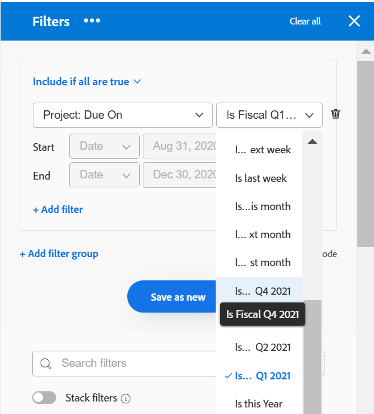

# Habilitar trimestres personalizados

<!--Audited: 03/2026-->

As informações destacadas nesta página referem-se a funcionalidades que ainda não estão disponíveis. Ela está disponível somente no ambiente de Pré-visualização para todos os clientes. Depois das versões mensais para produção, os mesmos recursos também ficam disponíveis no ambiente de produção para clientes que ativaram versões rápidas. 

Para obter informações sobre versões rápidas, consulte [Habilitar ou desabilitar versões rápidas para sua organização](/help/quicksilver/administration-and-setup/set-up-workfront/configure-system-defaults/enable-fast-release-process.md). 

Para fins de relatórios, você pode criar trimestres personalizados se os trimestres de sua organização forem baseados em critérios específicos diferentes das datas do calendário (como dias úteis ou dias de compras).

Dependendo dos produtos comprados por sua empresa, é possível configurar o seguinte número de trimestres na área de configuração do Workfront:

* Os clientes que compraram somente [!DNL Workfront] podem configurar até oito trimestres personalizados para seus sistemas [!DNL Adobe Workfront].
* Os clientes que compraram o [!DNL Workfront] e o [!DNL Workfront Planning] podem configurar até 100 trimestres para seus sistemas [!DNL Workfront], que também estão disponíveis no [!DNL Planning].

## Requisitos de acesso

+++ Expanda para visualizar os requisitos de acesso da funcionalidade neste artigo.

<table style="table-layout:auto"> 
 <col> 
 <col> 
 <tbody> 
  <tr> 
   <td>[!DNL Adobe Workfront] pacote</td> 
   <td>
Qualquer
</td> 
  </tr> 
  <tr> 
   <td>[!DNL Adobe Workfront] licença</td> 
   <td>
[!UICONTROL Padrão]

       
[!UICONTROL Plan]
</td>
  </tr> 
  <tr> 
   <td>Configurações de nível de acesso</td> 
   <td>[!UICONTROL Administrador do Sistema]</td> 
  </tr> 
 </tbody> 
</table>

Para obter informações, consulte [Requisitos de acesso na documentação do Workfront](/help/quicksilver/administration-and-setup/add-users/access-levels-and-object-permissions/access-level-requirements-in-documentation.md).

+++

## Configurar trimestres personalizados para o sistema [!DNL Workfront]

{{step-1-to-setup}}

1. (Condicional) Dependendo do ambiente no qual você acessa Trimestres personalizados, execute um dos seguintes procedimentos:

   * No ambiente de Produção, clique em **[!UICONTROL Preferências do Projeto]** > **[!UICONTROL Projetos].**
   * No ambiente de Visualização, clique em **[!UICONTROL Trimestres personalizados]**.

1. Selecione **[!UICONTROL Habilitar Trimestres Personalizados]**.

1. Digite um nome para o trimestre personalizado, como &quot;T1 fiscal de 2021&quot;.
1. Selecione datas de início e término para o trimestre personalizado.

   

1. (Opcional) Clique em **[!UICONTROL Adicionar trimestre personalizado]** para adicionar mais trimestres personalizados ao sistema.

   >[!IMPORTANT]
   >
   > Se sua empresa comprou o [!DNL Workfront Planning], você não poderá salvar trimestres personalizados se houver lacunas ou sobreposições entre os trimestres.
   >
   >Intervalos e sobreposições entre os trimestres são permitidos somente para [!DNL Workfront] clientes.

1. (Opcional e condicional) Se sua empresa comprou apenas o [!DNL Workfront], sem o [!DNL Workfront Planning], crie um elemento de relatório que faça referência aos trimestres fiscais.

   **Exemplo:** Crie um filtro para uma lista de [!UICONTROL projetos] e inclua a Data de Conclusão Planejada de um projeto que faça referência aos trimestres personalizados.

   

   As referências a &quot;Este trimestre&quot;, &quot;Próximo trimestre&quot; e &quot;Último trimestre&quot; são substituídas por novas referências aos trimestres personalizados.

   Para obter informações sobre elementos de relatórios, consulte [Elementos de relatórios: filtros, exibições e agrupamentos](../../../reports-and-dashboards/reports/reporting-elements/reporting-elements-filters-views-groupings.md).

   Para obter informações sobre como criar filtros, consulte [Criar ou editar filtros em [!DNL Adobe Workfront]](../../../reports-and-dashboards/reports/reporting-elements/create-filters.md).
1. (Opcional e condicional) Se sua empresa adquiriu o Workfront Planning e você tem acesso a [!DNL Workfront Planning], vá para uma página de tipo de registro e abra uma exibição de linha do tempo. A exibição mostra os novos trimestres personalizados.
Para obter informações, consulte [Gerenciar a exibição da linha do tempo](/help/quicksilver/planning/views/manage-the-timeline-view.md).
