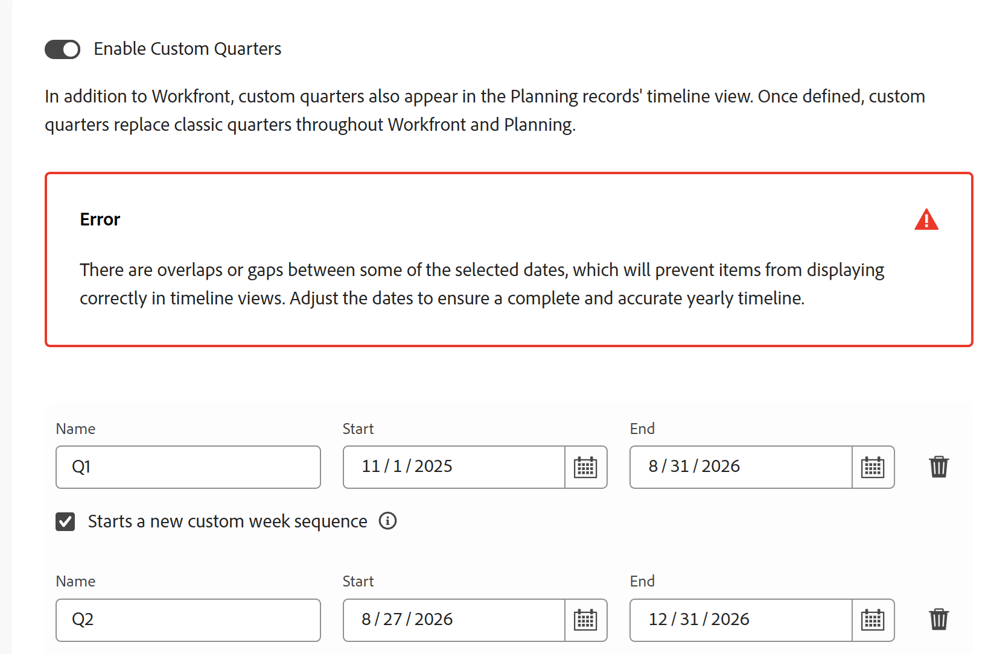

# Habilitar trimestres personalizados

<!--Audited: 03/2026-->

<!--remove Production and Preview references at release-->

As informações destacadas nesta página referem-se a funcionalidades que ainda não estão disponíveis. Ela está disponível somente no ambiente de Pré-visualização para todos os clientes. Depois das versões mensais para produção, os mesmos recursos também ficam disponíveis no ambiente de produção para clientes que ativaram versões rápidas. 

Para obter informações sobre versões rápidas, consulte [Habilitar ou desabilitar versões rápidas para sua organização](/help/quicksilver/administration-and-setup/set-up-workfront/configure-system-defaults/enable-fast-release-process.md). 

Para fins de relatórios, você pode criar trimestres personalizados se os trimestres de sua organização forem baseados em critérios específicos diferentes das datas do calendário (como dias úteis ou dias de compras).

Dependendo dos produtos comprados por sua empresa, é possível configurar o seguinte número de trimestres na área de configuração do Workfront:

* Os clientes que compraram somente [!DNL Workfront] podem configurar até oito trimestres personalizados para seus sistemas [!DNL Adobe Workfront].
* Os clientes que compraram o [!DNL Workfront] e o [!DNL Workfront Planning] podem configurar até 100 trimestres para seus sistemas [!DNL Workfront], que também estão disponíveis no [!DNL Planning].

* Os clientes que compraram [!DNL Workfront] e [!DNL Workfront Planning] podem configurar semanas personalizadas para cada trimestre personalizado. As semanas personalizadas estão visíveis nas [!DNL Planning] exibições da linha do tempo.

## Requisitos de acesso

+++ Expanda para visualizar os requisitos de acesso da funcionalidade neste artigo.

<table style="table-layout:auto"> 
 <col> 
 <col> 
 <tbody> 
  <tr> 
   <td>[!DNL Adobe Workfront] pacote</td> 
   <td>
Qualquer
</td> 
  </tr> 
  <tr> 
   <td>[!DNL Adobe Workfront] licença</td> 
   <td>
Licença do [!UICONTROL Workflow Standard] ou [!UICONTROL Workfront Plan]

       

</td>
  </tr> 
  <tr> 
   <td>Configurações de nível de acesso</td> 
   <td>[!UICONTROL Administrador do Sistema]</td> 
  </tr> 
 </tbody> 
</table>

Para obter informações, consulte [Requisitos de acesso na documentação do Workfront](/help/quicksilver/administration-and-setup/add-users/access-levels-and-object-permissions/access-level-requirements-in-documentation.md).

+++

<!--
When we release fiscal weeks, replace the table above with this:

<table style="table-layout:auto"> 
 <col> 
 <col> 
 <tbody> 
  <tr> 
   <td>[!DNL Adobe Workfront] package</td> 
   <td>
   <ul>
   <li>
To configure custom quarters:

   
Any Workfront or Workflow package
</li>
   <li>
   

   
To configure custom weeks:

   
Any Planning package, including Planning as a standalone product

   

   </li>
   </ul>
   </td> 
  </tr> 
  <tr> 
   <td>[!DNL Adobe Workfront] license</td> 
   <td>
   
   <ul>
   <li>
To configure custom quarters:

   
[!UICONTROL Workflow Standard] or [!UICONTROL Workfront Plan] license
</li>
   <li>
   

   
To configure custom weeks:

   
A [!UICONTROL Planning Standard] license, in addition to a Workfront or a Workflow license

   

   </li>
   </ul>
    </td>
  </tr> 
  <tr> 
   <td>Access level configurations</td> 
   <td>[!UICONTROL System Administrator]</td> 
  </tr> 
 </tbody> 
</table>

-->

## Configurar trimestres personalizados para o sistema [!DNL Workfront]

A configuração de trimestres personalizados difere de acordo com o ambiente usado.

### Configure trimestres personalizados para seu sistema [!DNL Workfront] no ambiente de Produção

{{step-1-to-setup}}

1. Clique em **[!UICONTROL Trimestres personalizados]**.

1. Selecione **[!UICONTROL Habilitar Trimestres Personalizados]**.

1. Digite um nome para o trimestre personalizado, como &quot;T1 fiscal de 2021&quot;.
1. Selecione datas de início e término para o trimestre personalizado.

   

1. (Opcional) Clique em **[!UICONTROL Adicionar trimestre personalizado]** para adicionar mais trimestres personalizados ao sistema.

   >[!IMPORTANT]
   >
   > Se sua empresa comprou o [!DNL Workfront Planning], você não poderá salvar trimestres personalizados se houver lacunas ou sobreposições entre os trimestres.
   >
   >Intervalos e sobreposições entre os trimestres são permitidos somente para [!DNL Workfront] clientes.

1. (Opcional e condicional) Se sua empresa comprou apenas o [!DNL Workfront], sem o [!DNL Workfront Planning], crie um elemento de relatório que faça referência aos trimestres fiscais.

   **Exemplo:** Crie um filtro para uma lista de [!UICONTROL projetos] e inclua a Data de Conclusão Planejada de um projeto que faça referência aos trimestres personalizados.

   

   As referências a &quot;Este trimestre&quot;, &quot;Próximo trimestre&quot; e &quot;Último trimestre&quot; são substituídas por novas referências aos trimestres personalizados.

   Para obter informações sobre elementos de relatórios, consulte [Elementos de relatórios: filtros, exibições e agrupamentos](../../../reports-and-dashboards/reports/reporting-elements/reporting-elements-filters-views-groupings.md).

   Para obter informações sobre como criar filtros, consulte [Criar ou editar filtros em [!DNL Adobe Workfront]](../../../reports-and-dashboards/reports/reporting-elements/create-filters.md).
1. (Opcional e condicional) Se sua empresa adquiriu o Workfront Planning e você tem acesso a [!DNL Workfront Planning], vá para uma página de tipo de registro e abra uma exibição de linha do tempo. A exibição mostra os novos trimestres personalizados.
Para obter informações, consulte [Gerenciar a exibição da linha do tempo](/help/quicksilver/planning/views/manage-the-timeline-view.md).

### Configurar trimestres personalizados para o sistema [!DNL Workfront] no ambiente de Visualização

>[!NOTE]
>
>Se sua organização adquiriu um pacote do Planning além de um pacote do Workflow, ou se adquiriu o Workfront Planning como um pacote independente, você pode configurar semanas personalizadas, além de trimestres personalizados.
> 
>Semanas personalizadas não estão disponíveis para relatórios e listas do Workfront.

{{step-1-to-setup}}

1. Clique em **[!UICONTROL Trimestres personalizados]**.

1. Selecione **[!UICONTROL Habilitar Trimestres Personalizados]**.

1. Digite um nome para o trimestre personalizado. Por exemplo, &quot;T1 fiscal de 2021&quot;.
1. Selecione datas de início e término para o trimestre personalizado.

1. (Opcional) Selecione a opção **Inicia uma nova sequência semanal personalizada**.

   Quando selecionada, essa opção define o início do trimestre personalizado como o início da primeira semana personalizada do trimestre no modo de exibição de linha do tempo do Planning.
1. (Opcional) Na área **Formato de rótulo de semana personalizado**, escolha o **Formato** para os rótulos de semana personalizados. Escolha entre as seguintes opções:

   * **W1, W2, W3 ...** . Este é o formato padrão.
   * **FW1, FW2, FW3 ...**
   * **Semana1, Semana 2, Semana 3, ...**
   * **Personalizado**

1. (Condicional) Se você selecionou **Personalizado** para o campo **Formato**, digite um **Rótulo personalizado** para identificar as semanas personalizadas.

   As semanas personalizadas são exibidas nas exibições de linha do tempo do Planning.

   >[!TIP]
   >
   >Ao adicionar um rótulo personalizado, você pode digitar até 100 caracteres.
   >
   >Você pode indicar o nome da primeira semana e as semanas seguintes usarão o mesmo rótulo seguido de um número sequencial.
   >
   >Por exemplo, um **Rótulo personalizado** de &quot;Semana fiscal&quot; adicionará os rótulos de &quot;Semana fiscal 1, Semana fiscal 2, Semana fiscal 3 ...&quot; para o resto das semanas na sequência.

1. (Opcional) Clique em **[!UICONTROL Adicionar trimestre personalizado]** para adicionar mais trimestres personalizados ao sistema.

   >[!IMPORTANT]
   >
   > Se sua empresa comprou o [!DNL Workfront Planning], você não poderá salvar trimestres personalizados se houver lacunas ou sobreposições entre os trimestres.
   >
   >Intervalos e sobreposições entre os trimestres são permitidos somente para [!DNL Workfront] clientes.

1. (Opcional e condicional) Para exibir os trimestres personalizados no Workfront, crie um elemento de relatório que faça referência aos trimestres personalizados.

   **Exemplo:** Crie um filtro para uma lista de [!UICONTROL projetos] e inclua a Data de Conclusão Planejada de um projeto que faça referência aos trimestres personalizados.

   

   As referências a &quot;Este trimestre&quot;, &quot;Próximo trimestre&quot; e &quot;Último trimestre&quot; são substituídas por novas referências aos trimestres personalizados.

   Para obter informações sobre elementos de relatórios, consulte [Elementos de relatórios: filtros, exibições e agrupamentos](../../../reports-and-dashboards/reports/reporting-elements/reporting-elements-filters-views-groupings.md).

   Para obter informações sobre como criar filtros, consulte [Criar ou editar filtros em [!DNL Adobe Workfront]](../../../reports-and-dashboards/reports/reporting-elements/create-filters.md).
1. (Opcional e condicional) Para exibir trimestres e semanas personalizados no Workfront Planning, vá para uma página de tipo de registro e abra uma exibição de linha do tempo. A exibição mostra os novos trimestres e semanas personalizados.

Para obter informações, consulte [Gerenciar a exibição da linha do tempo](/help/quicksilver/planning/views/manage-the-timeline-view.md).

