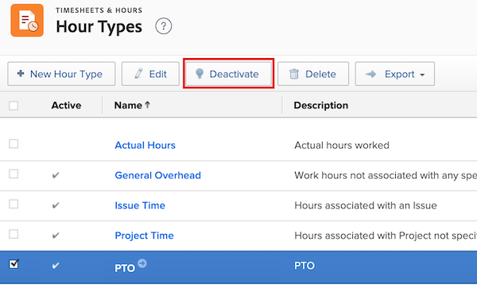

# Gerenciar tipos de horas

<!--Audited: 05/2025-->

<!--Audited: 07/2024-->

<!--DON'T DELETE, DRAFT OR HIDE THIS ARTICLE. IT IS LINKED TO THE PRODUCT, THROUGH THE CONTEXT SENSITIVE HELP LINKS. 
**Linked to Creating Billing Record-->

Os tipos de horas são rótulos usados para definir suas entradas de horas. Você pode associar tipos de horas a suas entradas de horas.

Há dois conjuntos de tipos de horas:

* Tipos de horas específicas do projeto: este é o tempo registrado em projetos, tarefas e problemas. Tipos de hora específicos do projeto podem ser associados a entradas de hora em qualquer lugar no [!DNL Adobe Workfront], onde você pode registrar horas para projetos, tarefas e problemas.

  Ao registrar horas em [!DNL Workfront], os tipos de horas específicos do projeto que estão disponíveis dependem das opções de configuração definidas nos níveis de sistema, projeto e usuário.

  Os seguintes tipos de horas específicos do projeto padrão estão sempre disponíveis:

   * Tempo em Projeto
   * Tempo de tarefa
   * Tempo do problema

  O administrador [!DNL Workfront] determina quais tipos de horas específicas do projeto são disponibilizadas, conforme descrito em [Definir tipos de horas e disponibilidade](../../../timesheets/create-and-manage-timesheets/define-hour-types-and-availability.md).

  >[!NOTE]
  >
  >Se você habilitar qualquer tipo de hora específico de projeto no sistema [!DNL Workfront], pelo menos um tipo de hora específico de projeto deve ser habilitado em cada projeto no sistema. Você não pode ativar um tipo de hora específico do projeto no nível do sistema e não tem tipos de hora específicos do projeto disponíveis no nível do projeto.

* Tipos de horas gerais: horas gerais não podem ser associadas a um projeto, tarefa ou problema, e são registradas diretamente em uma folha de horas.

Para obter informações sobre como registrar horas e associá-las a tipos de horas, consulte [Registrar tempo](/help/quicksilver/timesheets/create-and-manage-timesheets/log-time.md).

## Requisitos de acesso

+++ Expanda para visualizar os requisitos de acesso para a funcionalidade neste artigo.

Você deve ter o seguinte acesso para executar as etapas deste artigo:

<table style="table-layout:auto"> 
 <col> 
 <col> 
 <tbody> 
  <tr> 
   <td role="rowheader">plano do Adobe Workfront</td> 
   <td>Qualquer</td> 
  </tr> 
  <tr> 
   <td role="rowheader">Licença do Adobe Workfront</td> 
   <td> 
Novo: Padrão

   
Ou

   
Atual: Plano
</td> 
  </tr> 
  <tr> 
   <td role="rowheader">Configurações de nível de acesso</td> 
   <td>Administrador de Sistema</td>
  </tr> 
 </tbody> 
</table>

Para obter mais detalhes sobre as informações nesta tabela, consulte [Requisitos de acesso na documentação do Workfront](/help/quicksilver/administration-and-setup/add-users/access-levels-and-object-permissions/access-level-requirements-in-documentation.md).

+++

## Tipos de horas incorporadas

O Workfront vem com um conjunto de tipos de horas incorporados. Esses tipos de horas não podem ser editados ou ocultos.

Os tipos de horas que vêm com [!DNL Workfront] são:

* **[!UICONTROL Período de licença por doença]**: um tipo de hora geral que não pode ser associado a entradas de hora em um projeto, tarefa ou problema. O período de licença por doença não pode ser contado como receita.
* **[!UICONTROL Férias]**: um tipo de hora geral que não pode ser associado a entradas de hora em um projeto, tarefa ou problema. O período de férias não pode ser contado como receita.
* **[!UICONTROL Horas Gerais Gerais]**: um tipo de hora geral que não pode ser associado a entradas de hora em um projeto, tarefa ou problema. Pode contar como receita no processo de planejamento do projeto.
* **[!UICONTROL Hora do Projeto]**: um tipo de hora geral que só pode ser associado a entradas de hora em um projeto.
* **[!UICONTROL Horário da Tarefa]**: um tipo de hora geral que só pode ser associado a entradas de hora em uma tarefa.
* **[!UICONTROL Hora do Problema]**: um tipo de hora geral que só pode ser associado a entradas de hora em um problema.

## Criar tipos de horas

Como administrador do [!DNL Workfront], você pode criar novos tipos de horas para sua organização nos níveis do sistema e do projeto. Posteriormente, os usuários podem definir quais tipos de horas estão disponíveis para projetos e usuários específicos. Para obter mais informações, consulte [Definir tipos de hora e disponibilidade](../../../timesheets/create-and-manage-timesheets/define-hour-types-and-availability.md)

Para criar novos tipos de horas:

{{step-1-to-setup}}

1. No painel esquerdo, clique em **Folhas de horas e Horas** e em **Tipos de horas**.

1. Na seção **Tipos de Hora**, clique em **+ Novo Tipo de Hora**.
1. Na caixa de diálogo **Novos Tipos de Hora**, especifique as seguintes informações:

   <table style="table-layout:auto"> 
    <col> 
    <col> 
    <tbody> 
     <tr> 
      <td role="rowheader">[!UICONTROL Nome]</td> 
      <td>Insira um nome de tipo de hora que seja facilmente reconhecível no sistema.</td> 
     </tr> 
     <tr> 
      <td role="rowheader">[!UICONTROL Descrição]</td> 
      <td>Adicione uma descrição para o tipo de hora.</td> 
     </tr> 
     <tr> 
      <td role="rowheader">[!UICONTROL Escopo]</td> 
      <td> 
Selecione se o tipo de hora é geral ou específico do projeto no menu suspenso <strong>Escopo</strong>.
 
Os tipos de horas gerais são visíveis apenas em folhas de horas e não podem ser associados a projetos, tarefas ou problemas.
 
<b>IMPORTANTE</b>: se você tiver um Tipo de Hora personalizado [!UICONTROL Específico do Projeto] e alterá-lo para [!UICONTROL Geral], todas as horas de Tarefa, Problemas e Projeto existentes serão definidas para seus tipos padrão do sistema.
 </td> 
     </tr> 
     <tr> 
      <td role="rowheader">[!UICONTROL Contar como Receita]</td> 
      <td>
Selecione esta opção se quiser que a entrada de horas associada a este tipo de hora afete seus cálculos de receita.

      
O Período de Doença e o Período de Férias não podem ser contados como receita.

      
<b>Nota</b>

      
Quando os tipos de hora gerais são contados como receita, a Taxa de custo associada ao perfil do usuário que registra o tempo é associada ao custo por hora.  
      </td> 
     </tr> 
    </tbody> 
   </table>

1. Clique em **[!UICONTROL Criar Tipo de Hora].**

## Desativar tipos de horas

Você pode desativar os tipos de horas se não quiser mais que os usuários associem suas horas a eles. A desativação de tipos de horas os oculta de qualquer lugar em [!DNL Workfront] onde os tipos de horas estejam visíveis.

Para desativar um tipo de hora:

{{step-1-to-setup}}

1. No painel esquerdo, clique em **[!UICONTROL Folhas de horas e Horas]** e em **[!UICONTROL Tipos de horas]**.

1. Selecione o tipo de hora que deseja desativar.

1. Clique em **[!UICONTROL Desativar]**.

   
