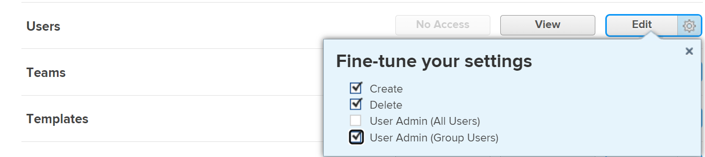

# Desativar ou reativar uma empresa

<!--The highlighted information on this page refers to functionality not yet generally available. It is available only in the Preview Sandbox environment, and is being released in a phased rollout to Production.-->

É possível desativar uma empresa que não é mais usada, mantendo todos os dados históricos associados a ela. Se você desativar uma empresa já em uso em algum lugar no sistema, ela continuará a funcionar da mesma forma que sempre funcionou. Ele não é removido ou bloqueado.

## Requisitos de acesso

+++ Expanda para visualizar os requisitos de acesso da funcionalidade neste artigo.

<table style="table-layout:auto">
 <tbody> 
  <tr> 
   <td> 
[!DNL Workfront] pacote
 </td> 
   <td>
Qualquer

   </td> 
  </tr> 
  <tr> 
   <td> 
[!DNL Adobe Workfront] licença
 </td> 
   <td>
[!UICONTROL Plan]

   
[!UICONTROL Padrão]

   </td> 
  </tr>
  <tr> 
   <td>Configurações de nível de acesso</td> 
  <td> 
Você deve ter um dos seguintes:
 
    <ul> 
     <li> 
O nível de acesso do [!UICONTROL System Administrator], que permite editar qualquer empresa no sistema.
 </li> 
     <li> 
Acesso administrativo para gerenciar empresas, que permite editar qualquer empresa no sistema.
 </li> 
    </ul> 
<b>NOTA</b>:
     <ul> 
      <li> 
Você também pode gerenciar empresas associadas a qualquer grupo ao qual esteja atribuído como administrador de grupo.
 </li> 
      <li> 
Para adicionar e remover usuários do sistema [!DNL Workfront], você deve ter um dos seguintes:
 
       <ul> 
        <li> 
O nível de acesso do [!UICONTROL System Administrator]. 
 </li> 
        <li> 
Configuração de <b>[!UICONTROL Usuários]</b> em seu nível de acesso configurada para <b>[!UICONTROL Editar]</b> acesso, com <b>[!UICONTROL Criar]</b> e pelo menos uma das duas opções <b>[!UICONTROL Administrador de Usuários]</b> habilitadas em <b>[!UICONTROL Ajustar suas configurações]</b> . 
 
  
 
Dessas duas opções, se <b>[!UICONTROL Usuário Admin (Usuários de Grupo)]</b> estiver habilitado, você deverá ser um administrador de grupo de um grupo do qual o usuário seja membro.
 </li> 
       </ul>
       </li> 
     </ul> 
 </td>
  </tr> 
 </tbody> 
</table>

Para obter informações, consulte [Requisitos de acesso na documentação do Workfront](/help/quicksilver/administration-and-setup/add-users/access-levels-and-object-permissions/access-level-requirements-in-documentation.md).

+++

## Desativar ou reativar uma empresa

{{step-1-to-setup}}

1. No painel esquerdo, clique no ícone **[!UICONTROL Empresas]** .

1. Selecione uma ou mais empresas para desativar ou reativar.
1. Clique em **[!UICONTROL Editar]**.<!--MAKE THIS A SEPARATE NUMBERED LINE(Conditional) In the Preview environment, disable the **[!UICONTROL Is Active]** option to deactivate it, or enable the option to activate it.-->
1. Para uma única empresa, desabilite a opção **[!UICONTROL Está ativo]** para desativá-lo ou habilite a opção para ativá-lo. <!--ADD TO THE FRONT OF THIS SENTENCE In the Production environment, -->

   Ou

   Para várias empresas, selecione **[!UICONTROL Não]** no menu suspenso **[!UICONTROL Está ativo]** para desativá-las ou **[!UICONTROL Sim]** para ativá-las.

1. Clique em **[!UICONTROL Salvar alterações]**.
