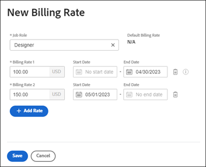

# Substituir taxas de cobrança de função de trabalho no nível da empresa

Quando uma função de trabalho é criada, você tem a opção de selecionar uma taxa de cobrança por hora para essa função. Você pode criar várias taxas de faturamento por hora específicas para uma empresa. Cada taxa de faturamento é efetiva para uma faixa de datas específica.

No nível do projeto, você pode ativar uma opção para permitir que as taxas de cobrança no nível da empresa substituam as taxas no nível do projeto. Para obter mais informações, consulte [Sobrepor Taxas de Cobrança no Nível do Projeto com Taxas de Cobrança no Nível da Empresa](../../../manage-work/projects/project-finances/override-project-level-with-company-level-billing-rates.md).

## Requisitos de acesso

Você deve ter o seguinte:

<table style="table-layout:auto"> 
 <col> 
 <col> 
 <tbody> 
  <tr> 
   <td role="rowheader">[!DNL Adobe Workfront] plano*</td> 
   <td> 
Qualquer Um 
 </td> 
  </tr> 
  <tr> 
   <td role="rowheader">[!DNL Adobe Workfront] licença*</td> 
   <td>Plano</td> 
  </tr> 
  <tr> 
   <td role="rowheader">Configurações de nível de acesso*</td> 
   <td> 
Acesso administrativo a Empresas se você não for um Administrador do sistema
 
[!UICONTROL Editar] acesso a Dados Financeiros
 
<b>NOTA</b>: Se ainda não tiver acesso, pergunte ao seu [!DNL Workfront] administrador se eles definirem restrições adicionais no seu nível de acesso. Para obter informações sobre como uma [!DNL Workfront] administrador pode modificar seu nível de acesso, consulte <a href="../../../administration-and-setup/add-users/configure-and-grant-access/create-modify-access-levels.md" class="MCXref xref">Criar ou modificar níveis de acesso personalizados</a>.
 </td> 
  </tr> 
 </tbody> 
</table>

&#42;Para descobrir que plano, tipo de licença ou acesso você tem, entre em contato com o [!DNL Workfront] administrador.

## Substituir ou alterar uma taxa de cobrança estabelecida usada para uma função de trabalho específica

1. Clique em **[!UICONTROL Menu principal]** ícone  no canto superior direito de [!DNL Adobe] Workfront e clique em **[!UICONTROL Configuração]** .

1. Clique em **[!UICONTROL Empresas]**.
1. Localize a empresa à qual a função de trabalho está atribuída.
1. Clique no nome da empresa na lista.
1. Clique em **[!UICONTROL Taxas de cobrança]** no painel esquerdo.
1. Clique em **[!UICONTROL Adicionar taxa de cobrança] > [!UICONTROL Novo preço]** ou escolha uma taxa existente para editar.
1. No [!UICONTROL Novo preço] , selecione um [!UICONTROL **Função de trabalho**] para definir a taxa de faturamento do.

   A variável [!UICONTROL **Taxa de Cobrança Padrão**] exibe a taxa de nível do sistema para esta função de trabalho.

   

1. No [!DNL **Taxas de cobrança 1**] informe a taxa de faturamento. Em seguida, clique em [!UICONTROL **Salvar**] para substituir a taxa de faturamento uma vez.

   Ou

   Clique em [!UICONTROL **Adicionar taxa**] para adicionar mais taxas de faturamento com datas de efetivação.

1. (Condicional) Se você estiver adicionando mais de uma taxa de faturamento, especifique as seguintes informações:

   * **[!UICONTROL Taxas de cobrança 1], 2, etc.**: O valor da taxa de faturamento do período.
   * **[!UICONTROL Data de início]**: A data em que a taxa entra em vigor.
   * **[!UICONTROL Data final]**: A data em que a taxa termina.

     A Taxa de Cobrança 1 não terá uma data inicial e a última taxa de cobrança não terá uma data final. Algumas datas são adicionadas automaticamente. Por exemplo, se a Taxa de cobrança 1 não tiver uma data final e você adicionar a Taxa de cobrança 2 com uma data inicial de 1º de maio de 2023, uma data final de 30 de abril de 2023 será adicionada à Taxa de cobrança 1 para que não haja lacunas.

1. Clique em [!UICONTROL **Salvar**].

   >[!NOTE]
   >
   >As taxas de função de trabalho alteradas no projeto afetarão somente esse projeto. As taxas alteradas no nível da empresa afetarão todos os projetos. Para obter mais informações, consulte [Visão geral da substituição de Taxas de cobrança de função de trabalho e do cálculo de Receita em um projeto](../../../manage-work/projects/project-finances/override-role-billing-rates-and-calculate-project-revenue.md).
