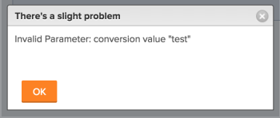

# Mensagem de erro: Parâmetro inválido: valor de conversão

## Problema

Você recebe a seguinte mensagem de erro ao tentar alterar o formato de um campo personalizado em um formulário personalizado existente: &quot;Parâmetro inválido: valor de conversão &quot;&lt;...>&quot;&quot;\

## Causa

Essa mensagem ocorre no seguinte cenário:

Por exemplo, você tem um Campo personalizado formatado como Texto.  Agora, você deseja alterar o Formato do Campo personalizado para Moeda. Em algum lugar na instância do Adobe Workfront, esse campo já está anexado a um objeto e tem informações já especificadas nele. As informações existentes em pelo menos um desses campos já estão formatadas como Texto. Portanto, o Formato do campo não pode ser alterado para Moeda.

## Requisitos de acesso

+++ Expanda para visualizar os requisitos de acesso para a funcionalidade neste artigo.

Você deve ter o seguinte acesso para executar as etapas deste artigo:

<table style="table-layout:auto"> 
 <col> 
 <col> 
 <tbody> 
  <tr> 
   <td role="rowheader">[!DNL Adobe Workfront] plano</td> 
   <td>Qualquer</td> 
  </tr> 
  <tr> 
   <td role="rowheader">[!DNL Adobe Workfront] licença</td> 
   <td>
   
Novo: Padrão

   
ou

   
Atual: Plano
</td> 
  </tr> 
  <tr> 
   <td role="rowheader">Configurações de nível de acesso</td> 
   <td> 
Editar acesso a:
 
    <ul> 
     <li> 
Criar relatórios, painéis e calendários
 </li> 
     <li> 
Criar filtros, visualizações e agrupamentos
 </li> 
    </ul>
  </tr> 
 </tbody> 
</table>

Para obter mais detalhes sobre as informações nesta tabela, consulte [Requisitos de acesso na documentação do Workfront](/help/quicksilver/administration-and-setup/add-users/access-levels-and-object-permissions/access-level-requirements-in-documentation.md).

+++

## Solução

Faça o seguinte:

1. Crie relatórios para todos os objetos que podem ter esse campo associado à sua Forms personalizada.\
   Para obter informações sobre como criar um relatório, consulte [Criar um relatório personalizado](../../reports-and-dashboards/reports/creating-and-managing-reports/create-custom-report.md).

1. Inclua o Campo personalizado que você está tentando editar na exibição do relatório para que você possa ver qual objeto tem esse campo preenchido com um valor de texto.
1. Corrija os valores de Campo personalizado dos objetos exibidos em um formato de texto e forneça a eles um valor formatado como Moeda; em seguida, tente alterar o campo Formato no Formulário personalizado novamente.\
   Ou\
   Se você tiver muitos valores de campo já preenchidos com informações formatadas em texto, considere adicionar um novo Campo personalizado ao Formulário personalizado e formatá-lo como Moeda.
