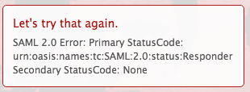

# Mensagem de erro: SAML 2.0 error: Primary StatusCode

## Problema

Você não pode estabelecer uma conexão bem-sucedida com o ADFS.

>[!NOTE]
>
>Se você estabelecer uma conexão de teste bem-sucedida e ainda estiver com problemas, poderá ter mapeamentos de atributos incorretos ou problemas com as IDs da federação. Entre em contato com o suporte ao cliente se tiver dúvidas.

## Requisitos de acesso

+++ Expanda para visualizar os requisitos de acesso para a funcionalidade neste artigo.

Você deve ter o seguinte acesso para executar as etapas deste artigo:

<table style="table-layout:auto"> 
 <col> 
 <col> 
 <tbody> 
  <tr> 
   <td role="rowheader">[!DNL Adobe Workfront] plano</td> 
   <td>Qualquer</td> 
  </tr> 
  <tr> 
   <td role="rowheader">[!DNL Adobe Workfront] licença</td> 
   <td>
   
Novo: Padrão

   
ou

   
Atual: Plano
</td> 
  </tr> 
  <tr> 
   <td role="rowheader">Configurações de nível de acesso</td> 
   <td>[!UICONTROL Administrador do Sistema]</td> 
  </tr> 
 </tbody> 
</table>

Para obter mais detalhes sobre as informações nesta tabela, consulte [Requisitos de acesso na documentação do Workfront](/help/quicksilver/administration-and-setup/add-users/access-levels-and-object-permissions/access-level-requirements-in-documentation.md).

+++

## Causa 1: o algoritmo de hash seguro está definido como SHA-256

### Solução

1. No Windows, clique em **[!UICONTROL Iniciar]** > **[!UICONTROL Administração]** > **[!UICONTROL Gerenciamento do ADFS 2.0]**.\
   A caixa de diálogo Gerenciamento do ADFS 2.0 é exibida.

1. Selecione **[!UICONTROL Relação de Confiança]** > **[!UICONTROL Relações de Confiança de Terceira Parte Confiável]** no painel esquerdo.

1. Clique com o botão direito do mouse na confiança da terceira parte confiável relacionada a [!DNL Adobe Workfront] e selecione **[!UICONTROL Propriedades]**.
1. Clique na guia **[!UICONTROL Avançado]** e selecione **[!UICONTROL SHA-1]** no menu suspenso **[!UICONTROL Algoritmo de hash seguro]**.
   

## Causa 2: o Certificado de Autenticação do ADFS está prestes a expirar e foi substituído por um novo Certificado com datas sobrepostas

### Solução

A Página de Instalação do SSO [!DNL Workfront] lista a data de expiração do certificado. Se o certificado estiver prestes a expirar, você precisará obter manualmente o Novo Certificado de Autenticação do Servidor ADFS:

1. No Windows, clique em **[!UICONTROL Iniciar]** > **[!UICONTROL Administração]** > **[!UICONTROL Gerenciamento do ADFS 2.0]**.\
   A caixa de diálogo Gerenciamento do ADFS 2.0 é exibida.

1. Selecione **[!UICONTROL Relação de Confiança]** > **[!UICONTROL Relações de Confiança de Terceira Parte Confiável]** no painel esquerdo.

1. Clique com o botão direito do mouse na confiança da terceira parte confiável relacionada a [!DNL Workfront] e selecione **[!UICONTROL Propriedades]**.
1. Clique na guia **[!UICONTROL Assinatura]**.
1. Clique no nome do Certificado de Autenticação e clique em **[!UICONTROL Exibir]**.
1. Clique em Copiar para **[!UICONTROL Arquivo]**... e selecione **[!UICONTROL Avançar]**.

1. Selecione **[!UICONTROL X.509 (CER) codificado na Base 64]** e clique em **[!UICONTROL Avançar]**.

1. Especifique o nome do arquivo e clique em **[!UICONTROL Avançar]**.
1. Clique em **[!UICONTROL Concluir]**.
1. Em [!DNL Workfront], navegue até **[!UICONTROL Configuração]** > **[!UICONTROL Sistema]** > **[!UICONTROL Logon Único (SSO)]** e carregue manualmente o Certificado de Autenticação.

## Causa 3: falha na verificação de revogação de certificados

A solução para isso depende da versão do [!DNL Microsoft] ADFS que você está usando. Consulte a documentação de [!DNL Microsoft] para obter os comandos apropriados para a sua versão.
