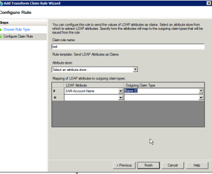

# Mensagem de erro: SAML 2.0 Erro: identificador de usuário não encontrado

## Problema

Você não pode estabelecer uma conexão bem-sucedida com o ADFS.

>[!NOTE]
>
>Se você estabelecer uma conexão de teste bem-sucedida e ainda estiver com problemas, poderá ter mapeamentos de atributos incorretos ou problemas com as IDs da federação. Entre em contato com o suporte ao cliente se tiver dúvidas.

## Causa:

As declarações no servidor ADFS estão incorretas.

## Requisitos de acesso

Você deve ter o seguinte acesso para executar as etapas deste artigo:

+++ Expanda para visualizar os requisitos de acesso para a funcionalidade neste artigo.

Você deve ter o seguinte acesso para executar as etapas deste artigo:

<table style="table-layout:auto"> 
 <col> 
 <col> 
 <tbody> 
  <tr> 
   <td role="rowheader">[!DNL Adobe Workfront] plano</td> 
   <td>Qualquer</td> 
  </tr> 
  <tr> 
   <td role="rowheader">[!DNL Adobe Workfront] licença</td> 
   <td>
   
Novo: Padrão

   
ou

   
Atual: Plano
</td> 
  </tr> 
  <tr> 
   <td role="rowheader">Configurações de nível de acesso</td> 
   <td>Você deve ser um administrador [!DNL Workfront]. </td> 
  </tr> 
 </tbody> 
</table>

Para obter mais detalhes sobre as informações nesta tabela, consulte [Requisitos de acesso na documentação do Workfront](/help/quicksilver/administration-and-setup/add-users/access-levels-and-object-permissions/access-level-requirements-in-documentation.md).

+++

## Solução

No servidor ADFS, verifique se há uma reclamação de ID de nome:

1. No Windows, clique em **[!UICONTROL Iniciar]** > **[!UICONTROL Administração]** > **[!UICONTROL Gerenciamento do ADFS 2.0]**.\
   A caixa de diálogo Gerenciamento do ADFS 2.0 é exibida.

1. Selecione **[!UICONTROL Relação de Confiança]** > **[!UICONTROL Relações de Confiança de Terceira Parte Confiável]** no painel esquerdo.

1. Clique com o botão direito do mouse na confiança da terceira parte confiável relacionada ao Adobe Workfront e selecione **[!UICONTROL Editar Regras de Declaração]**.
1. Verifique se a declaração tem um **[!UICONTROL Tipo de Declaração de Saída]** de **[!UICONTROL ID de Nome]**.

