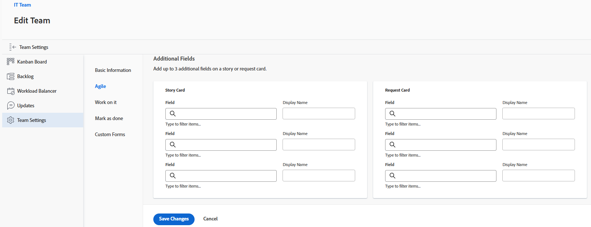
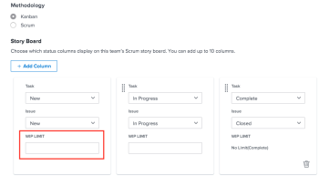

# Configurar [!UICONTROL Kanban]

<!--Audited: 12/2023-->

Você pode criar uma equipe Agile em [!DNL Adobe Workfront] conforme descrito em [Criar uma equipe Agile](../../agile/get-started-with-agile-in-workfront/create-an-agile-team.md). Ao criar uma equipe Ágil, é possível escolher a metodologia que a equipe usa para concluir o trabalho. You can choose from the following options:

* Scrum
* Kanban

Este artigo descreve como definir as configurações de uma equipe Kanban. Depois de criar uma equipe Agile e escolher a metodologia Kanban, consulte este artigo para atualizar as seguintes configurações:

* Se as histórias são estimadas em pontos ou horas
* As colunas de status no storyboard Agile
* Campos adicionais a serem exibidos nos cartões de história no storyboard Agile
* O limite do trabalho em andamento (WIP)
* Como adicionar histórias automaticamente do backlog
* Quanto tempo os cartões permanecem no quadro Kanban

For information about configuring a Scrum team, see [Configure Scrum](../get-started-with-agile-in-workfront/configure-scrum.md).

## Requisitos de acesso

+++ Expanda para visualizar os requisitos de acesso da funcionalidade neste artigo.

<table style="table-layout:auto"> 
 <col> 
 </col> 
 <col> 
 </col> 
 <tbody> 
  <tr> 
   <td role="rowheader">Pacote do Adobe Workfront</td> 
   <td> 
Qualquer
 </td> 
  </tr>

<tr> 
   <td role="rowheader">Licença do Adobe Workfront</td> 
   <td> 
Padrão
 
   
Trabalho ou maior
 </td> 
  </tr>

<tr> 
   <td role="rowheader">Configurações de nível de acesso</td> 
   <td> 
Editar acesso a equipes
  </td> 
  </tr>

</tbody> 
</table>

Para obter mais detalhes sobre as informações contidas nesta tabela, consulte [Requisitos de acesso na documentação do Workfront](/help/quicksilver/administration-and-setup/add-users/access-levels-and-object-permissions/access-level-requirements-in-documentation.md).

+++

## Configure se as histórias são estimadas em pontos ou horas

Você pode configurar histórias para serem estimadas usando pontos ou horas.

Para configurar como as histórias são estimadas para sua equipe Agile:

{{step1-to-team}}

1. Clique no ícone **[!UICONTROL Trocar Equipes]**, em seguida, selecione uma nova equipe no menu suspenso ou pesquise por uma equipe na caixa de pesquisa.
1. Selecione a equipe Agile que você deseja gerenciar.
1. Clique no menu **&#x200B;**&#x200B;Mais e selecione **[!UICONTROL Editar]**.

   

1. Na seção **[!UICONTROL Agile]**, na área **[!UICONTROL Estimar Histórias em]**, selecione se deseja usar pontos ou horas para estimar o tamanho (carga de trabalho) das histórias. Se você selecionar Pontos, especifique quantas horas são iguais a 1 ponto. (O padrão é 1 ponto = 8 horas.) Este é o número de Horas planejadas que são adicionadas à história.

   **Example:** If you have selected to estimate stories in points and 1 point equals 8 hours, and a story is estimated at 3 points, 24 Planned Hours are added to the story.

1. Clique em **[!UICONTROL Salvar alterações]**.

## Configure status columns on the Agile story board

Você pode definir os status existentes no storyboard da equipe Agile. Esses são os únicos status exibidos no storyboard.

Para definir os status que estão disponíveis para o storyboard associado à Equipe Agile:

{{step1-to-team}}

1. Clique no ícone **[!UICONTROL Alternar equipes]**  e selecione uma nova equipe no menu suspenso ou procure uma equipe na barra de pesquisa.

1. Selecione a equipe Agile que você deseja gerenciar.
1. Clique no menu **[!UICONTROL Mais]** e selecione **[!UICONTROL Editar]**.

   

1. Na seção **[!UICONTROL Agile]**, localize a área **[!UICONTROL Storyboard]**.

1. (Opcional) Clique em **[!UICONTROL Adicionar coluna]** para adicionar outra coluna de status ao storyboard.
1. (Optional) Drag any status column using the drag-and-drop indicator to reorder the status columns on the story board. The first column can&#39;t be moved, and you cannot drag another column in front of the first column.

   

1. Selecione os status da tarefa.

   >[!IMPORTANT]
   >
   >Somente os status bloqueados em todo o sistema estão disponíveis para seleção. Não é possível selecionar status específicos de grupo. O status da primeira coluna sempre corresponde a **[!UICONTROL New]**.

   Você pode adicionar status personalizados se o administrador do [!DNL Workfront] os tiver configurado. Para obter mais informações, consulte [Criar ou editar um status](../../administration-and-setup/customize-workfront/creating-custom-status-and-priority-labels/create-or-edit-a-status.md).

1. Clique em **[!UICONTROL Salvar alterações]**.

## Configurar campos adicionais para exibir em cartões de história no storyboard Agile

Ao adicionar campos a cartões de matéria, os campos são somente visualização e são exibidos somente quando o campo é preenchido.

Por padrão, os seguintes tipos de dados são exibidos no cartão de história para tarefas e problemas:

* Nome da história com um link diretamente para a tarefa ou problema
* O nome do projeto com um link direto para o projeto
* Esse link é exibido apenas para histórias, não para subtarefas
* A descrição da tarefa ou do problema
* Compromisso atual
* Exiba e edite o percentual concluído ajustando o próprio percentual concluído ou ajustando o número de pontos ou horas concluídos
* Usuários atribuídos

É possível exibir dados adicionais (incluindo dados personalizados) em cartões de história. Talvez você queira exibir campos adicionais em cartões de história por vários motivos. Por exemplo, você pode exibir a ID do cliente se estiver trabalhando em histórias para vários clientes dentro da iteração, ou exibir a Data de início do projeto ou a Data de conclusão do projeto.

>[!NOTE]
>
>Se você usar um campo personalizado em um cartão de matéria, ele não poderá conter um ponto no nome.

Para configurar cartões de história atribuídos à equipe do Agile para exibir campos adicionais:

{{step1-to-team}}

1. Clique no ícone **[!UICONTROL Alternar equipes]**  e selecione uma nova equipe no menu suspenso ou procure uma equipe na barra de pesquisa.

1. Selecione a equipe Agile que você deseja gerenciar.
1. Clique no menu **[!UICONTROL Mais]** e selecione **[!UICONTROL Editar]**.

   

1. Na seção **[!UICONTROL Agile]**, digite um nome de campo para localizá-lo.

   

1. Select the name of the field you&#39;d like to add.
1. Type the **[!UICONTROL Display name]** for the field to show on the story or issue card.
1. Clique em **[!UICONTROL Salvar alterações]**.

## Configurar o limite do trabalho em andamento (WIP)

Ao definir o limite de WIP de uma equipe Kanban, você pode controlar o número de itens nos quais a equipe está trabalhando no momento limitando o número de tarefas que podem aparecer na coluna [!UICONTROL Novo] ou [!UICONTROL Em andamento] do quadro [!UICONTROL Kanban].

Após configurar o limite de WIP para uma equipe Kanban, você pode exibir o limite de WIP e atualizá-lo a partir do storyboard Agile [!UICONTROL Kanban], conforme descrito em [Gerenciar o limite de trabalho em andamento (WIP) no quadro [!UICONTROL Kanban]](../../agile/use-kanban-in-an-agile-team/work-in-progress-limit-on-the-kanban-board.md).

Para limitar o WIP para a equipe Kanban:

{{step1-to-team}}

1. Clique no ícone **[!UICONTROL Alternar equipes]**  e selecione uma nova equipe no menu suspenso ou procure uma equipe na barra de pesquisa.

1. Selecione a equipe Kanban que deseja gerenciar.
1. Clique no menu **&#x200B;**&#x200B;Mais e selecione **[!UICONTROL Editar]**.

   

1. Na seção **[!UICONTROL Agile]**, na seção **[!UICONTROL Metodologia]**, verifique se o Kanban está selecionado.

1. Na seção **[!UICONTROL Storyboard]**, no campo **[!UICONTROL Limite de WIP]**, especifique o número máximo de itens permitidos em cada coluna do storyboard Agile [!UICONTROL Kanban]. É possível definir um limite diferente para cada coluna. O limite máximo que pode ser definido para cada coluna é 100.
Quando definido, o limite WIP exibe uma mensagem de aviso no storyboard [!UICONTROL Kanban] Agile sempre que o limite é excedido para qualquer coluna no storyboard. Essa mensagem de aviso é exibida somente na primeira vez que o limite de WIP é excedido. Esta mensagem de aviso não é exibida em nenhuma coluna com status igual a [!UICONTROL Concluído].
O limite de WIP é simplesmente um aviso visual e não impede que sua equipe tenha mais itens em uma única coluna do que o limite definido.

   

1. Clique em **Salvar alterações**.

## Configurar a adição automática de histórias do backlog

<!-- this functionality needs to be verified-->

Você pode configurar histórias do backlog para serem adicionadas automaticamente à primeira coluna no quadro [!UICONTROL Kanban] imediatamente após um item ser movido dessa coluna.

You must enable the **Show Backlog** setting on the [!UICONTROL Kanban] board to use this funcitionality.

Any time a story is moved from the [!UICONTROL In Progress] column into a column on the story board that represents a [!UICONTROL Complete] status (or a status that equates with [!UICONTROL Complete]), the next story from the Backlog column automatically moves to the [!UICONTROL New] column of the [!UICONTROL Kanban Board].

The next story is the incomplete story with the lowest backlog order number that meets all of the following criteria:

* It is assigned to the team.
* Ela não tem uma data de conclusão real (ou seja, ainda não está concluída).
* Ainda não está em um quadro Kanban.
* Pertence a um projeto com status atual.

A ordem de backlog não é a mesma que a prioridade. Você pode organizar a ordem do backlog arrastando e soltando matérias na coluna Backlog. A história no topo do backlog é aquela que é puxada para o quadro em seguida.

Para adicionar automaticamente histórias do backlog ao quadro [!UICONTROL Kanban]:

{{step1-to-team}}

1. Clique no ícone **[!UICONTROL Alternar equipes]**  e selecione uma nova equipe no menu suspenso ou procure uma equipe na barra de pesquisa.

1. Selecione a equipe Kanban que deseja gerenciar.
1. Clique no menu **&#x200B;**&#x200B;Mais e selecione **[!UICONTROL Editar]**.

   

1. Selecione **[!UICONTROL Adicionar automaticamente a próxima história da lista de pendências]** para configurar o próximo item da lista de pendências a ser adicionado automaticamente à coluna **[!UICONTROL Nova]** quando um item for movido para fora da coluna **[!UICONTROL Em andamento]**.

1. Clique em **[!UICONTROL Salvar alterações]**.

## Configure por quanto tempo os cartões permanecem no quadro [!UICONTROL Kanban]

Você pode escolher por quanto tempo os cartões concluídos permanecem no quadro [!UICONTROL Kanban]. As tarefas que caem do quadro [!UICONTROL Kanban] ainda podem ser acessadas em seus projetos originais.

{{step1-to-team}}

1. (Opcional) Clique no ícone **[!UICONTROL Alternar equipes]**  e selecione uma nova equipe Kanban no menu suspenso ou procure uma equipe na barra de pesquisa.
1. Selecione a equipe Kanban.
1. Clique no menu **&#x200B;**&#x200B;Mais e selecione **[!UICONTROL Editar]**.

   

1. No menu suspenso **[!UICONTROL Número de dias em que os cartões Concluídos permanecem no quadro Kanban]**, selecione um valor.

   Você pode escolher um número de 1 a 30 dias.
1. Clique em **[!UICONTROL Salvar alterações]**.
