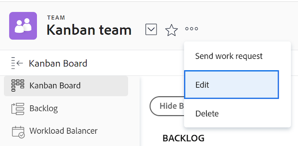

# Configurar o [!UICONTROL Scrum]

Você pode criar uma equipe Ágil em [!DNL Adobe Workfront] conforme descrito em [Criar uma equipe Ágil](/help/quicksilver/agile/get-started-with-agile-in-workfront/create-an-agile-team.md). Ao criar uma equipe ágil, você pode escolher a metodologia que a equipe usa para concluir seu trabalho. Você pode escolher entre as seguintes opções:

* Scrum
* Kanban

Este artigo descreve como definir as configurações de uma equipe Scrum. Depois de criar uma equipe ágil e escolher a metodologia Scrum, você pode consultar este artigo para atualizar as seguintes configurações:

* Se as histórias são estimadas em pontos ou horas
* As colunas de status no quadro de matérias Ágil para iterações e projetos
* Campos adicionais a serem exibidos nos cartões de história no storyboard Agile
* Como os indicadores de cor são usados para matérias no storyboard Agile
* Como as datas são aplicadas ao adicionar itens de trabalho a uma iteração

Para obter informações sobre como configurar uma equipe Kanban, consulte [Configurar Kanban](/help/quicksilver/agile/get-started-with-agile-in-workfront/configure-kanban.md).

## Requisitos de acesso

+++ Expanda para visualizar os requisitos de acesso da funcionalidade neste artigo.

<table style="table-layout:auto"> 
 <col> 
 </col> 
 <col> 
 </col> 
 <tbody> 
  <tr> 
   <td role="rowheader">Pacote do Adobe Workfront</td> 
   <td> 
Qualquer
 </td> 
  </tr>

<tr> 
   <td role="rowheader">Licença do Adobe Workfront</td> 
   <td> 
Padrão
 
   
Trabalho ou maior
 </td> 
  </tr>

<tr> 
   <td role="rowheader">Configurações de nível de acesso</td> 
   <td> 
Editar acesso ao Teams
  </td> 
  </tr>

</tbody> 
</table>

Para obter mais detalhes sobre as informações contidas nesta tabela, consulte [Requisitos de acesso na documentação do Workfront](/help/quicksilver/administration-and-setup/add-users/access-levels-and-object-permissions/access-level-requirements-in-documentation.md).

+++

## Configure se as histórias são estimadas em pontos ou horas

>[!NOTE]
>
>Esta configuração não pode ser mudada se o grupo tem alguma iteração que está atualmente em progresso.

Você pode configurar histórias para serem estimadas usando pontos ou horas.

Para configurar como as histórias são estimadas para sua equipe Ágil:

{{step1-to-team}}

1. Clique no ícone **[!UICONTROL Alternar equipe]** e, em seguida, selecione uma nova equipe no menu suspenso ou pesquise uma equipe na barra de pesquisa.
1. Selecione a equipe ágil que deseja gerenciar.
1. Clique no menu **[!UICONTROL Mais]** e selecione **[!UICONTROL Editar]**.

   Somente membros da equipe com uma licença [!UICONTROL Padrão], [!UICONTROL Plano] ou [!UICONTROL Trabalho] veem esta opção.
   

1. Na seção **[!UICONTROL Agile]**, na área **[!UICONTROL Estimar Histórias em]**, selecione se deseja usar pontos ou horas para estimar o tamanho (carga de trabalho) das histórias. Se você selecionar Pontos, especifique quantas horas são iguais a 1 ponto. (O padrão é 1 ponto = 8 horas.) Este é o número de Horas planejadas que são adicionadas à história.

   **Exemplo:** Se você optou por estimar histórias em pontos e 1 ponto é igual a 8 horas, e uma história é estimada em 3 pontos, 24 Horas planejadas serão adicionadas à história.

1. Clique em **[!UICONTROL Salvar alterações]**.

## Configurar colunas de status no storyboard do Agile

Você pode configurar quais colunas são exibidas no storyboard do Agile para todas as iterações atribuídas à sua equipe ou para um determinado projeto.

* [Configurar colunas de status para iterações](#configure-status-columns-for-iterations)
* [Configurar colunas de status para projetos](#configure-status-columns-for-projects)

### Configurar colunas de status para iterações {#configure-status-columns-for-iterations}

Você pode definir os status existentes no storyboard da equipe Agile. Esses são os únicos status exibidos no quadro de matérias.

Para definir os status que estão disponíveis para o storyboard associado à Equipe Agile:

{{step1-to-team}}

1. Clique no ícone **[!UICONTROL Equipe de comutação]**  e selecione uma nova equipe no menu suspenso ou procure uma equipe na barra de pesquisa.

1. Selecione a equipe Agile que você deseja gerenciar.
1. Clique no menu **[!UICONTROL Mais]** e selecione **[!UICONTROL Editar]**.

   Somente membros da equipe com uma licença de [!UICONTROL Plano] ou [!UICONTROL Trabalho] veem essa opção.

   

1. Na seção **[!UICONTROL Agile]**, localize a área **[!UICONTROL Storyboard]**.

1. (Opcional) Clique em **[!UICONTROL Adicionar coluna]** para adicionar outra coluna de status ao storyboard.
1. (Opcional) Arraste qualquer coluna de status usando o indicador de arrastar e soltar para reordenar as colunas de status no storyboard. A primeira coluna não pode ser movida e você não pode arrastar outra coluna na frente da primeira coluna.

   

1. Selecione os status de tarefas e problemas. Os status da tarefa são exibidos como o título de cada coluna no storyboard. Os status de problemas selecionados são mapeados para os status de tarefas. Isso significa que quando você move uma ocorrência para outra coluna do storyboard, o status da ocorrência muda para os status da ocorrência mostrados aqui, e não para o nome da coluna no storyboard (que reflete o status da tarefa).

   >[!IMPORTANT]
   >
   >Somente os status bloqueados em todo o sistema estão disponíveis para seleção; não é possível selecionar status específicos do grupo. Além disso, o status da primeira coluna sempre corresponde a **[!UICONTROL New]**.

   Você pode adicionar status personalizados se o administrador do [!DNL Workfront] os tiver configurado; os status personalizados podem ser configurados conforme descrito em [Criar ou editar um status](../../administration-and-setup/customize-workfront/creating-custom-status-and-priority-labels/create-or-edit-a-status.md).

   >[!NOTE]
   >
   >Ao selecionar status de ocorrência, o padrão da terceira coluna sempre é [!UICONTROL Fechado]. Se você tiver mais de três colunas, certifique-se de atualizá-las manualmente para refletir os status apropriados.

1. Clique em **[!UICONTROL Salvar alterações]**.

### Configurar colunas de status para projetos {#configure-status-columns-for-projects}

Para obter informações sobre como configurar colunas de status para um projeto, consulte a seção [Criar ou personalizar uma exibição [!UICONTROL Ágil]](../../reports-and-dashboards/reports/reporting-elements/create-edit-views.md#customizing-an-agile-view) no artigo [Criar ou editar exibições em [!DNL Adobe Workfront]](../../reports-and-dashboards/reports/reporting-elements/create-edit-views.md).

## Configurar campos adicionais para exibir em cartões de história no storyboard Agile

Quando você adiciona campos a cartões de matéria, os campos são somente exibição e somente exibição quando o campo está preenchido.

Por padrão, os seguintes tipos de dados são exibidos no cartão da matéria para tarefas e ocorrências:

* Nome da matéria com um link direto para a tarefa ou ocorrência
* O nome do projeto com um link direto para o projeto
* Este link é exibido apenas para matérias, não para subtarefas
* A descrição da tarefa ou da ocorrência
* Compromisso atual
* Exiba e edite o percentual concluído ajustando o próprio percentual concluído ou ajustando o número de pontos ou horas concluídos
* Usuários atribuídos

É possível exibir dados adicionais (incluindo dados personalizados) em cartões de história. Talvez você queira exibir campos adicionais em cartões de história por vários motivos. Por exemplo, você pode exibir a ID do cliente se estiver trabalhando em histórias para vários clientes dentro da iteração, ou exibir a Data de início do projeto ou a Data de conclusão do projeto.

>[!NOTE]
>
>Se você usar um campo personalizado em um cartão de matéria, ele não poderá conter um ponto no nome.

Para configurar cartões de história atribuídos à equipe do Agile para exibir campos adicionais:

{{step1-to-team}}

1. Clique no ícone **[!UICONTROL Equipe de comutação]**  e selecione uma nova equipe no menu suspenso ou procure uma equipe na barra de pesquisa.

1. Selecione a equipe Agile que você deseja gerenciar.
1. Clique no menu **[!UICONTROL Mais]** e selecione **[!UICONTROL Editar]**.
Somente membros da equipe com uma licença de [!UICONTROL Plano] ou [!UICONTROL Trabalho] veem essa opção.

   

1. Na seção **[!UICONTROL Ágil]**, digite um nome de campo para localizá-lo.

   

1. Selecione o nome do campo que deseja adicionar.
1. Digite o **[!UICONTROL Nome de exibição]** para que o campo seja exibido na história ou no cartão do problema.
1. Clique em **[!UICONTROL Salvar alterações]**.

## Configurar como os indicadores de cores são usados para matérias no quadro de matérias Ágil

Por padrão, os ladrilhos do quadro de matérias em uma iteração ágil são codificados por cores de acordo com o projeto ao qual a matéria está associada. Cada projeto recebe arbitrariamente uma cor no quadro de matérias. É possível alterar esse comportamento padrão para cada grupo Agile. As cores de matérias Ágeis podem ser vinculadas à prioridade da matéria, ao proprietário etc.

Para alterar o comportamento de como as cores são atribuídas às histórias de uma equipe Ágil:

{{step1-to-team}}

1. Clique no ícone **[!UICONTROL Alternar equipe]**  e, em seguida, selecione uma nova equipe no menu suspenso ou pesquise uma equipe na barra de pesquisa.

1. Selecione a equipe Agile que você deseja gerenciar.
1. Clique no menu **[!UICONTROL Mais]** e selecione **[!UICONTROL Editar]**.

   Somente membros da equipe com uma licença de [!UICONTROL Plano] ou [!UICONTROL Trabalho] veem essa opção.

   

1. Na seção [!UICONTROL Ágil], na área [!UICONTROL Associar cor do cartão a], selecione uma das seguintes opções:

   * **[!UICONTROL Projeto]**: as cores estão associadas ao projeto ao qual a história está vinculada. (Quando uma história é criada, ela deve ser associada a um projeto, conforme descrito em [Criar uma História Ágil](/help/quicksilver/agile/work-in-an-agile-environment/create-an-agile-story.md). Todas as tarefas do mesmo projeto são exibidas com a mesma cor.
   * **[!UICONTROL Forma Livre]**: todos os cartões são exibidos em azul por padrão até que um usuário altere a cor manualmente, conforme descrito em [[!UICONTROL Categorizar histórias por cor] no Quadro de Rabisco](/help/quicksilver/agile/use-scrum-in-an-agile-team//scrum-board/categorize-stories-by-color.md).
   * **[!UICONTROL Prioridade]**: as cores estão associadas à prioridade da história, como a seguir:

      * Alto = Vermelho
      * Medium = Amarela
      * Baixo = Verde

        Se o administrador do sistema tiver configurado prioridades personalizadas para o sistema [!DNL Workfront], a prioridade mais alta será vermelha, a segunda mais alta será amarela e a terceira mais alta será verde.
   * **[!UICONTROL Proprietário da Tarefa]**: todas as histórias com o mesmo destinatário principal têm a mesma cor. O destinatário principal é o usuário que foi atribuído pela primeira vez à tarefa.

1. Clique em **[!UICONTROL Salvar alterações]**.

## Configurar como as datas são aplicadas ao adicionar itens de trabalho a uma iteração

Por padrão, quando você adiciona um item de trabalho a uma iteração Scrum, a Data inicial planejada e a Data de conclusão planejada no item de trabalho são modificadas para corresponder às datas inicial e final da iteração. Você pode optar por manter as datas originais em todos os itens de trabalho da equipe.

{{step1-to-team}}

1. (Opcional) Clique no ícone **[!UICONTROL Equipe do Switch]** , em seguida, selecione uma nova equipe do Scrum no menu suspenso ou procure uma equipe na barra de pesquisa.
1. Clique no menu **[!UICONTROL Mais]** e selecione **[!UICONTROL Editar]**.
Somente membros da equipe com uma licença de [!UICONTROL Plano] ou [!UICONTROL Trabalho] veem essa opção.
1. Na seção [!UICONTROL Agile], na área [!UICONTROL Quando um Item de Trabalho for Adicionado a uma Iteração], selecione uma das seguintes opções:

   * **[!UICONTROL Modifique a Data de Início Planejada e a Data de Conclusão Planejada para corresponder às datas de início e término da iteração]**: quando itens de trabalho são adicionados a uma iteração, as datas dos itens de trabalho são alteradas para as datas da iteração.

     Para obter mais informações sobre como as datas são modificadas, consulte a seção [Entender como a adição de histórias afeta as datas da tarefa](../../agile/use-scrum-in-an-agile-team/iterations/add-stories-to-existing-iteration.md#understand-how-adding-stories-affects-task-dates) no artigo [Adicionar histórias a uma iteração existente](../../agile/use-scrum-in-an-agile-team/iterations/add-stories-to-existing-iteration.md).
   * **[!UICONTROL Não modifique a Data Inicial Planejada e a Data de Conclusão Planejada para corresponder às datas inicial e final da iteração]**: quando itens de trabalho são adicionados a uma iteração, os itens de trabalho retêm suas datas originais.

   Se você alterar a opção de data, as datas dos itens de trabalho já na iteração não serão ajustadas.

   Essas opções podem afetar as datas quando as equipes atribuem itens de trabalho às iterações umas das outras. Por exemplo, a equipe A modifica as datas do item de trabalho para as datas de iteração e a equipe B não modifica as datas do item de trabalho. Se a equipe B atribuir um item de trabalho à iteração da equipe A, as datas do item de trabalho serão alteradas. Entretanto, se a equipe A atribuir um item de trabalho à iteração da equipe B, as datas não serão alteradas.

1. Clique em **[!UICONTROL Salvar alterações]**.
