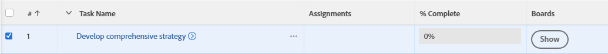

# Adicionar tarefas ou problemas existentes a um quadro [!DNL Workfront]

>[!IMPORTANT]
>
>Os fluxos de trabalho só estão disponíveis para um grupo específico de clientes.

Você pode adicionar qualquer tarefa ou problema a um quadro ou fluxo de trabalho em [!DNL Adobe Workfront] a partir de uma lista ou exibição de relatório, ou dos detalhes do objeto.

## Requisitos de acesso

+++ Expanda para visualizar os requisitos de acesso para a funcionalidade neste artigo.

<table style="table-layout:auto">
 <col>
 <col>
 <tbody>
  <tr>
   <td role="rowheader">Pacote do Adobe Workfront</td>
   <td> 
Qualquer
 </td>
  </tr>
  <tr>
   <td role="rowheader">Licença do Adobe Workfront</td>
   <td>
   
Standard
 
   
Trabalhar ou superior

   </td>
  </tr>
  <tr>
   <td role="rowheader">Permissões de objeto</td>
   <td>Exibir permissões ou mais altas para a tarefa ou problema </td>
  </tr>
 </tbody>
</table>

Para obter mais detalhes sobre as informações nesta tabela, consulte [Requisitos de acesso na documentação do Workfront](/help/quicksilver/administration-and-setup/add-users/access-levels-and-object-permissions/access-level-requirements-in-documentation.md).

+++

## Adicionar tarefas ou problemas existentes a um quadro ou workflow a partir de uma lista

{{step1-click-main-menu}}

1. Escolha um dos seguintes: **[!UICONTROL Projetos]**, **[!UICONTROL Relatórios]** ou **[!UICONTROL Painéis]**.
1. Vá para o projeto, relatório ou painel que contém a tarefa ou problema que deseja adicionar ao quadro ou fluxo de trabalho.
1. Selecione uma ou mais tarefas ou problemas.

   Se você selecionar uma subtarefa, ela também será adicionada como um cartão no quadro.

1. Clique em [!UICONTROL **Mais**] > [!UICONTROL **Adicionar aos Quadros**] ou [!UICONTROL **Adicionar aos Fluxos de Trabalho**].
1. Na caixa de diálogo [!UICONTROL Adicionar a], selecione o quadro ou fluxo de trabalho ao qual adicionar os itens.

   Para uma placa, somente placas independentes estão disponíveis, não placas que fazem parte de fluxos de trabalho.

1. Clique em [!UICONTROL **Adicionar**].

   Para um quadro: a tarefa ou problema é adicionado ao quadro como um cartão. Se o quadro tiver políticas de coluna aplicadas ao status, o cartão será adicionado na coluna correspondente ao seu status. Caso contrário, ele aparecerá na primeira coluna à esquerda, sem incluir a coluna de entrada.

   Para obter informações sobre políticas de coluna, consulte [Gerenciar colunas do quadro](/help/quicksilver/agile/get-started-with-boards/manage-board-columns.md).

   Para um workflow: a tarefa ou problema é adicionada à lista de cartões do workflow como um cartão não planejado.

## Adicionar tarefa ou problemas existentes a um quadro ou fluxo de trabalho a partir dos detalhes do objeto

{{step1-click-main-menu}}

1. Clique em [!UICONTROL **Projetos**] e no nome de um projeto para abri-lo.
1. Clique em [!UICONTROL **Tarefas**] ou [!UICONTROL **Problemas**] no painel esquerdo.
1. Clique na tarefa, subtarefa ou problema que deseja adicionar a um quadro ou workflow.
1. Clique no menu **[!UICONTROL Mais]** ao lado do nome do objeto e selecione [!UICONTROL **Adicionar aos Quadros**] ou [!UICONTROL **Adicionar a Fluxos de Trabalho**].
1. Na caixa de diálogo [!UICONTROL Adicionar a], selecione o quadro ou fluxo de trabalho ao qual adicionar os itens.

   Para uma placa, somente placas independentes estão disponíveis, não placas que fazem parte de fluxos de trabalho.

1. Clique em [!UICONTROL **Adicionar**].

   Para um quadro: a tarefa ou problema é adicionado ao quadro como um cartão. Se o quadro tiver políticas de coluna aplicadas ao status, o cartão será adicionado na coluna correspondente ao seu status. Caso contrário, ele aparecerá na primeira coluna à esquerda, sem incluir a coluna de entrada.

   Para obter informações sobre políticas de coluna, consulte [Gerenciar colunas do quadro](/help/quicksilver/agile/get-started-with-boards/manage-board-columns.md).

   Para um workflow: a tarefa ou problema é adicionada à lista de cartões do workflow como um cartão não planejado.

## Mostrar os quadros associados a uma tarefa ou problema de uma lista

1. Vá para o projeto, relatório ou painel que contém a tarefa ou problema para o qual deseja ver informações de quadros.
1. Selecione uma exibição que inclua a coluna Quadros ou crie uma nova exibição com a coluna Quadros.
Para obter informações sobre exibições, consulte [Criar ou editar exibições no Adobe Workfront](/help/quicksilver/reports-and-dashboards/reports/reporting-elements/create-edit-views.md).
1. Clique em [!UICONTROL **Mostrar**] na coluna para exibir a lista de quadros em que a tarefa ou problema está.

   

1. Clique no nome de um quadro para abrir a tarefa ou problema conectado no quadro.

   
