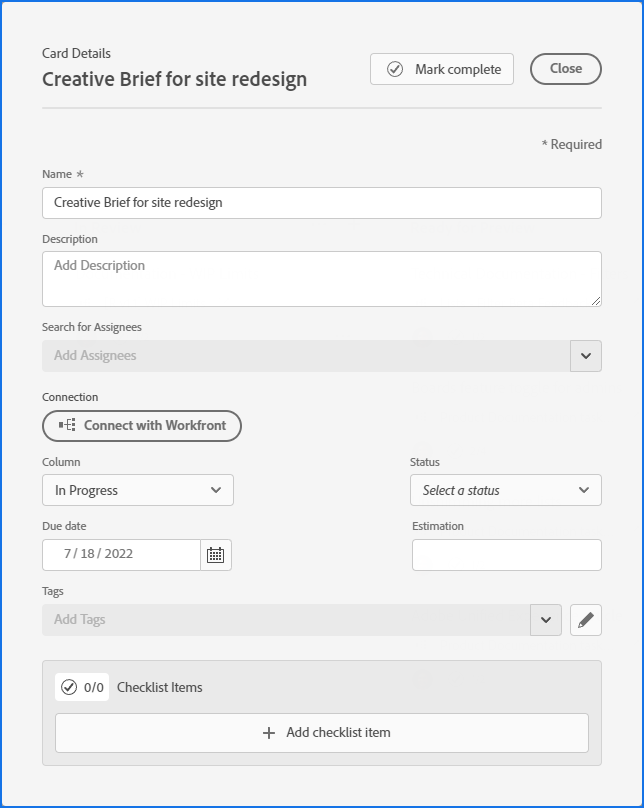

# Adicionar um cartão ad hoc a um quadro

Você pode adicionar rapidamente um cartão a um quadro e atribuí-lo a um membro no quadro. O cartão pode representar uma tarefa, ocorrência, pessoa, grupo ou qualquer tipo de item que você deseja incluir no quadro.

>[!NOTE]
>
>Os cartões ad hoc em um quadro não estão conectados aos itens de trabalho em [!DNL Adobe Workfront]. Para obter detalhes sobre placas conectadas, consulte [Usar placas conectadas em placas](/help/quicksilver/agile/get-started-with-boards/connected-cards.md).

## Requisitos de acesso

Você deve ter o seguinte acesso para executar as etapas neste artigo:

<table style="table-layout:auto"> 
 <col> 
 </col> 
 <col> 
 </col> 
 <tbody> 
  <tr> 
   <td role="rowheader"><strong>[!DNL Adobe Workfront] plano*</strong></td> 
   <td> 
Qualquer Um
 </td> 
  </tr> 
  <tr> 
   <td role="rowheader"><strong>[!DNL Adobe Workfront] licença*</strong></td> 
   <td> 
[!UICONTROL Solicitação] ou superior
 </td> 
  </tr> 
 </tbody> 
</table>

&#42;Para descobrir qual plano, tipo de licença ou acesso você tem, entre em contato com seu [!DNL Workfront] administrador.

## Adicionar um cartão ad hoc com detalhes completos

Um cartão ad hoc não está conectado a um item de trabalho em [!DNL Adobe Workfront].

1. Clique no botão **[!UICONTROL Menu principal]** ícone  no canto superior direito de [!DNL Adobe] Workfront, em seguida, clique em **[!UICONTROL Quadros]**.
1. Acesse um quadro. Para obter mais informações, consulte [Criar ou editar um quadro](../../agile/get-started-with-boards/create-edit-board.md).
1. Clique em **[!UICONTROL Adicionar cartão] > [!UICONTROL Novo cartão]**.
1. No **[!UICONTROL Detalhes do cartão]** , adicione as seguintes informações:

   <table style="table-layout:auto"> 
    <col> 
    <col> 
    <tbody> 
     <tr> 
      <td role="rowheader"><strong>[!UICONTROL Name]</strong> </td> 
      <td>O nome do cartão.</td> 
     </tr> 
     <tr> 
      <td role="rowheader"><strong>[!UICONTROL Descrição]</strong> </td> 
      <td>Uma descrição do cartão.</td> 
     </tr> 
     <tr> 
      <td role="rowheader"><strong>[!UICONTROL Destinatários]</strong> </td> 
      <td> 
Para atribuir o cartão, comece a digitar um nome no campo de pesquisa e selecione-o quando for exibido na lista. Você pode adicionar indivíduos e equipes e pode atribuir mais de uma pessoa ou equipe a um cartão.
 
Os designados devem ser membros do quadro ou não aparecerão na lista de seleção. Quando uma equipe é membro no quadro, os membros individuais da equipe podem ser atribuídos ao cartão.
</td>
     </tr> 
     <tr> 
      <td role="rowheader"><strong>[!UICONTROL Coluna]</strong> </td> 
      <td>Selecione a coluna do cartão. Se deixar o <strong>[!UICONTROL Coluna]</strong> em branco, o cartão é colocado na primeira coluna à esquerda da placa.</td>
     </tr>
     <tr> 
      <td role="rowheader"><strong>[!UICONTROL Status]</strong> </td> 
      <td>Selecione um status para o cartão. Se você clicar em <strong>[!UICONTROL Marca concluída]</strong> na parte superior do cartão, o status muda automaticamente para [!UICONTROL completo].</td> 
     </tr>
     <tr> 
      <td role="rowheader"><strong>[!UICONTROL Estimativa]</strong></td> 
      <td>
Digite o número estimado de horas para o cartão ser concluído. Esta é apenas uma entrada manual.
</td>
     </tr>
     <tr> 
      <td role="rowheader"><strong>[!UICONTROL Data de vencimento]</strong></td> 
      <td>Selecione uma data de vencimento para o cartão. </td>
     </tr>
     <tr> 
      <td role="rowheader"><strong>[!UICONTROL Tags]</strong></td> 
      <td>Procure e selecione as tags para o cartão. Para obter informações sobre como criar novas tags, consulte <a href="../../agile/get-started-with-boards/add-tags.md" class="MCXref xref">Adicionar tags</a>.</td> 
     </tr>  
     <tr> 
      <td role="rowheader"><strong>[!UICONTROL Itens da lista de verificação]</strong> </td> 
      <td> 
Clique em <strong>[!UICONTROL Adicionar item da lista de verificação]</strong>. Em seguida, digite o título do item e pressione Enter. Outro item é adicionado automaticamente. Continue inserindo títulos para adicionar mais itens.
 
O contador na parte superior da lista de verificação mostra o número de itens concluídos e o número total de itens.
 
Para obter mais informações sobre itens da lista de verificação, consulte <a href="/help/quicksilver/agile/get-started-with-boards/manage-checklist-items.md">Gerenciar itens da lista de verificação em cartões</a>.
 </td> 
     </tr> 
    </tbody> 
   </table>

   

1. Clique em **[!UICONTROL Fechar]** para adicionar o cartão ao quadro.

   Os destinatários, as tags, a data de vencimento, o contador da lista de verificação, as horas estimadas e o status são exibidos no cartão.

## Adição rápida de um cartão ad hoc

Você pode adicionar cartões ad hoc com apenas um título para preencher rapidamente o quadro.

1. Acesse o quadro ao qual você deseja adicionar cartões.
1. Clique no botão **[!UICONTROL Adicionar]** ícone  na coluna onde deseja adicionar o cartão.
1. Digite o nome do cartão e pressione Enter.

   Outro cartão é adicionado automaticamente abaixo do novo cartão.

1. Continue inserindo os nomes dos cartões para adicionar mais cartões.
1. Para interromper a adição de cartões, clique fora da coluna .
1. Para adicionar mais detalhes, edite o cartão. Para obter mais informações, consulte [Editar um cartão existente](#edit-an-existing-card) neste artigo.

## Editar um cartão existente {#edit-an-existing-card}

1. Acesse o quadro.
1. Clique no nome do cartão para editar o nome.
1. Para editar os detalhes do cartão, clique no cartão (não no nome do cartão).

   Ou

   Clique no botão **[!UICONTROL Mais]** menu ![[!UICONTROL Menu Mais]](assets/more-icon-spectrum.png) no cartão e selecione **[!UICONTROL Editar]**.

1. No [!UICONTROL Detalhes do cartão] , atualize as informações conforme necessário e clique em **[!UICONTROL Fechar]** para retornar ao quadro.

   Se você tiver políticas de coluna ativadas para atualizar valores de campo, alterar o status no cartão move automaticamente o cartão para a coluna correspondente. Para obter mais informações, consulte &quot;Definir configurações e políticas da coluna&quot; no artigo [Gerenciar colunas do quadro](/help/quicksilver/agile/get-started-with-boards/manage-board-columns.md).
