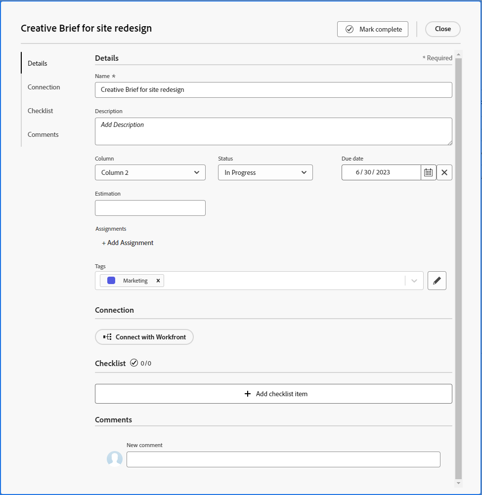

# Adicionar um cartão ad hoc a um quadro

Você pode adicionar rapidamente um cartão a um quadro e atribuí-lo a um membro do quadro. O cartão pode representar uma tarefa, problema, pessoa, grupo ou qualquer tipo de item que você deseja incluir no quadro.

>[!NOTE]
>
>Os cartões ad hoc em um quadro não estão conectados aos itens de trabalho em [!DNL Adobe Workfront]. Para obter detalhes sobre cartões conectados, consulte [Usar cartões conectados em quadros](/help/quicksilver/agile/get-started-with-boards/connected-cards.md).

## Requisitos de acesso

+++ Expanda para visualizar os requisitos de acesso para a funcionalidade neste artigo.

<table style="table-layout:auto"> 
 <col> 
 <col> 
 <tbody> 
  <tr> 
   <td role="rowheader">Pacote do Adobe Workfront</td> 
   <td> 
Qualquer
 </td> 
  </tr> 
  <tr> 
   <td role="rowheader">Licença do Adobe Workfront</td> 
   <td> 
   
Colaborador ou superior
 
   
Solicitação ou superior

   </td> 
  </tr> 
 </tbody> 
</table>

Para obter mais detalhes sobre as informações nesta tabela, consulte [Requisitos de acesso na documentação do Workfront](/help/quicksilver/administration-and-setup/add-users/access-levels-and-object-permissions/access-level-requirements-in-documentation.md).

+++

## Adicione um cartão ad hoc com detalhes completos

Um cartão ad hoc não está conectado a um item de trabalho em [!DNL Adobe Workfront].

{{step1-to-boards}}

1. Acessar um quadro. Para obter informações, consulte [Criar ou editar um quadro](../../agile/get-started-with-boards/create-edit-board.md).
1. Clique em **[!UICONTROL Adicionar cartão] > [!UICONTROL Novo cartão]**.

   A caixa [!UICONTROL Detalhes do cartão] é exibida.

   >[!NOTE]
   >
   >Se você clicar fora do campo Nome, o cartão ad hoc será salvo automaticamente como &quot;Sem título&quot; na parte inferior da coluna mais à esquerda. Para sair sem salvar o cartão, clique em [!UICONTROL **Cancelar**] sem clicar em outro local na caixa [!UICONTROL Detalhes do Cartão].

1. Na caixa **[!UICONTROL Detalhes do cartão]**, adicione as seguintes informações:

   <table style="table-layout:auto"> 
    <col> 
    <col> 
    <tbody> 
     <tr> 
      <td role="rowheader"><strong>[!UICONTROL Nome]</strong> </td> 
      <td>O nome do cartão.</td> 
     </tr> 
     <tr> 
      <td role="rowheader"><strong>[!UICONTROL Descrição]</strong> </td> 
      <td>Uma descrição do cartão. Você pode adicionar URLs na descrição e eles se tornarão links clicáveis quando o cartão for salvo.</td>
     </tr>
     <tr> 
      <td role="rowheader"><strong>[!UICONTROL coluna]</strong> </td> 
      <td>Selecione a coluna do cartão. Se você deixar o campo <strong>[!UICONTROL Column]</strong> em branco, o cartão será colocado na primeira coluna à esquerda do quadro.</td>
     </tr>
     <tr> 
      <td role="rowheader"><strong>[!UICONTROL Status]</strong> </td> 
      <td>Selecione um status para o cartão. Se você clicar em <strong>[!UICONTROL Marca Concluída]</strong> na parte superior do cartão, o status será alterado automaticamente para [!UICONTROL Concluída].</td> 
     </tr>
     <tr> 
      <td role="rowheader"><strong>[!UICONTROL Data de vencimento]</strong></td> 
      <td>Selecione uma data de vencimento para o cartão. </td>
     </tr>
     <tr> 
      <td role="rowheader"><strong>[!UICONTROL Estimativa]</strong></td> 
      <td>Digite o número estimado de horas para a conclusão do cartão. Esta entrada é apenas manual.</td>
     </tr>
     <tr> 
      <td role="rowheader"><strong>[!UICONTROL Atribuições]</strong> </td> 
      <td>Para atribuir o cartão, clique em <strong>[!UICONTROL Adicionar Atribuição]</strong> e comece a digitar um nome no campo de pesquisa. Em seguida, selecione-o quando ele for exibido na lista de resultados. Você pode adicionar indivíduos e equipes e atribuir mais de uma pessoa ou equipe a um cartão.</td>
     </tr>     
     <tr> 
      <td role="rowheader"><strong>[!UICONTROL Marcas]</strong></td> 
      <td>Procure e selecione tags para o cartão. Para obter informações sobre como criar novas marcas, consulte <a href="../../agile/get-started-with-boards/add-tags.md" class="MCXref xref">Adicionar marcas</a>.</td> 
     </tr>
     <tr>
      <td role="rowheader"><strong>[!UICONTROL Conexão]</strong> </td>
      <td>Você pode conectar um cartão ad hoc a uma tarefa ou problema do [!DNL Workfront]. Para obter mais informações, consulte "Converter um cartão ad hoc em um cartão conectado" no artigo <a href="/help/quicksilver/agile/get-started-with-boards/connected-cards.md">Usar cartões conectados em quadros</a>.</td>
     </tr>
     <tr> 
      <td role="rowheader"><strong>[!UICONTROL Lista de Verificação]</strong> </td> 
      <td> 
Clique em <strong>[!UICONTROL Adicionar item de lista de verificação]</strong>. Em seguida, digite o título do item e pressione Enter. Outro item é adicionado automaticamente. Continue inserindo títulos para adicionar mais itens.
 
O contador na parte superior da lista de verificação mostra o número de itens concluídos e o número total de itens.
 
Para obter mais informações sobre itens da lista de verificação, consulte <a href="/help/quicksilver/agile/get-started-with-boards/manage-checklist-items.md">Gerenciar itens da lista de verificação em cartões</a>.
 </td> 
     </tr>
     <tr>
      <td role="rowheader"><strong>[!UICONTROL Comentários]</strong></td>
      <td>
Clique no campo <strong>[!UICONTROL Novo comentário]</strong> e digite seu comentário. Use as ferramentas de formatação para formatar o texto. (As imagens não estão disponíveis em comentários em cartões ad hoc.) Para marcar uma pessoa ou equipe, use a caixa de pesquisa na parte inferior da área de comentários. O usuário não precisa ser membro do painel.

<strong>OBSERVAÇÃO:</strong> No momento, os usuários marcados em comentários em cartões ad hoc não recebem uma notificação por email.
      

Clique em <strong>[!UICONTROL Enviar]</strong> para adicionar o comentário ao cartão.

      
Para obter mais informações sobre comentários, consulte <a href="/help/quicksilver/workfront-basics/updating-work-items-and-viewing-updates/update-work.md">Atualizar trabalho</a>.
</td>
     </tr>
    </tbody> 
   </table>

   

   Use o painel de navegação esquerdo para se mover entre seções de campos nos detalhes do cartão.

1. Clique em **[!UICONTROL Fechar]** para adicionar o cartão ao quadro.

   Os responsáveis, as tags, a data de vencimento, o contador da lista de verificação, as horas estimadas e o status são exibidos no cartão.

## Adição rápida de um cartão ad hoc

Você pode adicionar cartões ad hoc com apenas um título para preencher rapidamente seu quadro.

1. Acesse o quadro ao qual deseja adicionar cartões.
1. Clique no ícone **[!UICONTROL Adicionar]**  na coluna em que deseja adicionar o cartão.
1. Digite o nome do cartão e pressione Enter.

   Outra placa é adicionada automaticamente abaixo da nova placa.

1. Continue inserindo nomes de cartão para adicionar mais cartões.
1. Para interromper a adição de cartões, clique fora da coluna.
1. Para adicionar mais detalhes, você deve editar o cartão. Para obter informações, consulte [Editar um cartão existente](#edit-an-existing-card) neste artigo.

## Editar um cartão existente {#edit-an-existing-card}

1. Acesse o quadro.
1. Clique no nome do cartão para editar o nome.
1. Para editar os detalhes do cartão, clique nele (não no nome do cartão).

   Ou

   Clique no menu **[!UICONTROL Mais]** ![[!UICONTROL Mais menus]](assets/more-icon-spectrum.png) no cartão e selecione **[!UICONTROL Editar]**.

1. Na caixa [!UICONTROL Detalhes do Cartão], atualize as informações conforme necessário e clique em **[!UICONTROL Fechar]** para retornar ao quadro.

   Se você tiver políticas de coluna ativadas para atualizar valores de campo, alterar o status no cartão moverá automaticamente o cartão para a coluna correspondente. Para obter mais informações, consulte &quot;Definir configurações e políticas de coluna&quot; no artigo [Gerenciar colunas do quadro](/help/quicksilver/agile/get-started-with-boards/manage-board-columns.md).
