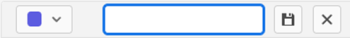

# Adicionar tags

Você pode adicionar tags a cartões para mostrar visualmente que são semelhantes. Em seguida, você pode filtrar por essas tags para exibir cartões relacionados. Tags não são compartilhadas entre quadros.

## Requisitos de acesso

Você deve ter o seguinte acesso para executar as etapas neste artigo:

<table style="table-layout:auto"> 
 <col> 
 </col> 
 <col> 
 </col> 
 <tbody> 
  <tr> 
   <td role="rowheader"><strong>[!DNL Adobe Workfront] plano*</strong></td> 
   <td> 
Qualquer Um
 </td> 
  </tr> 
  <tr> 
   <td role="rowheader"><strong>[!DNL Adobe Workfront] licença*</strong></td> 
   <td> 
[!UICONTROL Solicitação] ou superior
 </td> 
  </tr> 
 </tbody> 
</table>

&#42;Para descobrir qual plano, tipo de licença ou acesso você tem, entre em contato com seu [!DNL Workfront] administrador.

## Criar tags para o seu quadro

1. Clique no botão **[!UICONTROL Menu principal]** ícone  no canto superior direito de [!DNL Adobe Workfront], depois clique em **[!UICONTROL Quadros]**.
1. Acesse um quadro. Para obter mais informações, consulte [Criar ou editar um quadro](../../agile/get-started-with-boards/create-edit-board.md).
1. Clique no botão **[!UICONTROL Mais]** menu  ao lado do nome do quadro, escolha **[!UICONTROL Gerenciador de tags]**.

   

1. No **[!UICONTROL Editar tags]** caixa de diálogo, selecione **[!UICONTROL Criar tag]**.
1. Digite o nome da tag na caixa realçada e escolha uma cor para essa tag no menu suspenso.
1. Clique no botão **[!UICONTROL Salvar]** ícone para salvar a tag ou o **[!UICONTROL Cancelar]** ícone para cancelar a criação da tag.

   

1. (Condicional) Repita as etapas 4 a 6 para criar tags adicionais.
1. Clique em **[!UICONTROL Concluído]** no canto superior direito da caixa.

   

## Adicionar uma tag a um cartão

1. Acesse um quadro.
1. Para editar os detalhes do cartão, clique no cartão (não no nome do cartão).

   Ou

   Clique no botão **[!UICONTROL Mais]** menu ![[!UICONTROL Menu Mais]](assets/more-icon-spectrum.png) no cartão e selecione **[!UICONTROL Editar]**.

1. No **[!UICONTROL Tags]** digite o nome de uma tag existente e selecione-a nos resultados da pesquisa.\
   Ou\
   Clique no botão **[!UICONTROL Editar]**&#x200B;Ícone &#x200B;  e criar uma nova tag no Gerenciador de tags. Clique em **Concluído** para retornar ao cartão. A nova tag é adicionada automaticamente ao cartão.
1. Clique em **Fechar**.

## Editar uma tag

1. Acesse um quadro.
1. Clique no botão **[!UICONTROL Mais]** menu  ao lado do nome do quadro, escolha **[!UICONTROL Gerenciador de tags]**.

   

1. (Condicional) Clique no nome da tag para editar o texto.
1. (Condicional) Clique no botão [!UICONTROL color] menu suspenso para alterar a cor da tag.
1. Clique em **[!UICONTROL Concluído]**.

## Remover uma tag de um cartão

1. Acesse um quadro.
1. Para editar os detalhes do cartão, clique no cartão (não no nome do cartão).

   Ou

   Clique no botão **[!UICONTROL Mais]** menu ![[!UICONTROL Menu Mais]](assets/more-icon-spectrum.png) no cartão e selecione **[!UICONTROL Editar]**.

1. Encontre a tag que deseja remover do cartão e clique no botão **[!UICONTROL Remover]** ícone .
1. Clique em **[!UICONTROL Fechar]**.

## Excluir uma tag

1. Clique no botão **[!UICONTROL Menu principal]** ícone  no canto superior direito de [!DNL Adobe Workfront], depois clique em **[!UICONTROL Quadros]**.
1. Acesse um quadro. Para obter mais informações, consulte [Criar ou editar um quadro](../../agile/get-started-with-boards/create-edit-board.md).
1. Clique no botão **[!UICONTROL Mais]**&#x200B; menu ao lado do nome do quadro e escolha **[!UICONTROL Gerenciador de tags]**.

   

1. Encontre a tag que deseja excluir e clique no botão **[!UICONTROL Excluir]** ícone .
1. Clique em **[!UICONTROL Concluído]**.
