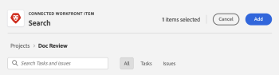
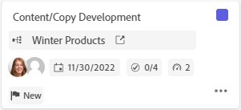

# Use cartões conectados em quadros

<!-- Audited: 2/2024 -->

Você pode adicionar um cartão ao seu quadro que esteja conectado a tarefas e problemas existentes no [!DNL Workfront].

Quando qualquer um dos detalhes a seguir é atualizado para o cartão em um local, ele é atualizado automaticamente no outro local:

* [!UICONTROL Nome]
* [!UICONTROL Descrição]
* [!UICONTROL Responsáveis]
* [!UICONTROL Status]
* [!UICONTROL Data de conclusão planejada]
* [!UICONTROL Estimativa] / [!UICONTROL Pontos da História]
* [!UICONTROL Subtarefas]
* [!UICONTROL Documentos]

Para sincronizar cartões conectados com o Workfront, clique no menu **[!UICONTROL Mais]** ![[!UICONTROL Mais menu]](assets/more-icon-spectrum.png) ao lado do nome do quadro e selecione **[!UICONTROL Sincronizar itens conectados]**. Os cartões arquivados não são sincronizados com as tarefas e os problemas do Workfront. Se você restaurar um cartão, ele será sincronizado novamente.

>[!NOTE]
>
>Uma única tarefa ou problema conectado só pode ser adicionado uma vez por placa. A mesma tarefa ou problema pode ser conectado a várias placas.

## Requisitos de acesso

+++ Expanda para visualizar os requisitos de acesso da funcionalidade neste artigo.

<table style="table-layout:auto"> 
 <tbody> 
  <tr> 
   <td role="rowheader">Pacote do Adobe Workfront</td> 
   <td> 
Qualquer
 </td> 
  </tr> 
  <tr> 
   <td role="rowheader">Licença do Adobe Workfront</td> 
   <td> 
   
Colaborador ou posterior
 
   
Solicitação ou posterior

   </td> 
  </tr> 
  <tr>
   <td role="rowheader">Configurações de nível de acesso</td>
   <td>
Exibir ou aumentar o acesso a tarefas e ocorrências
</td>
  </tr>
  <tr>
   <td role="rowheader">Permissões de objeto</td>
   <td>
Visualize ou aumente as permissões para a tarefa ou problema do Workfront

</td>
  </tr>
 </tbody> 
</table>

Para obter mais detalhes sobre as informações contidas nesta tabela, consulte [Requisitos de acesso na documentação do Workfront](/help/quicksilver/administration-and-setup/add-users/access-levels-and-object-permissions/access-level-requirements-in-documentation.md).

+++

## Adicionar um cartão conectado

{{step1-to-boards}}

1. Acessar um quadro. Para obter informações, consulte [Criar ou editar um quadro](../../agile/get-started-with-boards/create-edit-board.md).
1. Clique em **[!UICONTROL Adicionar cartão] > [!UICONTROL Cartão conectado]**.
1. Escolha um projeto e, em seguida, escolha uma tarefa ou ocorrência a ser adicionada como um cartão no quadro.

   Você pode selecionar vários objetos e eles serão adicionados como cartões separados.

   >[!NOTE]
   >
   >* Somente os objetos para os quais você tem permissões estão disponíveis nos resultados da pesquisa. Se um item estiver esmaecido, ele já foi adicionado ao painel.
   >* Quando você filtra por **[!UICONTROL Projetos que possuo]** ou **[!UICONTROL Projetos em que estou]**, os projetos que equivalem a um status Concluído, Inativo ou Rejeitado não são incluídos. Você ainda pode pesquisar esses projetos com o filtro **[!UICONTROL Todos]**.

1. Clique em **[!UICONTROL Adicionar]**.

   

   O cartão é adicionado na parte inferior da coluna mais à esquerda. O objeto [!DNL Workfront] conectado e seus destinatários são exibidos no cartão.

   

1. Clique em  para abrir a tarefa ou ocorrência [!DNL Workfront] em uma nova guia do navegador.
1. Para editar os detalhes do cartão, clique no cartão (não no nome).

   Ou

   Clique no menu **[!UICONTROL Mais]**  no cartão e selecione **[!UICONTROL Editar]**.

1. Na caixa **[!UICONTROL Detalhes do cartão]**, adicione ou atualize as seguintes informações:

   <table style="table-layout:auto"> 
    <tbody> 
     <tr> 
      <td role="rowheader"><strong>[!UICONTROL Name]</strong></td> 
      <td>Alterar o nome também altera o nome no objeto [!DNL Workfront] conectado.</td> 
     </tr> 
     <tr> 
      <td role="rowheader"><strong>[!UICONTROL Description]</strong></td> 
      <td>A alteração da descrição também altera a descrição no objeto [!DNL Workfront] conectado. Você pode adicionar URLs na descrição e eles se tornarão links clicáveis quando o cartão for salvo.</td> 
     </tr>
     <tr>
      <td role="rowheader"><strong>[!UICONTROL Coluna]</strong></td>
      <td>Selecione a coluna para o cartão.</td>
     </tr>
     <tr>
      <td role="rowheader"><strong>[!UICONTROL Status]</strong></td>
      <td>
Selecione um status para o cartão. Os padrões são [!UICONTROL New], [!UICONTROL In Progress] e [!UICONTROL Complete], mas todos os status personalizados definidos para o item em [!DNL Workfront] também estão disponíveis.

      
Se você tiver políticas de coluna ativadas para atualizar valores de campo, a alteração do status no cartão moverá automaticamente o cartão para a coluna correspondente. Para obter mais informações, consulte “Definir configurações e políticas de coluna” no artigo <a href="/help/quicksilver/agile/get-started-with-boards/manage-board-columns.md" class="MCXref xref">Gerenciar colunas do quadro</a>.

      
Se você clicar em <strong>[!UICONTROL Mark Complete]</strong> na parte superior do cartão, o status mudará automaticamente para Complete.
</td>
     </tr>
     <tr>
      <td role="rowheader"><strong>[!UICONTROL Conclusão Planejada]</strong></td>
      <td>Alterar essa data também altera a data de conclusão planejada no objeto [!DNL Workfront] conectado.</td>
     </tr>
      <tr>
      <td role="rowheader"><strong>[!UICONTROL Estimativa]</strong></td>
      <td>
O número de horas para a conclusão do cartão.

Alterar a estimativa também altera o valor dos pontos da história no objeto conectado [!DNL Workfront].
</td>
     </tr>
     <tr>
      <td role="rowheader"><strong>[!UICONTROL Atribuições]</strong></td>
      <td>
Para atribuir mais pessoas ou uma equipe ao cartão, clique em <strong>[!UICONTROL Adicionar Atribuição]</strong> e comece a digitar um nome no campo de pesquisa. Em seguida, selecione-o quando ele for exibido na lista de resultados. É possível adicionar indivíduos e equipes. Somente uma atribuição de equipe é permitida em um cartão conectado.

      
Todos os destinatários selecionados também são atribuídos à tarefa ou ocorrência em [!DNL Workfront].
</td>
     </tr>
     <tr>
      <td role="rowheader"><strong>[!UICONTROL Tags]</strong></td>
      <td>
Procure e selecione tags para o cartão.

      
Para obter informações sobre como criar novas marcas, consulte <a href="../../agile/get-started-with-boards/add-tags.md" class="MCXref xref">Adicionar marcas</a>.
</td>
     </tr>
     <tr>
      <td role="rowheader"><strong>[!UICONTROL Custom fields]</strong></td>
      <td>
Todos os campos personalizados que você adiciona são exibidos nesta área.

      
Para obter mais informações, consulte <a href="/help/quicksilver/agile/get-started-with-boards/customize-fields-on-card.md">Personalizar quais campos são exibidos em um cartão</a>.
</td>
     </tr>
     <tr>
     <tr>
      <td role="rowheader"><strong>[!UICONTROL Subtask]</strong></td>
      <td>
Todas as subtarefas existentes para a tarefa são exibidas nesta seção. Clique em <strong>[!UICONTROL Adicionar Subtarefa]</strong> para adicionar uma nova subtarefa.

      
O contador na parte superior da seção mostra o número de subtarefas concluídas e o número total de subtarefas.

      
Para obter mais informações sobre subtarefas, consulte <a href="/help/quicksilver/agile/get-started-with-boards/manage-subtasks-on-boards.md">Gerenciar subtarefas em painéis</a>.
</td>
     </tr>
     <tr> 
      <td role="rowheader"><strong>[!UICONTROL Lista de Verificação]</strong></td>
      <td>
Clique em <strong>[!UICONTROL Adicionar item de lista de verificação]</strong>. Em seguida, digite o título do item e pressione Enter. Outro item é adicionado automaticamente. Continue inserindo títulos para adicionar mais itens.

      
O contador na parte superior da lista de verificação mostra o número de itens concluídos e o número total de itens.
 
Para obter mais informações sobre itens da lista de verificação, consulte <a href="/help/quicksilver/agile/get-started-with-boards/manage-checklist-items.md">Gerenciar itens da lista de verificação em cartões</a>.
</td>
     </tr>
     <tr>
      <td role="rowheader"><strong>[!UICONTROL Documents]</strong></td>
      <td>Para um documento existente, passe o mouse sobre a miniatura do documento e clique em <strong>Visualizar</strong> para exibir o arquivo no navegador ou em <strong>Baixar</strong> para baixar o arquivo no computador. Para obter um novo documento, consulte <a href="/help/quicksilver/agile/get-started-with-boards/add-documents-on-cards.md">Adicionar documentos em cartões</a>.</td>
     </tr>
     <tr>
      <td role="rowheader"><strong>[!UICONTROL Horas]</strong></td>
      <td>Consulte "Registrar horas em uma placa conectada" abaixo.</td>
     </tr>
     <tr>
      <td role="rowheader"><strong>[!UICONTROL Comentários]</strong></td>
      <td>
Clique no campo <strong>[!UICONTROL Novo comentário]</strong> e digite seu comentário. Use as ferramentas de formatação para formatar o texto. Para marcar uma pessoa ou equipe, use a caixa de pesquisa na parte inferior da área de comentários. O usuário não precisa ser membro do painel. Os usuários marcados em cartões conectados receberão notificações por email.

Clique em <strong>[!UICONTROL Enviar]</strong> para adicionar o comentário ao cartão.

      
Para obter mais informações sobre comentários, consulte <a href="/help/quicksilver/workfront-basics/updating-work-items-and-viewing-updates/update-work.md">Atualizar trabalho</a>.
</td>
     </tr>
     <tr> 
      <td role="rowheader"><strong>[!UICONTROL Atividade do Sistema]</strong></td> 
      <td>
Se você tiver <strong>Atividade do sistema</strong> habilitada como uma seção de cartão, a atividade será exibida nesta área.
 
Para obter mais informações, consulte <a href="/help/quicksilver/agile/get-started-with-boards/customize-fields-on-card.md">Personalizar quais campos são exibidos em um cartão</a> e <a href="/help/quicksilver/administration-and-setup/set-up-workfront/system-tracked-update-feeds/system-tracked-update-feeds.md">Atualizações rastreadas pelo sistema</a>.
</td>
     </tr>     
    </tbody> 
   </table>

   Use o painel de navegação esquerdo para se mover entre seções de campos nos detalhes do cartão.

1. Clique em **[!UICONTROL Fechar]** para retornar ao painel.
O objeto, os destinatários, as marcas, a data de vencimento, o contador da lista de verificação, as horas estimadas e o status conectados são exibidos no cartão.

   

## Desconecte um cartão conectado

Você pode desconectar um cartão conectado do objeto Workfront dele, e o cartão permanece no quadro como um cartão ad hoc que pode ser editado.

>[!NOTE]
>
>Se você desconectar um cartão conectado em um quadro dinâmico, ele reaparecerá quando você atualizar o quadro porque este tipo de quadro extrai todas as tarefas e problemas de um projeto específico.
>
>Se você desconectar uma placa conectada de qualquer outro tipo de placa que tenha uma coluna de entrada, a placa reaparecerá na coluna de entrada quando você atualizar a placa se a tarefa ou problema conectado ainda não estiver marcado como concluído.
>
>Em ambos os cenários, após uma atualização, você terá dois cartões para a mesma tarefa ou problema: um cartão ad hoc e um cartão conectado.

Para desconectar uma placa no nível da placa:

1. Acesse o quadro.
1. Clique no menu **[!UICONTROL Mais]**  no cartão conectado e selecione **[!UICONTROL Desconectar]**.
1. Clique em **[!UICONTROL Desconectar]** na mensagem de confirmação.

Para desconectar uma placa no nível da placa:

1. Acesse a placa e abra a placa conectada.
1. Clique no menu **[!UICONTROL Mais]**  na área Conexão dos detalhes do cartão e selecione **[!UICONTROL Desconectar]**.
1. Clique em **[!UICONTROL Desconectar]** na mensagem de confirmação.

## Converter um cartão ad hoc em um cartão conectado

Depois de criar um cartão ad hoc, é possível convertê-lo em um cartão conectado. Para obter detalhes sobre cartões ad hoc, consulte [Adicionar um cartão ad hoc a um painel](/help/quicksilver/agile/get-started-with-boards/add-card-to-board.md).

1. Acesse o painel e abra o cartão ad hoc.
1. Verifique o nome e a descrição na placa. Eles serão adicionados à tarefa ou problema criado em [!DNL Workfront].
1. Na área [!UICONTROL Conexão] dos detalhes do cartão, clique em **[!UICONTROL Conectar-se ao Workfront]**.
1. Na janela [!UICONTROL Cartão de Conexão], selecione se você está criando uma tarefa ou um problema.
1. Procure e selecione um projeto ao qual adicionar a tarefa ou problema.

   >[!NOTE]
   >
   >* Somente objetos para os quais você tem permissão estarão disponíveis nos resultados da pesquisa.
   >* Quando você filtra por **[!UICONTROL Projetos dos quais sou proprietário]** ou **[!UICONTROL Projetos dos quais sou proprietário]**, os projetos com o status [!UICONTROL Concluído], [!UICONTROL Desativado] ou [!UICONTROL Rejeitado] não são incluídos. Você ainda pode pesquisar por esses projetos com o filtro **[!UICONTROL Todos]**.

1. Clique em **[!UICONTROL Conectar]**.

   

   O nome do projeto é exibido na área Conexão, nos detalhes do cartão.

1. Clique em **[!UICONTROL Fechar]** para retornar ao painel.

## Registra horas em um cartão conectado

Você deve ter as permissões corretas para registrar horas na tarefa ou problema conectado.

Por padrão, os campos de registro de tempo não são exibidos em cartões conectados. Você deve habilitar [!UICONTROL **Horas**] na área [!UICONTROL Configurar] em [!UICONTROL Cartões]. Para obter mais informações, consulte [Personalizar quais campos são exibidos em um cartão](/help/quicksilver/agile/get-started-with-boards/customize-fields-on-card.md).

1. Insira o número de horas para a tarefa ou ocorrência.
1. Selecione um [!UICONTROL Tipo de Hora] no menu suspenso, se for diferente do padrão.
1. Clique em [!UICONTROL **Horário do Log**].

   

   O tempo registrado no cartão também é salvo na tarefa ou ocorrência conectada.

O tempo de registro no cartão é o mesmo que o tempo de registro em uma tarefa ou ocorrência. Para obter mais informações, consulte “Tempo de log em um projeto, tarefa ou problema” no artigo [Tempo de log](/help/quicksilver/timesheets/create-and-manage-timesheets/log-time.md).

