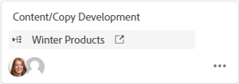

# Usar placas conectadas em placas

Você pode adicionar um cartão ao seu quadro que esteja conectado a tarefas e problemas existentes no [!DNL Workfront].

Quando qualquer um dos detalhes a seguir é atualizado para o cartão em um local, ele é atualizado automaticamente no outro local:

* [!UICONTROL Nome]
* [!UICONTROL Descrição]
* [!UICONTROL Atribuídos]
* [!UICONTROL Status]
* [!UICONTROL Data de conclusão planejada]
* [!UICONTROL Estimativa] / [!UICONTROL Pontos da história]

>[!NOTE]
>Uma única tarefa ou problema conectado só pode ser adicionado uma vez por quadro. A mesma tarefa ou problema pode ser conectado a várias placas.

## Requisitos de acesso

Você deve ter o seguinte acesso para executar as etapas deste artigo:

<table style="table-layout:auto"> 
 <tbody> 
  <tr> 
   <td role="rowheader"><strong>[!DNL Adobe Workfront] plano*</strong></td> 
   <td> 
Qualquer Um
 </td> 
  </tr> 
  <tr> 
   <td role="rowheader"><strong>[!DNL Adobe Workfront] licença*</strong></td> 
   <td> 
[!UICONTROL Solicitação] ou superior
 </td> 
  </tr> 
  <tr>
   <td role="rowheader"><strong>Configurações de nível de acesso*</strong></td>
   <td>
[!UICONTROL Exibir] ou superior acesso a tarefas e problemas
</td>
  </tr>
  <tr>
   <td role="rowheader"><strong>Permissões de objeto</strong></td>
   <td>
Permissões do [!UICONTROL View] ou superior para a tarefa ou problema do Workfront
</td>
  </tr>
 </tbody> 
</table>

&#42;Para descobrir que plano, tipo de licença ou acesso você tem, entre em contato com o [!DNL Workfront] administrador.

## Adicionar um cartão conectado

1. Clique em **[!UICONTROL Menu principal]** ícone  no canto superior direito do Adobe Workfront e clique em **[!UICONTROL Quadros]**.
1. Acessar um quadro. Para obter informações, consulte [Criar ou editar um quadro](../../agile/get-started-with-boards/create-edit-board.md).
1. Clique em **[!UICONTROL Adicionar cartão] > [!UICONTROL Cartão conectado]**.
1. Escolha um projeto e escolha uma tarefa ou problema para adicionar como cartão ao quadro.

   Você pode selecionar vários objetos e todos eles serão adicionados como cartões separados.

   >[!NOTE]
   >
   >* Somente objetos para os quais você tem permissão estarão disponíveis nos resultados da pesquisa. Se um item estiver esmaecido, ele já foi adicionado ao quadro.
   >* Ao filtrar por **[!UICONTROL Projetos dos quais sou proprietário]** ou **[!UICONTROL Projetos em que estou trabalhando]**, os projetos com status Concluído, Inativo ou Rejeitado não são incluídos. Você ainda pode pesquisar por esses projetos com a **[!UICONTROL Todos]** filtro.

1. Clique em **[!UICONTROL Adicionar]**.

   

   O cartão é adicionado na parte inferior da coluna mais à esquerda. O conectado [!DNL Workfront] objeto e seus atribuídos são exibidos no cartão.

   >[!NOTE]
   >
   >Se um destinatário na lista [!DNL Workfront] tarefa ou problema não é um membro do painel, eles não estão atribuídos ao cartão.

   

1. Clique em  para abrir o [!DNL Workfront] tarefa ou problema em uma nova guia do navegador.
1. Para editar os detalhes do cartão, clique nele (não no nome do cartão).

   Ou

   Clique em **[!UICONTROL Mais]** menu  no cartão e selecione **[!UICONTROL Editar]**.

1. No **[!UICONTROL Detalhes do cartão]** adicione ou atualize as seguintes informações:

   <table style="table-layout:auto"> 
    <tbody> 
     <tr> 
      <td role="rowheader"><strong>[!UICONTROL Nome]</strong></td> 
      <td> 
Alterar o nome também altera o nome no estado conectado [!DNL Workfront] objeto.
 </td> 
     </tr> 
     <tr> 
      <td role="rowheader"><strong>[!UICONTROL Descrição]</strong></td> 
      <td> 
Alterar a descrição também altera a descrição no [!DNL Workfront] objeto.
 </td> 
     </tr> 
     <tr>
      <td role="rowheader"><strong>[!UICONTROL Atribuídos]</strong></td>
      <td>
Para atribuir mais pessoas ou uma equipe ao cartão, comece digitando um nome no campo de pesquisa e selecione-o quando ele for exibido na lista. Você pode adicionar indivíduos e equipes. Somente uma atribuição de equipe é permitida em um cartão conectado.

      
Os atribuídos devem ser membros do painel de discussão ou não aparecerão na lista de seleção. Quando uma equipe é um membro do painel, os membros de cada equipe podem ser atribuídos ao cartão.

      
Todos os atribuídos selecionados também são atribuídos à tarefa ou problema no [!DNL Workfront].
</td>
     </tr>
     <tr>
      <td role="rowheader"><strong>[!UICONTROL Coluna]</strong></td>
      <td>
Selecione a coluna do cartão.
</td>
     </tr>
     <tr>
      <td role="rowheader"><strong>[!UICONTROL Status]</strong></td>
      <td>
Selecione um status para o cartão. Os padrões são [!UICONTROL Novo], [!UICONTROL Em Andamento] e [!UICONTROL Concluído], mas qualquer status personalizado definido para o item em [!DNL Workfront] também estão disponíveis.

      
Se você tiver políticas de coluna ativadas para atualizar valores de campo, alterar o status no cartão moverá automaticamente o cartão para a coluna correspondente. Para obter mais informações, consulte "Definir configurações e políticas de coluna" no artigo <a href="/help/quicksilver/agile/get-started-with-boards/manage-board-columns.md" class="MCXref xref">Gerenciar colunas do quadro</a>.

      
Se você clicar em <strong>[!UICONTROL Marcar como Concluída]</strong> na parte superior do cartão, o status muda automaticamente para Complete.
</td>
     </tr>
     <tr>
      <td role="rowheader"><strong>[!UICONTROL Término Planejado]</strong></td>
      <td>
Alterar essa data também altera a data de conclusão planejada no [!DNL Workfront] objeto.
</td>
     </tr>
      <tr>
      <td role="rowheader"><strong>[!UICONTROL Estimativa]</strong></td>
      <td>
O número de horas para a conclusão do cartão.

Se você usar a aceitação antecipada do recurso para [!DNL Workfront] [!UICONTROL Quadros], alterar a estimativa também altera o valor de pontos da história no [!DNL Workfront] objeto.

Se você não estiver optando pelos recursos anteriores, esse campo será apenas uma entrada manual e o valor não poderá ser maior que 99.
</td>
     </tr>
     <tr>
      <td role="rowheader"><strong>[!UICONTROL Marcas]</strong></td>
      <td>
Procure e selecione tags para o cartão.

      
Para obter informações sobre como criar novas tags, consulte <a href="../../agile/get-started-with-boards/add-tags.md" class="MCXref xref">Adicionar tags</a>.
</td>
     </tr>
     <tr> 
      <td role="rowheader"><strong>[!UICONTROL Itens da Lista de Verificação]</strong> </td> 
      <td> 
Clique em <strong>[!UICONTROL Adicionar item de lista de verificação]</strong>. Em seguida, digite o título do item e pressione Enter. Outro item é adicionado automaticamente. Continue inserindo títulos para adicionar mais itens.
 
O contador na parte superior da lista de verificação mostra o número de itens concluídos e o número total de itens.
 
Para obter mais informações sobre os itens da lista de verificação, consulte <a href="/help/quicksilver/agile/get-started-with-boards/manage-checklist-items.md">Gerenciar itens da lista de verificação em cartões</a>.
</td>
     </tr>
    </tbody> 
   </table>

1. Clique em **[!UICONTROL Fechar]** para retornar ao painel.
O objeto conectado, os atribuídos, as tags, a data de vencimento, o contador da lista de verificação, as horas estimadas e o status são exibidos no cartão.

   

## Desconecte um cartão conectado

Você pode desconectar um cartão conectado do objeto Workfront dele, e o cartão permanece no quadro como um cartão ad hoc que pode ser editado.

Para desconectar-se no nível do quadro:

1. Acesse o quadro.
1. Clique em **[!UICONTROL Mais]** menu  no cartão conectado e selecione **[!UICONTROL Desconectar]**.
1. Clique em **[!UICONTROL Desconectar]** na mensagem de confirmação.

Para desconectar no nível da placa:

1. Acesse a placa e abra a placa conectada.
1. Clique em **[!UICONTROL Mais]** menu  na área Conexão dos detalhes do cartão e selecione **[!UICONTROL Desconectar]**.
1. Clique em **[!UICONTROL Desconectar]** na mensagem de confirmação.

## Converter um cartão ad hoc em um cartão conectado

Depois de criar um cartão ad hoc, você pode convertê-lo em um cartão conectado. Para obter detalhes sobre cartões ad hoc, consulte [Adicionar um cartão ad hoc a um quadro](/help/quicksilver/agile/get-started-with-boards/add-card-to-board.md).

1. Acesse o quadro e abra o cartão ad hoc.
1. Verifique o nome e a descrição na placa. Eles serão adicionados à tarefa ou problema que você criar no [!DNL Workfront].
1. No [!UICONTROL Conexão] dos detalhes do cartão, clique em **[!UICONTROL Conectar-se ao Workfront]**.
1. No [!UICONTROL Conectar cartão] selecione se você está criando uma tarefa ou um problema.
1. Procure e selecione um projeto ao qual adicionar a tarefa ou problema.

   >[!NOTE]
   >
   >* Somente objetos para os quais você tem permissão estarão disponíveis nos resultados da pesquisa.
   >* Ao filtrar por **[!UICONTROL Projetos dos quais sou proprietário]** ou **[!UICONTROL Projetos em que estou trabalhando]**, projetos que equivalem a um [!UICONTROL Concluído], [!UICONTROL Morto]ou [!UICONTROL Rejeitado] status não estão incluídos. Você ainda pode pesquisar por esses projetos com a **[!UICONTROL Todos]** filtro.

1. Clique em **[!UICONTROL Conectar]**.

   

   O nome do projeto é exibido na área Conexão nos detalhes do cartão.

1. Clique em **[!UICONTROL Fechar]** para retornar ao painel.

## Registra horas em um cartão conectado

>[!NOTE]
>
>Esse recurso está disponível apenas por meio da aceitação antecipada de recursos para placas Workfront.

Você deve ter as permissões corretas para registrar horas na tarefa ou problema conectado.

Por padrão, os campos de registro de tempo não são exibidos em cartões conectados. Você deve ativar [!UICONTROL **Horas**] no [!UICONTROL Configurar] área sob [!UICONTROL Cartões]. Para obter mais informações, consulte [Personalizar quais campos são exibidos em um cartão](/help/quicksilver/agile/get-started-with-boards/customize-fields-on-card.md).

1. Insira o número de horas da tarefa ou problema.
1. Selecione um [!UICONTROL Tipo de Hora] no menu suspenso, se for diferente do padrão.
1. Clique em [!UICONTROL **Registro de tempo**].

   

   O tempo registrado no cartão também é salvo na tarefa ou problema conectado.

O tempo de registro no cartão é o mesmo que o tempo de registro em uma tarefa ou problema. Para obter mais informações, consulte &quot;Registrar tempo em um projeto, tarefa ou problema&quot; no artigo [Registrar tempo](/help/quicksilver/timesheets/create-and-manage-timesheets/log-time.md).

