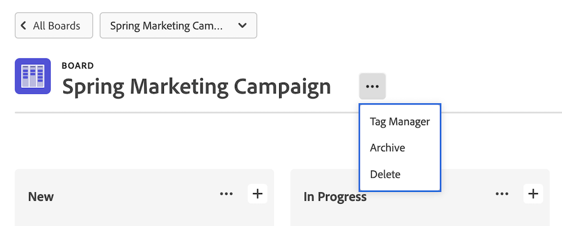

# Excluir ou arquivar um quadro

Você pode excluir ou arquivar um quadro em [!DNL Workfront]. Excluir um quadro o remove permanentemente [!DNL Workfront], enquanto o arquivamento de um quadro retém todas as placas e permite que ele seja restaurado posteriormente. Essas opções se aplicam a quadros independentes e a quadros que fazem parte de fluxos de trabalho.

>[!NOTE]
>
>A versão anterior dos fluxos de trabalho, chamada de coleções, está disponível somente por meio da opção de aceitação antecipada de recursos para [!UICONTROL [!DNL Workfront] Quadros]. Para obter detalhes, consulte [Opt-in de recurso antecipado para placas Adobe Workfront](/help/quicksilver/agile/get-started-with-boards/boards-early-feature-opt-in.md).
>Os fluxos de trabalho estão disponíveis para todos no ambiente de Visualização.

## Requisitos de acesso

Você deve ter o seguinte acesso para executar as etapas neste artigo:

<table style="table-layout:auto"> 
 <col> 
 </col> 
 <col> 
 </col> 
 <tbody> 
  <tr> 
   <td role="rowheader"><strong>[!DNL Adobe Workfront] plano*</strong></td> 
   <td> 
Qualquer Um
 </td> 
  </tr> 
  <tr> 
   <td role="rowheader"><strong>[!DNL Adobe Workfront] licença*</strong></td> 
   <td> 
[!UICONTROL Solicitação] ou superior
 </td> 
  </tr>
   </tbody> 
</table>

&#42;Para descobrir qual plano, tipo de licença ou acesso você tem, entre em contato com seu [!DNL Workfront] administrador.

## Excluir um quadro

Ao excluir um quadro, ele é removido permanentemente do [!DNL Workfront] e não pode ser restaurado. Qualquer cartão no quadro também é excluído junto com o quadro.

1. Clique no botão **[!UICONTROL Menu principal]** ícone  no canto superior direito de [!DNL Adobe Workfront], depois clique em **[!UICONTROL Quadros]**.
1. No painel, selecione o quadro a ser aberto.
1. Clique no botão **[!UICONTROL Mais]** menu ![[!UICONTROL Menu Mais]](assets/more-icon-spectrum.png) ao lado do nome do quadro e selecione **[!UICONTROL Excluir]**. Em seguida, clique em **[!UICONTROL Excluir quadro]** na mensagem de confirmação.

   >[!NOTE]
   >
   >Você só pode excluir quadros criados, não quadros aos quais você foi adicionado.

   

## Arquivar um quadro

As placas arquivadas mantêm todos os cartões e atribuições. Qualquer usuário pode arquivar ou restaurar um quadro a qualquer momento.

1. Clique no botão **[!UICONTROL Menu principal]** ícone  no canto superior direito de [!DNL Adobe Workfront], depois clique em **[!UICONTROL Quadros]**.
1. No painel, selecione o quadro a ser aberto.
1. Clique no botão **[!UICONTROL Mais]** menu ![[!UICONTROL Menu Mais]](assets/more-icon-spectrum.png) ao lado do nome do quadro e selecione **[!UICONTROL Arquivar]**.

   

## Restaurar uma placa

Uma placa arquivada pode ser restaurada a qualquer momento. Qualquer usuário pode restaurar um quadro arquivado.

1. Clique no botão **[!UICONTROL Menu principal]** ícone  no canto superior direito de [!DNL Adobe Workfront], depois clique em **[!UICONTROL Quadros]**.
1. No painel, clique no ícone de filtro  e selecione **[!UICONTROL Placas arquivadas]**.
1. Localize o quadro que você deseja restaurar, clique no botão **[!UICONTROL Mais]** menu  ao lado do nome do quadro e selecione **[!UICONTROL Restaurar]**.

   
