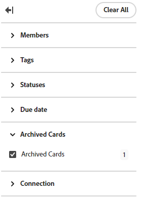

# Excluir ou arquivar um cartão de um quadro

Ao excluir um cartão de um quadro, ele é permanentemente excluído e não pode ser restaurado. O arquivamento de um cartão o envia para o arquivo e você pode restaurá-lo para o quadro posteriormente.

## Requisitos de acesso

Você deve ter o seguinte acesso para executar as etapas deste artigo:

<table style="table-layout:auto"> 
 <col> 
 <col> 
 <tbody> 
  <tr> 
   <td role="rowheader"><strong>[!DNL Adobe Workfront] plano*</strong></td> 
   <td> 
Qualquer Um
 </td> 
  </tr> 
  <tr> 
   <td role="rowheader"><strong>[!DNL Adobe Workfront] licença*</strong></td> 
   <td> 
[!UICONTROL Solicitação] ou superior
 </td> 
  </tr> 
 </tbody> 
</table>

&#42;Para descobrir que plano, tipo de licença ou acesso você tem, entre em contato com o [!DNL Workfront] administrador.

## Excluir um cartão de um quadro

1. Clique em **[!UICONTROL Menu principal]** ícone  no canto superior direito de [!DNL Adobe Workfront]e, em seguida, clique em **[!UICONTROL Quadros]**.
1. Acessar um quadro. Para obter informações, consulte [Criar ou editar um quadro](../../agile/get-started-with-boards/create-edit-board.md).
1. Clique em **[!UICONTROL Mais]** menu  no cartão e selecione **[!UICONTROL Excluir]**.
1. Clique em **[!UICONTROL Excluir]** na mensagem de confirmação.

## Arquivar um cartão de um quadro

1. Acesse o quadro.
1. Clique em **[!UICONTROL Mais]** menu  no cartão e selecione **[!UICONTROL Arquivar]**.

   Cartões arquivados ficam ocultos no quadro, a menos que você aplique um filtro para exibi-los. Para obter mais informações, consulte [Filtrar um quadro para mostrar cartões arquivados](#filter-a-board-to-show-archived-cards) neste artigo.

   Um [!UICONTROL Arquivar] ícone  é exibido em cartões arquivados. Você não pode editar um cartão arquivado, mas pode excluí-lo ou movê-lo para outra coluna.

1. Para restaurar um cartão arquivado, clique no link **[!UICONTROL Mais]** menu  no cartão e selecione **[!UICONTROL Restaurar]**.

## Filtrar um quadro para mostrar cartões arquivados {#filter-a-board-to-show-archived-cards}

Por padrão, somente os cartões ativos são exibidos em um quadro. Você pode filtrar o quadro para exibir também todos os cartões arquivados.

1. Acesse o quadro.
1. Clique em [!UICONTROL **Configurar**] à direita da placa para abrir o painel Configurar.
1. Expandir [!UICONTROL **Cartões**].
1. Ativar [!UICONTROL **Exibir cartões arquivados no quadro**].
1. Clique em [!UICONTROL **Filtro**], expanda a [!UICONTROL Cartões arquivados] e selecione **[!UICONTROL Cartões arquivados]** para exibir cartões arquivados.

   O filtro mostra o número de cartões arquivados.

   

   >[!NOTE]
   >
   >A variável [!UICONTROL Cartões arquivados] A seção não está disponível no filtro se você não ativou a configuração para exibir cartões arquivados. Para obter mais informações, consulte [Personalizar quais campos são exibidos em um cartão](/help/quicksilver/agile/get-started-with-boards/customize-fields-on-card.md).

1. Selecionar **[!UICONTROL Cartões arquivados]** novamente para desmarcar a opção e exibir somente cartões ativos.
