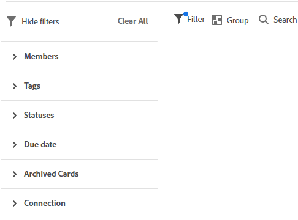

# Filtrar e pesquisar em um quadro

Você pode filtrar um quadro para exibir:

* Cartões atribuídos a certas pessoas
* Cartões com determinadas tags
* Cartões com status específico
* Cartões devidos num determinado período
* Cartões arquivados
* Cartões ligados a um projeto específico

Pesquisar também ajuda a localizar um cartão específico no quadro.

Quando os filtros são aplicados, um indicador é exibido no quadro . Clique em **[!UICONTROL Limpar tudo]** para remover todos os filtros do quadro, e clique em **[!UICONTROL Ocultar filtros]** para fechar o painel de filtro.

## Requisitos de acesso

Você deve ter o seguinte acesso para executar as etapas neste artigo:

<table style="table-layout:auto"> 
 <col> 
 <col> 
 <tbody> 
  <tr> 
   <td role="rowheader"><strong>[!DNL Adobe Workfront] plano*</strong></td> 
   <td> 
Qualquer Um
 </td> 
  </tr> 
  <tr> 
   <td role="rowheader"><strong>[!DNL Adobe Workfront] licença*</strong></td> 
   <td> 
[!UICONTROL Solicitação] ou superior
 </td> 
  </tr> 
 </tbody> 
</table>

&#42;Para descobrir qual plano, tipo de licença ou acesso você tem, entre em contato com seu [!DNL Workfront] administrador.

## Filtrar um quadro por destinatários

1. Clique no botão **[!UICONTROL Menu principal]** ícone  no canto superior direito de [!DNL Adobe Workfront], depois clique em **[!UICONTROL Quadros]**.
1. Acesse um quadro. Para obter mais informações, consulte [Criar ou editar um quadro](../../agile/get-started-with-boards/create-edit-board.md).
1. Clique no ícone de filtro , expanda a [!UICONTROL Membros] e selecione a pessoa ou pessoas cujos cartões você deseja visualizar. Também é possível exibir cartões não atribuídos.

   

## Filtrar um quadro por tags

1. Acesse o quadro.
1. Clique no ícone de filtro , expanda a [!UICONTROL Tags] e selecione as tags que deseja visualizar.

   

## Filtrar um quadro por status

1. Acesse o quadro.
1. Clique no ícone de filtro , expanda a [!UICONTROL Status] e selecione os tipos de status que deseja visualizar.

   Você também pode ocultar cartões concluídos.

   

## Filtrar um quadro por data de vencimento

1. Acesse o quadro.
1. Clique no ícone de filtro , expanda a [!UICONTROL Data de vencimento] e selecione as opções de data que deseja visualizar.

   Somente os cartões nos intervalos de datas selecionados são exibidos.

   

## Filtrar um quadro para mostrar cartões arquivados

Por padrão, somente os cartões ativos são exibidos em um quadro. Você pode filtrar o quadro para também exibir os cartões arquivados.

1. Acesse o quadro.
1. Clique no ícone de filtro , expanda a [!UICONTROL Cartões arquivados] e selecione **[!UICONTROL Cartões arquivados]** para exibir qualquer cartão arquivado.

   O filtro mostra o número de cartões arquivados.

   

1. Selecionar **[!UICONTROL Cartões arquivados]** novamente para limpar a opção e exibir apenas cartões ativos.

## Filtrar um quadro por conexão

1. Acesse o quadro.
1. Clique no ícone de filtro , expanda a [!UICONTROL Conexão] e selecione o [!DNL Workfront] projetos para os cartões conectados que você deseja visualizar.

   Também é possível exibir cartões que não estão conectados a um projeto.

   

## Pesquisar em um quadro

1. Acesse o quadro.
1. Clique no ícone de pesquisa  e digite um termo de pesquisa. Em seguida, pressione Enter.

   Todos os cartões que contêm o termo de pesquisa são exibidos.

   Clique no X para limpar a pesquisa.

   ![[!UICONTROL Pesquisar por cartões em um quadro]](assets/boards-searchbox.png)
