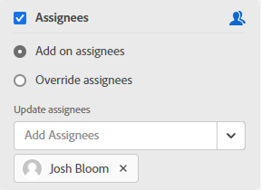

# Gerenciar colunas do quadro

<!-- Audited: 05/2024 -->

Um novo quadro contém três colunas por padrão. Você pode adicionar mais colunas, alterar a ordem das colunas, renomear colunas e excluir colunas desnecessárias.

As configurações de coluna incluem políticas, que permitem definir opções para o que acontece a um cartão quando ele é movido para essa coluna.

Para obter informações sobre como classificar os cartões em colunas, consulte [Filtrar e pesquisar em um quadro](/help/quicksilver/agile/get-started-with-boards/filter-search-in-board.md).

## Requisitos de acesso

+++ Expanda para visualizar os requisitos de acesso para a funcionalidade neste artigo.

Você deve ter o seguinte acesso para executar as etapas deste artigo:

<table style="table-layout:auto"> 
 <col> 
 </col> 
 <col> 
 </col> 
 <tbody> 
  <tr> 
   <td role="rowheader">[!DNL Adobe Workfront] plano</td> 
   <td> 
Qualquer
 </td> 
  </tr> 
  <tr> 
   <td role="rowheader">[!DNL Adobe Workfront] licença</td> 
   <td> 
Novo: Colaborador ou superior 

        
ou
 
        
Atual: [!UICONTROL Request] ou superior 
</td> 
  </tr> 
 </tbody> 
</table>

Para obter mais detalhes sobre as informações nesta tabela, consulte [Requisitos de acesso na documentação do Workfront](/help/quicksilver/administration-and-setup/add-users/access-levels-and-object-permissions/access-level-requirements-in-documentation.md).

+++

## Adicionar uma coluna a um quadro

{{step1-to-boards}}

1. Acessar um quadro. Para obter informações, consulte [Criar ou editar um quadro](../../agile/get-started-with-boards/create-edit-board.md).
1. Clique em **[!UICONTROL Adicionar coluna]** à direita das colunas existentes.
1. Na nova coluna, digite um nome e clique em **[!UICONTROL Adicionar Coluna]**.

   

>[!TIP]
>
>Para adicionar uma coluna de entrada, consulte [Adicionar uma coluna de entrada a um quadro](/help/quicksilver/agile/use-boards-agile-planning-tools/add-intake-column-to-board.md).

## Reordenar colunas em um quadro

1. Acesse o quadro.
1. Arraste e solte as colunas na ordem correta. Certifique-se de selecionar a parte superior da coluna antes de arrastá-la para outro local.

   

## Renomear uma coluna do quadro

1. Acesse o quadro.
1. Clique no nome da coluna, digite o novo nome e pressione Enter.

   Ou

   Clique no menu **[!UICONTROL Mais]**  na coluna e selecione **[!UICONTROL Editar]**. Na área Configurações, digite o novo nome no campo **[!UICONTROL Nome da coluna]** e clique em **[!UICONTROL Fechar]**.

## Excluir uma coluna de quadro

Quando você exclui uma coluna de um quadro, ela não pode ser recuperada.

1. Acesse o quadro.
1. Clique no menu **[!UICONTROL Mais]**  na coluna e selecione **[!UICONTROL Excluir]**.

   >[!NOTE]
   >
   >As colunas que contêm cartões, incluindo cartões arquivados, não podem ser excluídas. Se você tentar excluir uma coluna que contém cartões, deverá escolher outra coluna para esses cartões.

## Exibir contagem de cartões

Você pode usar uma definição de configuração para exibir o número de cartões em cada coluna.

Se você estiver usando o limite de WIP em uma coluna, não será adicionado um contador de placa separado. Para obter mais informações sobre limites WIP, consulte [Gerenciar o limite de [!UICONTROL Trabalho em Andamento] (WIP) em um quadro](/help/quicksilver/agile/use-boards-agile-planning-tools/manage-wip-limit-on-board.md).

1. Acesse o quadro.
1. Clique em **[!UICONTROL Configurar]** à direita do quadro para abrir o painel Configurar.
1. Expanda **[!UICONTROL Coluna]**.
1. Ative **[!UICONTROL Exibir uma contagem de cartão de coluna]**.

   

   O contador de cartão é exibido na parte superior de cada coluna.

1. Clique em **[!UICONTROL Ocultar configuração]** para fechar o painel [!UICONTROL Configurar].

## Definir configurações e políticas de coluna

As políticas de coluna incluem a atualização automática dos valores de campo e a configuração de um limite de trabalho em andamento.

A política de atualização do status funciona automaticamente para o cartão e a coluna:

* Quando um cartão é movido para uma coluna com uma política, o status do cartão é atualizado para o status definido na política. Isso se aplica a placas ad hoc e conectadas.
* Quando um status ad hoc ou cartão conectado é atualizado no cartão para corresponder ao status da coluna na política ou um status de cartão conectado é atualizado em outro lugar no Workfront, o cartão é movido automaticamente para essa coluna. Além disso, se um status personalizado em um cartão corresponder ao status do sistema atribuído à coluna, o cartão é movido para essa coluna.

Um cartão permanecerá em uma coluna em que é colocado se o status do cartão não corresponder a nenhum status definido em nenhuma política de coluna existente.

>[!NOTE]
>
>Os painéis dinâmicos sempre colocam cartões na coluna que corresponde ao status, independentemente das políticas de coluna estarem ativadas ou desativadas. Os cartões retornarão às colunas atribuídas quando você atualizar o quadro.
> 
>Além disso, para todos os tipos de quadro, se você mover um cartão de uma coluna para outra coluna com o mesmo status, o cartão retornará à coluna original quando você atualizar o quadro.

1. Acesse o quadro.
1. Clique no menu **[!UICONTROL Mais]**  na coluna e selecione **[!UICONTROL Editar]**.

   A área [!UICONTROL Configurações] é exibida. O **[!UICONTROL Nome da coluna]** permite que você saiba para qual coluna você está definindo configurações.

1. Habilite a política **[!UICONTROL Atualizar valores de campo automaticamente]** para alterar determinados valores de campo automaticamente quando um cartão for movido para esta coluna.

   

1. (Opcional) Defina um valor para o status do cartão:

   1. Marque a caixa de seleção **[!UICONTROL Status]**.

   1. Selecione o status a ser aplicado a um cartão quando ele for movido para essa coluna.

      

      As opções de conversão de status para cartões conectados também são exibidas. (A tradução de status não se aplica a cartões ad hoc.) Essas opções determinam o status personalizado aplicado à tarefa ou problema em [!DNL Workfront] quando um cartão conectado é movido para esta coluna.

   1. Selecione um status [!UICONTROL **Personalizado**] para aplicar ao cartão para tarefas e problemas.

      Quando um cartão é movido para essa coluna, [!DNL Workfront] tenta aplicar o status personalizado primeiro (por exemplo, Resolvido). Se o status personalizado selecionado não estiver disponível para essa placa, você será solicitado a escolher outro status que corresponda ao status do sistema (da etapa b acima). Para obter mais informações sobre status, consulte [Visão geral dos status](/help/quicksilver/administration-and-setup/customize-workfront/creating-custom-status-and-priority-labels/statuses-overview.md).

      Além disso, se o status na tarefa ou problema conectado for alterado para o status personalizado ou do sistema definido na política de coluna, o cartão será movido automaticamente para a coluna.

1. (Opcional) Defina um valor para os atribuídos do cartão:

   1. Marque a caixa de seleção **[!UICONTROL Atribuídos]**.
   1. Selecione uma ação.

      * **[!UICONTROL Adicionar responsáveis]:** Os responsáveis selecionados são adicionados à lista existente de responsáveis em um cartão quando ele é movido para esta coluna.
      * **[!UICONTROL Substituir atribuídos]:** os atribuídos selecionados substituem todos os outros atribuídos e se tornam os únicos atribuídos de um cartão quando ele é movido para esta coluna.

   1. Clique em [!UICONTROL **Adicionar atribuição**] e procure um usuário. Selecione os atribuídos nos resultados da pesquisa. Todos os usuários e equipes do Workfront estão disponíveis para escolha.

      

1. (Opcional) Defina um valor para as tags do cartão:

   1. Marque a caixa de seleção **[!UICONTROL Cartões]**.
   1. Selecione uma ação.

      * **[!UICONTROL Adicionar nas marcas]:** As marcas selecionadas são adicionadas à lista existente de marcas em um cartão quando ele é movido para esta coluna.
      * **[!UICONTROL Substituir marcas]:** As marcas selecionadas substituem todas as outras marcas e se tornam as únicas marcas em um cartão quando ele é movido para esta coluna.

   1. Selecione as tags na lista suspensa. Somente as marcas já criadas no [!UICONTROL Gerenciador de Marcas] estão disponíveis para seleção. Para obter informações sobre como adicionar novas marcas, consulte [Adicionar marcas](/help/quicksilver/agile/get-started-with-boards/add-tags.md).

      

1. Habilite a política de **[!UICONTROL Limite de trabalho em andamento]** para limitar o número de cartões que podem ser adicionados à coluna. Em seguida, digite o número do limite no campo **[!UICONTROL Definir limite]**.

   

   Para obter mais informações, consulte [Gerenciar o limite de Trabalho em andamento (WIP) em um quadro](/help/quicksilver/agile/use-boards-agile-planning-tools/manage-wip-limit-on-board.md).

1. Clique em **[!UICONTROL Fechar]** para sair da área Configurações e exibir a coluna e seus cartões.
