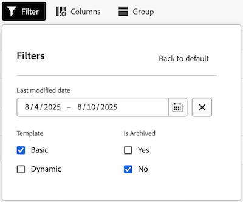

# Gerenciar a visualização de administrador do Boards

A Visualização de administração dos painéis contém uma lista de todos os painéis em sua conta que os administradores de sistema podem usar para obter um instantâneo rápido dos detalhes gerais dos painéis, incluindo quando foram atualizados pela última vez, quantos cartões cada um tem e mais.

Nessa área, você pode executar as seguintes ações:

* Filtrar a lista de painéis
* Configurar as colunas da lista de painéis
* Agrupar a lista de painéis

## Requisitos de acesso

+++ Expanda para visualizar os requisitos de acesso.

<table style="table-layout:auto"> 
 <col> 
 </col> 
 <col> 
 </col> 
 <tbody> 
  <tr> 
   <td role="rowheader">Pacote do Adobe Workfront</td> 
   <td> 
Qualquer
 </td> 
  </tr> 
  <tr> 
   <td role="rowheader">Licença do Adobe Workfront</td> 
   <td> 
Padrão

        
 Plano 
</td> 
  </tr> 
    <tr> 
   <td role="rowheader">Configurações de nível de acesso</td> 
   <td> 
Administrador de Sistema 

        </td> 
  </tr> 
 </tbody> 
</table>

Para obter mais detalhes sobre as informações contidas nesta tabela, consulte [Requisitos de acesso na documentação do Workfront](/help/quicksilver/administration-and-setup/add-users/access-levels-and-object-permissions/access-level-requirements-in-documentation.md).

+++

## Pré-requisitos

Você deve criar um Painel antes de visualizá-lo na Exibição do administrador.

Para obter mais informações, consulte [Criar ou editar um painel](/help/quicksilver/agile/get-started-with-boards/create-edit-board.md).

## Filtrar a lista de painéis

{{step1-to-boards}}

1. Na página **Painéis**, selecione a guia **Exibição do administrador**.

1. Selecione **Filtro**. O painel **Filtros** é aberto.

1. Siga as etapas abaixo para configurar o filtro:

   1. (Opcional) Clique no ícone **Calendário** ícone  e selecione um intervalo de datas para filtrar por painéis que foram modificados pela última vez nesse período.

   1. (Opcional) Na seção **Modelo**, selecione o tipo de modelo de painel pelo qual a lista filtrará. Você pode selecionar mais de um tipo de modelo.
Para obter mais informações sobre tipos de modelo de painel, consulte [Criar ou editar um painel](/help/quicksilver/agile/get-started-with-boards/create-edit-board.md).

   1. (Opcional) Na seção **Está arquivado**, selecione se as placas arquivadas ou não arquivadas serão exibidas. É possível selecionar mais de uma opção.

      

1. Clique fora do painel **Filtros** para fechá-lo. Suas seleções de filtro permanecerão aplicadas à lista Painéis até que seja alterada de volta para a exibição padrão.

   >[!NOTE]
   >
   >Para remover um filtro, abra o painel **Filtros** e clique em **Voltar ao padrão** no canto superior direito.

## Configurar as colunas da lista de painéis

{{step1-to-boards}}

1. Na página **Painéis**, selecione a guia **Exibição do administrador**.

1. Selecione **Colunas**. O painel **Visibilidade e ordem dos campos** é aberto.

1. Configure as colunas que aparecerão na lista Painéis, selecionando ou desmarcando a opção Alinhar com cada coluna:

   * **Proprietário**
   * **Última atualização**
   * **Membros**
   * **Arquivado**
   * **Modelo**
   * **Contagem de cartões**

1. (Opcional) Para ajustar a ordem em que os campos aparecem, clique e mantenha pressionado o ícone **Arrastar** à esquerda de um campo e arraste-o para uma nova posição.

   

1. Clique fora do painel **Visibilidade e ordem de campos** para fechá-lo. As configurações da coluna continuarão aplicadas à lista de placas até que sejam modificadas.

   >[!NOTE]
   >
   > Quando a exibição das colunas da lista Painéis é modificada, um ponto azul aparece acima do ícone **Colunas** para indicar que a exibição atual foi modificada em relação ao padrão.

## Agrupar a lista Painéis por um campo específico

{{step1-to-boards}}

1. Na página **Painéis**, selecione a guia **Exibição do administrador**.

1. Selecione **Grupo**. O painel **Agrupar por** é aberto.

1. Selecione o campo pelo qual deseja agrupar a lista Painéis:

   * **Arquivado**
   * **Proprietário**
   * **Modelo**

1. (Opcional) Para expandir ou recolher o agrupamento do painel **Agrupar por**, clique em **Recolher tudo** ou **Expandir tudo**.

   

1. (Opcional) Para alterar a ordem de exibição do agrupamento de A-Z para Z-A, selecione o campo pelo qual a lista está agrupada no momento e selecione **Z-A** na lista suspensa.

   

1. Clique fora do painel **Agrupar por** para fechá-lo. Aqui, você pode recolher ou expandir o agrupamento aplicado na lista selecionando a seta ao lado do título do agrupamento.

   

   >[!NOTE]
   >   
   >Quando a exibição de agrupamento da lista Painéis é modificada, um ponto azul aparece acima do ícone **Grupo** para indicar que a exibição atual é diferente da padrão.  
   >Se quiser remover um agrupamento, abra o painel **Agrupar por** e selecione **Limpar tudo** no canto superior direito.
