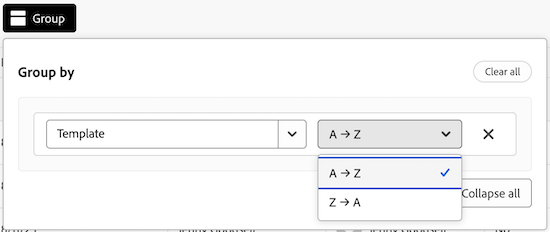

# Gerenciar a exibição de administração dos painéis

A Exibição de administrador dos painéis contém uma lista de todos os painéis na sua conta que os administradores do sistema podem usar para obter um instantâneo rápido dos detalhes gerais dos painéis, incluindo a última atualização, quantos cartões cada um tem e muito mais.

Nessa área, você pode executar as seguintes ações:

* Filtrar a lista Quadros
* Configurar as colunas da lista de Quadros
* Agrupar a lista Quadros

## Requisitos de acesso

+++ Expanda para visualizar os requisitos de acesso.

<table style="table-layout:auto"> 
 <col> 
 </col> 
 <col> 
 </col> 
 <tbody> 
  <tr> 
   <td role="rowheader">plano do Adobe Workfront</td> 
   <td> 
Qualquer
 </td> 
  </tr> 
  <tr> 
   <td role="rowheader">Licença do Adobe Workfront</td> 
   <td> 
Standard

        
 Plano 
</td> 
  </tr> 
    <tr> 
   <td role="rowheader">Configurações de nível de acesso</td> 
   <td> 
Administrador de Sistema 

        </td> 
  </tr> 
 </tbody> 
</table>

Para obter mais detalhes sobre as informações nesta tabela, consulte [Requisitos de acesso na documentação do Workfront](/help/quicksilver/administration-and-setup/add-users/access-levels-and-object-permissions/access-level-requirements-in-documentation.md).

+++

## Pré-requisitos

Você deve criar um Quadro antes de visualizá-lo na Exibição de administração.

Para obter mais informações, consulte [Criar ou editar um quadro](/help/quicksilver/agile/get-started-with-boards/create-edit-board.md).

## Filtrar a lista Quadros

{{step1-to-boards}}

1. Na página **Quadros**, selecione a guia **Exibição do administrador**.

1. Selecione **Filtro**. O painel **Filtros** é aberto.

1. Siga as etapas abaixo para configurar o filtro:

   1. (Opcional) Clique no ícone **Calendário**  e selecione um intervalo de datas para filtrar pelos Quadros que foram modificados pela última vez dentro desse período.

   1. (Opcional) Na seção **Modelo**, selecione o tipo de modelo de Quadro pelo qual a lista será filtrada. Você pode selecionar mais de um tipo de template.
Para obter mais informações sobre os tipos de modelo de quadro, consulte [Criar ou editar um quadro](/help/quicksilver/agile/get-started-with-boards/create-edit-board.md).

   1. (Opcional) Na seção **Está arquivado**, selecione se os painéis arquivados ou não arquivados serão exibidos. É possível selecionar mais de uma opção.

      

1. Clique fora do painel **Filtros** para fechá-lo. As seleções de filtro permanecerão aplicadas à lista Quadros até que seja alterada novamente para a exibição padrão.

   >[!NOTE]
   >
   >Para remover um filtro, abra o painel **Filtros** e clique em **Voltar ao padrão** no canto superior direito.

## Configurar as colunas da lista de Quadros

{{step1-to-boards}}

1. Na página **Quadros**, selecione a guia **Exibição do administrador**.

1. Selecione **Colunas**. O painel **Visibilidade e ordem de campos** é aberto.

1. Configure quais colunas aparecem na lista Quadros selecionando ou desmarcando a alternância em linha com cada coluna:

   * **Proprietário**
   * **Última atualização**
   * **Membros**
   * **Arquivado**
   * **Modelo**
   * **Contagem de cartões**

1. (Opcional) Para ajustar a ordem em que os campos aparecem, clique e mantenha pressionado o ícone **Arrastar** à esquerda de um campo e arraste-o para uma nova posição.

   

1. Clique fora do painel **Visibilidade e ordem de campos** para fechá-lo. As configurações de coluna permanecerão aplicadas à lista de Quadros até serem modificadas.

   >[!NOTE]
   >
   > Quando a exibição das colunas da lista de Quadros é modificada, um ponto azul aparece acima do ícone **Colunas** para indicar que a exibição atual foi modificada do padrão.

## Agrupar a lista Quadros por um campo específico

{{step1-to-boards}}

1. Na página **Quadros**, selecione a guia **Exibição do administrador**.

1. Selecione o **Grupo**. O painel **Agrupar por** é aberto.

1. Selecione o campo pelo qual você deseja agrupar a lista Quadros:

   * **Arquivado**
   * **Proprietário**
   * **Modelo**

1. (Opcional) Para expandir ou recolher o agrupamento do painel **Agrupar por**, clique em **Recolher tudo** ou **Expandir tudo**.

   

1. (Opcional) Para alterar a ordem de exibição do agrupamento de A-Z para Z-A, selecione o campo pelo qual a lista está agrupada no momento e selecione **Z-A** no menu suspenso.

   

1. Clique fora do painel **Agrupar por** para fechá-lo. Aqui, você pode recolher ou expandir o agrupamento aplicado na lista selecionando a seta ao lado do título do agrupamento.

   

   >[!NOTE]
   >   
   >Quando a exibição de agrupamento da lista Quadros é modificada, um ponto azul aparece acima do ícone **Grupo** para indicar que a exibição atual é diferente da padrão.  
   >Para remover um agrupamento, abra o painel **Agrupar por** e selecione **Limpar tudo** no canto superior direito.
