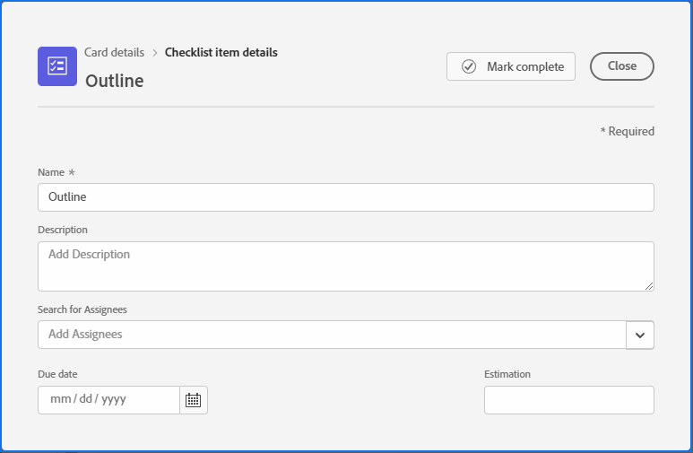

# Gerenciar itens da lista de verificação em cartões

Usar uma lista de verificação em um cartão permite dividir o trabalho em incrementos menores ou adicionar observações ao cartão. Os itens da lista de verificação estão disponíveis em cartões ad hoc e conectados.

Para obter informações sobre cartões, consulte [Adicionar um cartão ad hoc a um quadro](/help/quicksilver/agile/get-started-with-boards/add-card-to-board.md), [Usar cartões conectados em quadros](/help/quicksilver/agile/get-started-with-boards/connected-cards.md) e [Gerenciar cartões](/help/quicksilver/agile/get-started-with-boards/move-board-items.md).

## Requisitos de acesso

Você deve ter o seguinte acesso para executar as etapas deste artigo:

<table style="table-layout:auto"> 
 <col> 
 </col> 
 <col> 
 </col> 
 <tbody> 
  <tr> 
   <td role="rowheader"><strong>[!DNL Adobe Workfront] plano*</strong></td> 
   <td> 
Qualquer
 </td> 
  </tr> 
  <tr> 
   <td role="rowheader"><strong>[!DNL Adobe Workfront] licença*</strong></td> 
   <td> 
[!UICONTROL Solicitação] ou superior
 </td> 
  </tr> 
 </tbody> 
</table>

&#42;Para saber qual plano, tipo de licença ou acesso você tem, contate o administrador do [!DNL Workfront].

## Adicionar uma lista de verificação a um cartão

1. Clique no ícone  do **[!UICONTROL Menu principal]** no canto superior direito do Adobe Workfront e clique em **[!UICONTROL Quadros]**.
1. Acessar um quadro. Para obter informações, consulte [Criar ou editar um quadro](../../agile/get-started-with-boards/create-edit-board.md).
1. Clique no cartão para abrir a caixa [!UICONTROL Detalhes do cartão].

   Ou

   Clique no menu **[!UICONTROL Mais]**  no cartão e selecione **[!UICONTROL Editar]**.

1. Para adicionar um novo item, clique em **[!UICONTROL Adicionar item da lista de verificação]**. Em seguida, digite o título do item e pressione Enter. Outro item é adicionado automaticamente. Continue inserindo títulos para adicionar mais itens.

   O contador na parte superior da lista de verificação mostra o número de itens concluídos e o número total de itens.

1. Clique no  para abrir a caixa [!UICONTROL Detalhes do Item da Lista de Verificação].

   

1. (Opcional) Adicione uma descrição, destinatários, data de vencimento e horas estimadas para o item da lista de verificação.

   Para obter informações sobre qualquer um desses campos, consulte [Adicionar um cartão ad hoc a um quadro](/help/quicksilver/agile/get-started-with-boards/add-card-to-board.md) ou [Usar cartões conectados em quadros](/help/quicksilver/agile/get-started-with-boards/connected-cards.md).

1. Clique em **[!UICONTROL Fechar]** para retornar aos detalhes do cartão e à lista completa de itens da lista de verificação.

   Os responsáveis e a data de vencimento aparecem no item.

1. Para copiar um item, clique no menu **[!UICONTROL Mais]**  no item e selecione **[!UICONTROL Copiar]**.
1. Para excluir um item da lista de verificação, clique no menu **[!UICONTROL Mais]**  no item e selecione **[!UICONTROL Excluir]**.

## Concluir itens da lista de verificação

1. Acesse o quadro e localize o cartão no qual a lista de verificação está.
1. Clique no cartão para abrir a caixa [!UICONTROL Detalhes do cartão].

   Ou

   Clique no menu **[!UICONTROL Mais]**  no cartão e selecione **[!UICONTROL Editar]**.

1. Marque a caixa de seleção ao lado do item que está concluído.

   O contador é atualizado para mostrar os itens concluídos.

   Você pode desmarcar a caixa de seleção se precisar adicionar o item de volta à lista.

   

1. Clique em **[!UICONTROL Fechar]** para retornar ao quadro.

   O contador no cartão também é atualizado.
