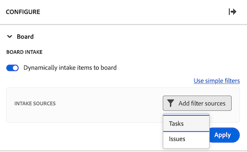

# Adicionar uma coluna de entrada a um quadro

<!-- Audited: 5/2025 -->

Opcionalmente, é possível adicionar uma coluna de entrada ao quadro que automaticamente obtém tarefas e problemas como cartões conectados quando adicionados em [!DNL Workfront] com base nos filtros definidos por você. A coluna de entrada pode servir como uma coluna de backlog para uma equipe Kanban, um local de entrada para uma equipe de suporte ver os problemas à medida que são adicionados a uma fila de solicitações ou qualquer outro propósito necessário.

Somente uma coluna de entrada é permitida em um quadro e sempre aparece como a coluna mais à esquerda.

A coluna de entrada não está disponível em uma placa dinâmica. No entanto, é possível atualizar os filtros que definem quais cartões são trazidos para um quadro dinâmico. Quando você altera esses filtros em um quadro dinâmico, as configurações do cartão que não fazem parte da tarefa ou problema do Workfront (como tags) são redefinidas.

>[!NOTE]
>
>Por motivos de segurança, somente o proprietário de um quadro pode alterar os filtros do quadro no painel Configurar.

A coluna de entrada é limitada a 300 tarefas e 300 problemas. A ordem padrão dos itens na coluna de entrada é a seguinte:

Tarefas:

* Ordem principal: nome do projeto
* Ordem secundária: estrutura do detalhamento do trabalho

Problemas:

* Ordem principal: nome do projeto
* Ordem secundária: número de referência

>[!IMPORTANT]
>
>É recomendável atualizar o quadro frequentemente se vários usuários estiverem trabalhando no quadro ao mesmo tempo. Atualizar a página ajuda a manter as alterações visuais no quadro atualizadas e evita que problemas como cartões duplicados sejam movidos para o quadro a partir da coluna de entrada.
>
>Para sincronizar com o Workfront e trazer novas tarefas e problemas para o quadro ou coluna de entrada, clique no menu Mais ![[!UICONTROL Mais menu]](assets/more-menu.png) ao lado do nome do quadro e selecione Sincronizar itens conectados.

Para obter mais informações sobre colunas, consulte [Gerenciar colunas do quadro](/help/quicksilver/agile/get-started-with-boards/manage-board-columns.md). Para obter informações sobre cartões conectados, consulte [Usar cartões conectados em quadros](/help/quicksilver/agile/get-started-with-boards/connected-cards.md).

## Requisitos de acesso

+++ Expanda para visualizar os requisitos de acesso para a funcionalidade neste artigo.

<table style="table-layout:auto"> 
 <col> 
 <col> 
 <tbody> 
  <tr> 
   <td role="rowheader">[!DNL Adobe Workfront]</td> 
   <td> 
Qualquer
 </td> 
  </tr> 
  <tr> 
   <td role="rowheader">[!DNL Adobe Workfront] licença</td> 
   <td> 
   
Novo: [!UICONTROL Contributor] ou superior
 
   
ou

   
Atual: [!UICONTROL Request] ou superior

   </td> 
  </tr> 
 </tbody> 
</table>

Para obter mais detalhes sobre as informações nesta tabela, consulte [Requisitos de acesso na documentação do Workfront](/help/quicksilver/administration-and-setup/add-users/access-levels-and-object-permissions/access-level-requirements-in-documentation.md).

+++

## Criar uma coluna de entrada usando filtros simples

{{step1-to-boards}}

1. No painel, selecione um quadro.
1. Clique em **Configurar** à direita do quadro para abrir o painel **Configurar**.
1. Selecione a seção **Board**. Novos campos são exibidos.
1. Ativar **Entrada dinâmica de itens no quadro**. A coluna de entrada em branco aparece no lado esquerdo da placa.

   

1. (Opcional) Procure e selecione [!DNL Workfront] [!UICONTROL **Projetos**].
1. (Opcional) Procure e selecione o usuário ou a equipe [!UICONTROL **Atribuições**].
1. Clique em **Aplicar**. Os objetos são exibidos na coluna entrada do quadro como cartões conectados.

   

## Criar uma coluna de entrada usando filtros avançados

{{step1-to-boards}}

1. No painel, selecione um quadro.
1. Clique em **Configurar** à direita do quadro para abrir o painel **Configurar**.
1. Selecione a seção **Board**. Novos campos são exibidos.
1. Ativar **Entrada dinâmica de itens no quadro**. A coluna de entrada em branco aparece no lado esquerdo da placa.

1. Clique em [!UICONTROL **Usar filtros avançados**].

1. Clique em **[!UICONTROL Adicionar fontes de filtro]** e selecione **[!UICONTROL Tarefas]** ou **[!UICONTROL Problemas]**.

   

   >[!NOTE]
   >
   >Você pode filtrar a coluna de entrada para incluir tarefas e problemas, mas deve configurar os filtros separadamente para cada tipo de objeto.
   >
   >Além disso, os filtros salvos e os filtros padrão do sistema estão disponíveis para seleção.

1. No painel de filtros, clique em **[!UICONTROL Novo filtro]**.

1. Crie seu filtro e clique em **[!UICONTROL Salvar como novo]**.

   

   O exemplo acima mostra um filtro para tarefas de um projeto específico que estão no status de [!UICONTROL Novo] ou [!UICONTROL Em andamento].

   >[!NOTE]
   >
   >É recomendável não usar o curinga &quot;Eu&quot; (usuário conectado) em um filtro de quadro, pois não há garantia de exibir sempre tarefas ou problemas para o usuário conectado. Depois que o quadro for configurado com as tarefas e problemas corretos, você pode filtrar o quadro para mostrar itens para um responsável específico. Para obter mais informações, consulte [Filtrar e pesquisar em um quadro](/help/quicksilver/agile/get-started-with-boards/filter-search-in-board.md).

   Para obter mais detalhes sobre a criação de filtros, consulte a seção Criar ou editar um filtro no construtor padrão no artigo [Criar ou editar filtros em [!DNL Adobe Workfront]](/help/quicksilver/reports-and-dashboards/reports/reporting-elements/create-filters.md).

1. Nomeie o filtro e clique em **[!UICONTROL Salvar]**. O filtro é exibido na lista de filtros salvos e aplicado automaticamente à coluna de entrada.

   

1. Clique no X na parte superior do painel de filtro para fechá-lo.

1. (Opcional) Para compartilhar o filtro com outras pessoas, passe o mouse sobre o filtro salvo, clique no ícone de menu **[!UICONTROL Mais]**  e selecione **[!UICONTROL Compartilhar]**. Escolha os usuários ou equipes com os quais compartilhar na caixa **Compartilhamento de filtro**. Para obter mais informações, consulte [Compartilhar um filtro, exibição ou agrupamento](/help/quicksilver/reports-and-dashboards/reports/reporting-elements/share-filter-view-grouping.md).
1. (Opcional) Para incluir tarefas e problemas na coluna de entrada, clique em **[!UICONTROL Filtrar fontes]** e selecione o outro objeto para criar outro filtro.
1. Quando terminar de adicionar filtros, analise a coluna entrada para verificar se as tarefas e problemas corretos foram exibidos.

   

   >[!NOTE]
   >
   >Você pode atualizar os filtros a qualquer momento abrindo o painel Configurar, clicando em **[!UICONTROL Filtrar fontes]** e selecionando **[!UICONTROL Tarefas]** ou **[!UICONTROL Problemas]**.

## Usar a coluna de entrada

Os cartões na coluna de entrada não são editáveis até que você os mova para outras colunas do quadro. Você pode clicar no cartão para abri-lo em um modo de exibição somente leitura ou clicar em  para abrir a tarefa ou problema em uma nova guia do navegador.

Você pode reordenar manualmente os itens na coluna de entrada.

Os ícones na parte superior direita da coluna de entrada mostram quantos cartões estão atualmente na coluna e quantos filtros são aplicados.

1. (Opcional) Para procurar um item na coluna de entrada, clique em  na coluna.
1. (Opcional) Para mover um cartão da coluna de entrada para outra coluna, arraste e solte o cartão na posição em que deseja que ele seja exibido.

   Ou

   Clique no **[!UICONTROL Mais]** ícone de menu  no cartão e selecione **[!UICONTROL Mover]**. Em seguida, na caixa **Mover [ITEM]**, escolha outra coluna e selecione **[!UICONTROL Mover]**.

1. (Opcional) Para excluir a coluna de entrada, clique no ícone de menu **[!UICONTROL Mais]**  e selecione **[!UICONTROL Excluir]**.
