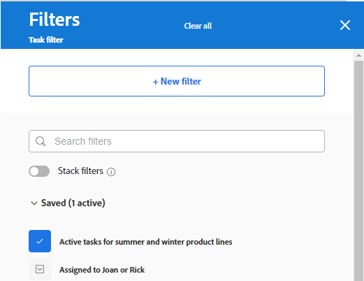

# Adicionar uma coluna de entrada a um quadro

Opcionalmente, é possível adicionar uma coluna de entrada ao quadro que extrai automaticamente tarefas e problemas como cartões conectados quando eles são adicionados em [!DNL Workfront], com base nos filtros definidos. A coluna de entrada pode servir como coluna de backlog para uma equipe de Kanban, um local de entrada para uma equipe de suporte para ver os problemas à medida que são adicionados a uma fila de solicitações ou qualquer outro propósito que você precise.

Apenas uma coluna de entrada é permitida em um quadro, e sempre aparece como a coluna mais à esquerda.

A coluna de entrada está limitada a 300 tarefas e 300 problemas. Elas são classificadas pela prioridade definida nos itens. Para obter informações sobre prioridade, consulte [Atualizar prioridade da tarefa](/help/quicksilver/manage-work/tasks/task-information/task-priority.md) e [Atualizar prioridade do problema](/help/quicksilver/manage-work/issues/issue-information/update-issue-priority.md).

Para obter mais informações sobre colunas, consulte [Gerenciar colunas do quadro](/help/quicksilver/agile/get-started-with-boards/manage-board-columns.md). Para obter informações sobre placas conectadas, consulte [Usar placas conectadas em placas](/help/quicksilver/agile/get-started-with-boards/connected-cards.md).

## Requisitos de acesso

Você deve ter o seguinte acesso para executar as etapas neste artigo:

<table style="table-layout:auto"> 
 <col> 
 </col> 
 <col> 
 </col> 
 <tbody> 
  <tr> 
   <td role="rowheader"><strong>[!DNL Adobe Workfront] plano*</strong></td> 
   <td> 
Qualquer Um
 </td> 
  </tr> 
  <tr> 
   <td role="rowheader"><strong>[!DNL Adobe Workfront] licença*</strong></td> 
   <td> 
[!DNL Request] ou superior
 </td> 
  </tr> 
 </tbody> 
</table>

&#42;Para descobrir qual plano, tipo de licença ou acesso você tem, entre em contato com seu [!DNL Workfront] administrador.

## Criar uma coluna de entrada

1. Clique no botão **[!UICONTROL Menu principal]** ícone  no canto superior direito do Adobe Workfront, em seguida, clique em **[!UICONTROL Quadros]**.
1. Acesse um quadro. Para obter mais informações, consulte [Criar ou editar um quadro](../../agile/get-started-with-boards/create-edit-board.md).
1. Clique em **[!UICONTROL Configurar]** à direita do quadro para abrir o painel Configurar .
1. Expandir **[!UICONTROL Placa]**.
1. Ligar **[!UICONTROL Incorporar dinamicamente itens ao quadro]**.

   

   A coluna de entrada é adicionada à esquerda do quadro. Permanece em branco até que você aplique filtros a ele.

1. Clique em **[!UICONTROL Filtrar fontes]** e selecione **[!UICONTROL Tarefas]** ou **[!UICONTROL Problemas]**.

   >[!NOTE]
   >
   >Você pode filtrar a coluna de entrada para incluir tarefas e problemas, mas deve configurar os filtros separadamente para cada tipo de objeto.
   >
   >Além disso, filtros salvos e filtros padrão do sistema estão disponíveis para você selecionar.

1. No painel de filtro, clique em **[!UICONTROL Novo filtro]** para começar.

   

1. Crie seu filtro e clique em **[!UICONTROL Salvar como novo]**.

   

   Este exemplo mostra um filtro para tarefas de um projeto específico que estão no status de [!UICONTROL Novo] ou [!UICONTROL Em Andamento]e são atribuídas a mim.

   Para obter detalhes sobre como criar um filtro, consulte a seção &quot;Criar ou editar um filtro no construtor padrão&quot; no artigo [Criar ou editar filtros em [!DNL Adobe Workfront]](/help/quicksilver/reports-and-dashboards/reports/reporting-elements/create-filters.md).

1. Nomeie o filtro e clique em **[!UICONTROL Salvar]**.

   

   Fornecer um nome exclusivo ao filtro permite pesquisá-lo mais tarde.

1. O filtro aparece na lista de filtros salvos e é aplicado automaticamente à coluna de entrada. Clique no X na parte superior do painel de filtro para fechá-lo.

   

1. (Opcional) Para compartilhar o filtro com outras pessoas, passe o mouse sobre o filtro salvo, clique no botão **[!UICONTROL Mais]** menu e selecione **[!UICONTROL Compartilhar]**. Escolha os usuários ou equipes com os quais deseja compartilhar na caixa Filtrar compartilhamento . Para obter mais informações, consulte [Compartilhar um filtro, visualização ou agrupamento](/help/quicksilver/reports-and-dashboards/reports/reporting-elements/share-filter-view-grouping.md).
1. (Opcional) Para incluir tarefas e problemas na coluna de entrada, clique em **[!UICONTROL Filtrar fontes]** e selecione o outro objeto para criar outro filtro.
1. Quando terminar de adicionar filtros, analise a coluna de entrada para verificar se as tarefas e os problemas corretos são exibidos.

   

   Os cartões na coluna de entrada não são editáveis até que você os mova para outras colunas da placa. Você pode clicar no cartão para abri-lo em uma visualização somente leitura ou clicar em  para abrir a tarefa ou o problema em uma nova guia do navegador.

   >[!NOTE]
   >
   >A exibição somente leitura dos cartões na coluna de entrada está disponível somente por meio da opção de aceitação antecipada de recursos para [!DNL Workfront] [!UICONTROL Quadros].

   Você pode reordenar manualmente os itens na coluna de entrada.

   Os ícones na parte superior direita da coluna de entrada mostram quantos cartões estão atualmente na coluna e quantos filtros são aplicados.

   >[!NOTE]
   >
   >Você pode atualizar os filtros a qualquer momento abrindo o painel Configurar , clicando em **[!UICONTROL Filtrar fontes]** e selecionando **[!UICONTROL Tarefas]** ou **[!UICONTROL Problemas]**.

1. (Opcional) Para procurar um item na coluna de entrada, clique em  na coluna .
1. (Opcional) Para mover um cartão da coluna de entrada para outra coluna, arraste e solte o cartão na posição que deseja que ele apareça.

   Ou

   Clique no botão **[!UICONTROL Mais]** menu  no cartão e selecione **[!UICONTROL Mover]**. Em seguida, no **[!UICONTROL Mover item]** escolha outra coluna e selecione **[!UICONTROL Mover]**.

1. (Opcional) Para excluir a coluna de entrada, clique no botão **[!UICONTROL Mais]** menu  e selecione **[!UICONTROL Excluir]**.
