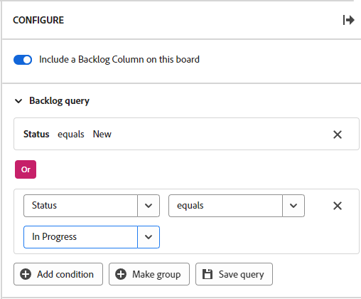

# Configurar o backlog em uma placa de workflow

>[!IMPORTANT]
>
>Os fluxos de trabalho só estão disponíveis para um grupo específico de clientes.

Você pode optar por exibir uma coluna de backlog em um quadro em um workflow e definir uma consulta para os cartões que são extraídos para o backlog do quadro a partir da lista de cartões de workflow.

>[!NOTE]
>
>Se você adicionar um novo cartão na coluna de backlog que não corresponda aos critérios de consulta, o cartão desaparecerá do backlog quando o quadro for atualizado e só estará disponível na lista de cartões. Você pode alterar a consulta a qualquer momento para ajustar quais cartões aparecem na coluna de backlog.

A coluna de backlog e o query não estão disponíveis em quadros independentes. Para obter informações sobre como adicionar uma coluna de entrada a um quadro independente, consulte [Adicionar uma coluna de entrada a um quadro](/help/quicksilver/agile/use-boards-agile-planning-tools/add-intake-column-to-board.md).

## Requisitos de acesso

+++ Expanda para visualizar os requisitos de acesso para a funcionalidade neste artigo.

<table style="table-layout:auto"> 
 <col> 
 <col> 
 <tbody> 
  <tr> 
   <td role="rowheader">Pacote do Adobe Workfront</td> 
   <td> 
Qualquer
 </td> 
  </tr> 
  <tr> 
   <td role="rowheader">Licença do Adobe Workfront</td> 
   <td> 
   
Colaborador ou superior
 
   
Solicitação ou superior

   </td> 
  </tr> 
 </tbody> 
</table>

Para obter mais detalhes sobre as informações nesta tabela, consulte [Requisitos de acesso na documentação do Workfront](/help/quicksilver/administration-and-setup/add-users/access-levels-and-object-permissions/access-level-requirements-in-documentation.md).

+++

## Configurar o backlog em uma placa de workflow

{{step1-to-boards}}

1. Abra o fluxo de trabalho no qual deseja trabalhar. Para abrir um fluxo de trabalho, clique em [!UICONTROL **Exibir fluxo de trabalho**].
1. Clique em qualquer quadro no fluxo de trabalho para abri-lo.
1. Clique em [!UICONTROL **Configurar**] à direita do quadro para abrir o painel Configurar.
1. Ativar [!UICONTROL **Incluir uma coluna de lista de pendências neste quadro**].

   A coluna de backlog é adicionada à esquerda do quadro. Permanece em branco até que você aplique uma consulta a ele.

1. Expandir [!UICONTROL **Consulta de lista de pendências**].

   >[!NOTE]
   >
   >Uma consulta padrão pode já ter sido aplicada ao backlog, mostrando todos os itens de trabalho da lista de cartões que têm um status e o status não é Concluído.

1. Clique em [!UICONTROL **Adicionar condição**] e clique no campo &quot;vazio&quot;.
1. Selecione o campo para consultar.

   Os campos que você pode escolher são os campos padrão em um cartão.

1. Selecione o modificador de consulta.

   As opções do modificador dependem dos campos aos quais podem ser aplicadas. Por exemplo, o campo &quot;nome&quot; não tem &quot;maior que&quot; ou &quot;menor que&quot; como opções do modificador, pois esses modificadores se aplicam apenas a números.

1. Selecione o valor.

   O valor não está disponível quando você usa &quot;existe&quot; ou &quot;não existe&quot; como modificador.

   Por exemplo, se você escolher &quot;Data de vencimento&quot; e &quot;existe&quot;, o backlog exibirá cartões com datas de vencimento atribuídas. Qualquer cartão sem data de vencimento não será extraído para o backlog.

1. (Opcional) Clique em [!UICONTROL **Adicionar condição**] para adicionar outra condição à consulta.

   

1. (Opcional) Clique em [!UICONTROL **Criar grupo**] para adicionar um grupo de condições conectadas à primeira condição com um operador OR.
1. Clique em [!UICONTROL **Salvar consulta**].

   A consulta é aplicada e os cartões que atendem aos critérios aparecem na coluna de backlog.
