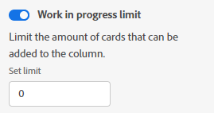

# Gerenciar o limite de [!UICONTROL Trabalho em andamento] (WIP) em um painel

Você pode configurar um limite de [!UICONTROL Trabalho em andamento] (WIP) para cada coluna de um quadro.

O limite WIP é simplesmente um aviso visual e não o impede de ter mais itens em cada coluna do que o limite definido.

## Requisitos de acesso

+++ Expanda para visualizar os requisitos de acesso da funcionalidade neste artigo.

<table style="table-layout:auto"> 
 <col> 
 <col> 
 <tbody> 
  <tr> 
   <td role="rowheader">Pacote do Adobe Workfront</td> 
   <td> 
Qualquer
 </td> 
  </tr> 
  <tr> 
   <td role="rowheader">Licença do Adobe Workfront</td> 
   <td> 
   
Colaborador ou posterior
 
   
Solicitação ou posterior

   </td> 
  </tr> 
 </tbody> 
</table>

Para obter mais detalhes sobre as informações contidas nesta tabela, consulte [Requisitos de acesso na documentação do Workfront](/help/quicksilver/administration-and-setup/add-users/access-levels-and-object-permissions/access-level-requirements-in-documentation.md).

+++

## Definir o limite WIP em uma coluna

{{step1-to-boards}}

1. Acessar um painel. Para obter mais informações, consulte [Criar ou editar um painel](../../agile/get-started-with-boards/create-edit-board.md).
1. Localize a coluna à qual deseja adicionar o limite de WIP.

   Para adicionar uma nova coluna, consulte [Gerenciar colunas do quadro](/help/quicksilver/agile/get-started-with-boards/manage-board-columns.md).

1. Clique no menu **[!UICONTROL Mais]** na coluna e selecione **[!UICONTROL Editar]** para abrir a área Configurações.
1. Em [!UICONTROL Políticas de coluna], habilite a política de limite **[!UICONTROL de ]Trabalhos em andamento** para limitar o número de cartões que podem ser adicionados à coluna.
1. Digite o número do limite no campo **[!UICONTROL Definir limite]**.

   

   O número de cartões e o limite são exibidos na parte superior da coluna. Se a coluna contiver mais cartas do que o limite, o contador ficará vermelho.

   

1. Clique em **[!UICONTROL Fechar]** para sair da área [!UICONTROL Configurações] e exibir a coluna e seus cartões.
