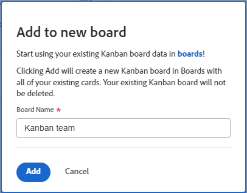

# Migrar cartões kanban de equipe ágil para quadros do Workfront

Você pode migrar seus itens de trabalho de um quadro kanban de equipe ágil para um quadro novo ou existente do Workfront. Quando você executa a migração, todos os cartões no quadro Kanban são copiados para o quadro do Workfront. Você não tem permissão para escolher cartões específicos.

O posicionamento dos cartões na placa Workfront é baseado nas políticas de coluna. (Por exemplo, uma política pode mover todos os cartões com o status &quot;Em andamento&quot; para uma coluna específica. Para obter mais informações sobre políticas de coluna, consulte [Gerenciar colunas do quadro](/help/quicksilver/agile/get-started-with-boards/manage-board-columns.md).) Se não houver políticas ou se os cartões não corresponderem às políticas, os cartões serão colocados na coluna mais à esquerda do quadro. No momento, os cartões na coluna Backlog do quadro herdado não são adicionados ao quadro do Workfront.

Os cartões não são removidos do quadro Kanban da equipe ágil e as alterações de status do cartão serão sincronizadas em ambos os quadros. Você pode manter as duas placas ativas até estar pronto para mudar para os Workfront Boards.

## Requisitos de acesso

Você deve ter o seguinte acesso para executar as etapas neste artigo:

<table style="table-layout:auto">
 <col>
 </col>
 <col>
 </col>
 <tbody>
  <tr>
   <td role="rowheader"><strong>[!DNL Adobe Workfront] plano*</strong></td>
   <td> 
Qualquer Um
 </td>
  </tr>
  <tr>
   <td role="rowheader"><strong>[!DNL Adobe Workfront] licença*</strong></td>
   <td> 
[!UICONTROL Solicitação] ou superior
 </td>
  </tr>
 </tbody>
</table>

&#42;Para descobrir qual plano, tipo de licença ou acesso você tem, entre em contato com seu [!DNL Workfront] administrador.

## Migrar cartões Kanban para um novo quadro

{{step1-to-team}}

1. Acesse um quadro kanban.
1. Clique em [!UICONTROL **Adicionar quadros**] e selecione [!UICONTROL **Novo quadro**].
1. No [!UICONTROL Adicionar ao novo quadro] digite um nome para o novo quadro (o nome do quadro atual) [!UICONTROL Kanban] quadro é exibido automaticamente) e clique em [!UICONTROL **Adicionar**].

   

1. (Opcional) Na mensagem de sucesso exibida, clique no link para abrir o novo quadro.

## Migrar cartões Kanban para um quadro existente

{{step1-to-team}}

1. Acesse um quadro kanban.
1. Clique em [!UICONTROL **Adicionar quadros**] e selecione [!UICONTROL **Placa existente**].
1. No [!UICONTROL Adicionar à placa existente] , procure e selecione o quadro para o qual migrar os cartões. Em seguida, clique em [!UICONTROL **Adicionar**].

   

1. (Opcional) Na mensagem de sucesso exibida, clique no link para abrir o quadro.
