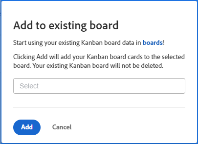

# Migrar cartões Kanban da equipe ágil para o Workfront Boards

Você pode migrar seus itens de trabalho de um quadro Kanban da Equipe Agile para um quadro Workfront novo ou existente. Quando você executa a migração, todos os cartões no quadro Kanban são copiados para o quadro Workfront. Você não tem permissão para escolher cartões específicos.

O posicionamento dos cartões no quadro do Workfront é baseado nas políticas de coluna. (Por exemplo, uma política poderia mover todos os cartões com status de &quot;Em andamento&quot; para uma coluna específica. Para obter mais informações sobre políticas de coluna, consulte [Gerenciar colunas do quadro](/help/quicksilver/agile/get-started-with-boards/manage-board-columns.md).) Se não houver políticas ou os cartões não corresponderem às políticas, os cartões serão colocados na coluna mais à esquerda do quadro. Nesse momento, os cartões na coluna Backlog da placa herdada não são adicionados à placa Workfront.

Os cartões não são removidos do quadro Kanban da equipe Agile e as alterações de status do cartão serão sincronizadas com ambos os quadros. Você pode manter ambas as placas ativas até estar pronto para mudar para Workfront Boards.

## Requisitos de acesso

+++ Expanda para visualizar os requisitos de acesso da funcionalidade neste artigo.

<table style="table-layout:auto"> 
 <col> 
 <col> 
 <tbody> 
  <tr> 
   <td role="rowheader">Pacote do Adobe Workfront</td> 
   <td> 
Qualquer
 </td> 
  </tr> 
  <tr> 
   <td role="rowheader">Licença do Adobe Workfront</td> 
   <td> 
   
Colaborador ou posterior
 
   
Solicitação ou posterior

   </td> 
  </tr> 
 </tbody> 
</table>

Para obter informações, consulte [Requisitos de acesso na documentação do Workfront](/help/quicksilver/administration-and-setup/add-users/access-levels-and-object-permissions/access-level-requirements-in-documentation.md).

+++

## Migrar cartões Kanban para um novo quadro

{{step1-to-team}}

1. Acessar um quadro Kanban.
1. Clique em [!UICONTROL **Adicionar aos Quadros**] e selecione [!UICONTROL **Novo Quadro**].
1. Na caixa de diálogo [!UICONTROL Adicionar ao novo painel], digite um nome para o novo painel (o nome do atual painel [!UICONTROL Kanban] é exibido automaticamente) e clique em [!UICONTROL **Adicionar**].

   

1. (Opcional) Na mensagem de sucesso exibida, clique no link para abrir o novo quadro.

## Migrar cartões Kanban para um quadro existente

{{step1-to-team}}

1. Acessar um quadro Kanban.
1. Clique em [!UICONTROL **Adicionar aos Quadros**] e selecione [!UICONTROL **Quadro Existente**].
1. Na caixa de diálogo [!UICONTROL Adicionar ao quadro existente], procure e selecione o quadro para o qual migrar os cartões. Em seguida, clique em [!UICONTROL **Adicionar**].

   

1. (Opcional) Na mensagem de sucesso exibida, clique no link para abrir o quadro.
