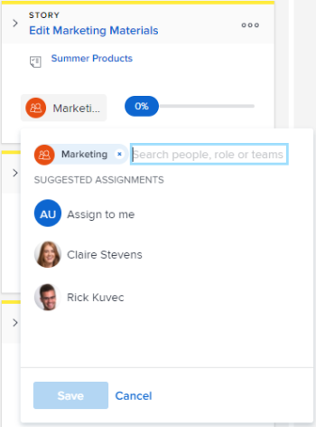

# Atribuir usuários a uma história no quadro [!UICONTROL Kanban]

Você pode atribuir usuários a histórias diretamente no quadro Kanban.

## Requisitos de acesso

+++ Expanda para visualizar os requisitos de acesso para a funcionalidade neste artigo.

Você deve ter o seguinte acesso para executar as etapas deste artigo:

<table style="table-layout:auto"> 
 <col> 
 </col> 
 <col> 
 </col> 
 <tbody> 
  <tr> 
   <td role="rowheader">[!DNL Adobe Workfront] plano</td> 
   <td> 
Qualquer
 </td> 
  </tr> 
  <tr> 
   <td role="rowheader">[!DNL Adobe Workfront] licença</td> 
   <td> 
Novo: [!UICONTROL Padrão]
 
   ou
   
Atual: [!UICONTROL Trabalho] ou superior
 </td> 
  </tr>
 </tbody> 
</table>

Para obter mais detalhes sobre as informações nesta tabela, consulte [Requisitos de acesso na documentação do Workfront](/help/quicksilver/administration-and-setup/add-users/access-levels-and-object-permissions/access-level-requirements-in-documentation.md).

+++

## Atribuir usuários a uma história no quadro [!UICONTROL Kanban]

{{step1-to-team}}

1. (Opcional) Clique no ícone **[!UICONTROL Equipe do Switch]** , em seguida, selecione uma nova equipe Kanban no menu suspenso ou procure uma equipe na barra de pesquisa.

1. Vá para o quadro ágil [!UICONTROL Kanban] onde deseja atribuir usuários.
1. Vá para o bloco história no quadro [!UICONTROL Kanban] onde deseja adicionar um usuário.
1. Clique no avatar da equipe no bloco da história (ou em um avatar do usuário, se já houver um atribuído), comece digitando o nome do usuário que deseja atribuir à história e clique no nome quando ele for exibido. Você também pode escolher um usuário sugerido.

   >[!TIP]
   >
   >Você também pode atribuir uma função de trabalho a uma história. Você só pode atribuir usuários e funções ativos.

   
