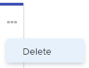

# Exclua histórias ou problemas do quadro [!UICONTROL Kanban]

Você pode excluir uma história ou problema do quadro [!UICONTROL Kanban]. Ao excluir uma história ou problema, ele é movido para a Lixeira por 30 dias e pode ser recuperado somente pelo administrador do sistema.

## Requisitos de acesso

Você deve ter o seguinte acesso para executar as etapas deste artigo:

<table style="table-layout:auto"> 
 <col> 
 </col> 
 <col> 
 </col> 
 <tbody> 
  <tr> 
   <td role="rowheader"><strong>[!DNL Adobe Workfront] plano*</strong></td> 
   <td> 
Qualquer
 </td> 
  </tr> 
  <tr> 
   <td role="rowheader"><strong>[!DNL Adobe Workfront] licença*</strong></td> 
   <td> 
[!UICONTROL Work] ou superior
 </td> 
  </tr> 
  <tr> 
   <td role="rowheader"><strong>Configurações de nível de acesso*</strong></td> 
   <td> 
[!UICONTROL Worker] ou superior
 
Observação: se você ainda não tiver acesso, pergunte ao administrador do [!DNL Workfront] se ele definiu restrições adicionais no seu nível de acesso. Para obter informações sobre como um administrador do [!DNL Workfront] pode modificar seu nível de acesso, consulte <a href="../../administration-and-setup/add-users/configure-and-grant-access/create-modify-access-levels.md" class="MCXref xref">Criar ou modificar níveis de acesso personalizados</a>.
 </td> 
  </tr> 
  <tr> 
   <td role="rowheader"><strong>Permissões de objeto</strong></td> 
   <td> 
[!UICONTROL Gerenciar] acesso à tarefa ou problema
 
Para obter informações sobre como solicitar acesso adicional, consulte <a href="../../workfront-basics/grant-and-request-access-to-objects/request-access.md" class="MCXref xref">Solicitar acesso aos objetos </a>.
 </td> 
  </tr> 
 </tbody> 
</table>

&#42;Para saber qual plano, tipo de licença ou acesso você tem, contate o administrador do [!DNL Workfront].

## Excluir uma história ou problema

1. Clique no ícone  do **[!UICONTROL Menu principal]** no canto superior direito de [!DNL Adobe Workfront] e em **[!UICONTROL Equipes]**.

1. (Opcional) Clique no ícone **[!UICONTROL Equipe do switch]**  e selecione uma nova equipe [!UICONTROL Kanban] no menu suspenso ou procure uma equipe na barra de pesquisa.
1. Clique no ícone **[!UICONTROL Mais]** sobre a história ou problema e selecione **[!UICONTROL Excluir]**.

   

1. Na mensagem de confirmação, clique em **[!UICONTROL Sim, excluir]**.
