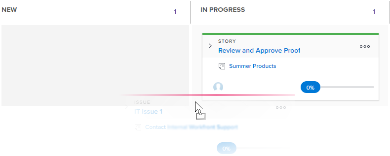

# Atualize o status das histórias no quadro [!UICONTROL Kanban]

Você pode alterar o status de uma história diretamente do quadro [!UICONTROL Kanban] para refletir como as histórias estão progredindo.

>[!NOTE]
>
>Somente os status selecionados na seção [!UICONTROL Story Board] da área [!UICONTROL configurações da equipe] estão disponíveis no quadro [!UICONTROL Kanban] e no menu suspenso de status. Para obter mais informações, consulte [Configurar Kanban](../../agile/get-started-with-agile-in-workfront/configure-kanban.md)

## Requisitos de acesso

+++ Expanda para visualizar os requisitos de acesso para a funcionalidade neste artigo.

Você deve ter o seguinte acesso para executar as etapas deste artigo:

<table style="table-layout:auto"> 
 <col> 
 </col> 
 <col> 
 </col> 
 <tbody> 
  <tr> 
   <td role="rowheader">[!DNL Adobe Workfront] plano</td> 
   <td> 
Qualquer
 </td> 
  </tr> 
  <tr> 
   <td role="rowheader">[!DNL Adobe Workfront] licença</td> 
   <td> 
Novo: [!UICONTROL Padrão]
 
   ou
   
Atual: [!UICONTROL Trabalho] ou superior
 </td> 
  </tr>
 </tbody> 
</table>

Para obter mais detalhes sobre as informações nesta tabela, consulte [Requisitos de acesso na documentação do Workfront](/help/quicksilver/administration-and-setup/add-users/access-levels-and-object-permissions/access-level-requirements-in-documentation.md).

+++

## Atualizar o status das histórias no quadro Kanban

{{step1-to-team}}

1. (Opcional) Clique no ícone **[!UICONTROL Equipe do switch]**  e selecione uma nova equipe [!UICONTROL Kanban] no menu suspenso ou procure uma equipe na barra de pesquisa.

1. Vá para o quadro [!UICONTROL Kanban] onde deseja atualizar o status de uma história.
1. Arraste uma história de uma coluna de status no quadro [!UICONTROL Kanban] e para outra coluna.
Uma história permanece na coluna [!UICONTROL Concluído] por duas semanas após ser adicionada.
   
